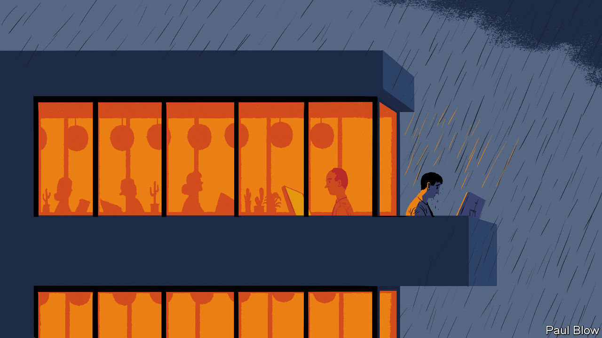

## Bartleby

# The pandemic may exacerbate the divide among workers

> It’s cold outside

> Apr 11th 2020

Editor’s note: The Economist is making some of its most important coverage of the covid-19 pandemic freely available to readers of The Economist Today, our daily newsletter. To receive it, register [here](https://www.economist.com//newslettersignup). For our coronavirus tracker and more coverage, see our [hub](https://www.economist.com//coronavirus)

CRISES OFFER the ultimate test for organisations. Under the pressure of a pandemic, many firms will change the way they operate. Three trends that were already in train may be accelerated. First, the way that meetings are undertaken. Second, the way that teams are organised. Third, the widening divide between company insiders, namely full-time employees, and outsiders, such as freelancers and contractors.

So many meetings have been conducted via Zoom and other apps that bosses may decide that this is a better approach than gathering everyone together in one fusty room. One estimate is that 2.1m people downloaded the Zoom app on March 23rd, the day Britain went into lockdown and the World Health Organisation warned that the pandemic was “accelerating”. Even when people start returning to offices, many of those who did not catch the virus will be nervous about being in close proximity to their colleagues.

Remote meetings have drawbacks. Conversations can be clunky and stilted, and not everyone (including Bartleby) welcomes the need to be on camera. So physical meetings will not disappear altogether, but they will be a smaller proportion of the total.

Another change will be a greater focus on communication between key employees. Worker interaction involves a lot more than meetings. Traditionally, people have popped over to each other’s desks for a brief chat. Often, these exchanges are all the more useful when they involve someone from a different department. Such informal interactions are not currently possible.

Email chains are an imperfect and cumbersome substitute. In the crisis, many firms have turned to apps like Slack, which allow teams to communicate on a dedicated forum. Stewart Butterfield, Slack’s chief executive, says the company started to detect a significant pickup in teams being created in South Korea and Japan in the middle of February. A bigger surge in business began in the week of March 9th, a hint that companies were beginning to take social distancing seriously. All told, use of Slack increased approximately 20% between February 1st and March 25th, while simultaneously connected users increased from 10.5m on March 16th to 12.5m on March 25th.

The divide between insiders and outsiders is probably the most significant change. The first group are likely to be protected by their employers, who will pay all or most of their salaries as long as they can afford to. The outsiders, whose ties with firms are looser, may be cast adrift. The divide helps explain a large part of the surge in unemployment claims on both sides of the Atlantic.

The insider/outsider split is one of the trends outlined by William Davidow and Michael Malone in “The Autonomous Revolution”, a new book. Permanent employees are an expensive burden, thanks to the associated costs like health care (in America) and pensions (everywhere). Online tools already let employers forecast workloads and schedule workers instantly. The current crisis may prompt firms to embrace these, as they reconsider which full-time workers are essential, and which are not. 

The pandemic will also accelerate the trend towards automation. In some cases companies will increasingly rely on automated processes to fulfil tasks, because some workers may fall ill. In other cases the push may come from outside: more consumers will become used to shopping online, or interacting with websites rather than waiting ages for call centres to answer their queries. Those habits look likely to stick after the pandemic ends, reducing the need for human employees.

A reduction in the supply of secure, full-paid jobs may coincide with an increase in demand for such roles. The crisis will have taught a stark lesson to those who work in the gig economy: they are highly vulnerable. Independence and the ability to manage your own time sound appealing when work is plentiful. In hard times workers will appreciate security, however tiresome the daily commute may be. The spike in unemployment will only increase the desire for stable jobs. That seems likely to keep a downward pressure on wages.

Employees may be used to hearing that “we are all in the same boat”. But this crisis is cementing a class system aboard corporate vessels. The managers have the first-class cabins and core workers get en-suite accommodation but the freelancers and contractors are clinging unsteadily to the lifeboats.

Dig deeper:For our latest coverage of the covid-19 pandemic, register for The Economist Today, our daily [newsletter](https://www.economist.com//newslettersignup), or visit our [coronavirus tracker and story hub](https://www.economist.com//coronavirus)

## URL

https://www.economist.com/business/2020/04/11/the-pandemic-may-exacerbate-the-divide-among-workers
