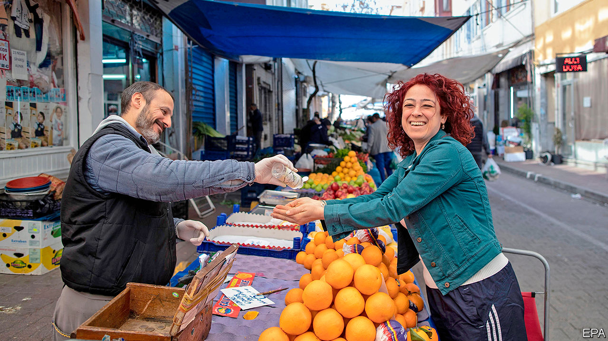

## Perfumed guardian

# Turks try to ward off covid-19 with eau de cologne

> Soap is cheaper, but kolonya is a national obsesssion

> Apr 11th 2020ISTANBUL

Editor’s note: The Economist is making some of its most important coverage of the covid-19 pandemic freely available to readers of The Economist Today, our daily newsletter. To receive it, register [here](https://www.economist.com//newslettersignup). For our coronavirus tracker and more coverage, see our [hub](https://www.economist.com//coronavirus)

IN MOST REGARDS, Turkey’s response to the covid-19 outbreak has not been out of the ordinary. The government has cancelled all international flights, sports events, and communal prayers at the country’s 90,000 mosques. Schools, universities and restaurants have been closed. People over 65 and under 20 have been ordered to stay at home.

Unlike other countries, however, Turkey has also made it a matter of policy to keep its citizens supplied with cologne. On March 18th President Recep Tayyip Erdogan promised to distribute the stuff to the elderly. Days later, local producers pledged they would not raise prices during the pandemic. Officials vowed that stocks would never run low.

Turkey is a land of germophobes. Food vendors hand out wet-wipes. The secular and pious alike wash their hands religiously. Asked how often they do so after a trip to the toilet in a 2015 survey, Turks scored higher (94%) than any country in Europe save Bosnia and Herzegovina, trouncing France (62%), Italy (57%) and the Netherlands (50%).

But nothing quite matches Turkey’s love for cologne. Named after the German city in which it was invented, cologne arrived in the Ottoman empire in the 19th century. It found a brand ambassador in Sultan Abdulhamid II, who carried Atkinsons cologne wherever he went and could get through a bottle in a matter of hours. The habit caught on, and cologne made its way into Turkish vocabulary, initially as odikolon (from eau de Cologne) and eventually as kolonya.

To this day, in homes across Anatolia, hosts sprinkle kolonya on their guests’ hands to kill bacteria (and body odour), before stuffing them with sweets and tea. Waiters do the same for patrons at restaurants, and bus attendants for passengers on long-distance routes.

Since the outbreak, kolonya has been flying off the shelves. One online retailer has reported a 3,400% increase in sales. Since kolonya is mostly alcohol, it may indeed destroy the virus. Granted, soap is cheaper. But kolonya smells nicer.

Dig deeper:For our latest coverage of the covid-19 pandemic, register for The Economist Today, our daily [newsletter](https://www.economist.com//newslettersignup), or visit our [coronavirus tracker and story hub](https://www.economist.com//coronavirus)

## URL

https://www.economist.com/europe/2020/04/11/turks-try-to-ward-off-covid-19-with-eau-de-cologne
