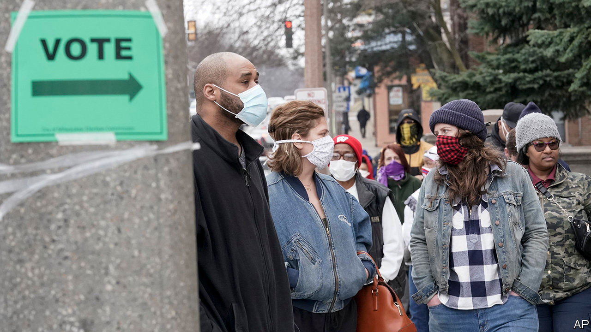

## Voting in a pandemic

# Wisconsin, or how not to run an election while covid-19 is spreading

> The mess in a battleground state holds lessons for November’s presidential election

> Apr 9th 2020

Editor’s note: The Economist is making some of its most important coverage of the covid-19 pandemic freely available to readers of The Economist Today, our daily newsletter. To receive it, register [here](https://www.economist.com//newslettersignup). For our coronavirus tracker and more coverage, see our [hub](https://www.economist.com//coronavirus)

DEMOCRACIES AROUND the world are wondering how to hold elections during a pandemic. The state of Wisconsin, which may well decide the outcome of America’s presidential election in November, has just provided a lesson in how not to do it.

On April 7th, despite a shelter-in-place order from the governor and warnings from the White House about the severity of America’s epidemic, Wisconsin held votes for several offices, including the state Supreme Court. The day before the vote was due, Wisconsin’s Democratic governor, Tony Evers, issued an executive order postponing voting in person until June. That order was disputed by the state’s Republican Party and its challenge went all the way to the state Supreme Court. The judges sided with the Republicans, so an election that had apparently been cancelled a few hours earlier then went ahead anyway.

In the past decade Wisconsin’s politics have been growing steadily more toxic. As a purple state that is bitterly fought over in national elections, Wisconsin shows what happens when partisanship, left unchecked, leaches into the soil from which political institutions grow.

Democratic candidates do well in Wisconsin’s cities, principally Milwaukee and Madison. The cities are where cases of covid-19 have been diagnosed and where people are sheltering at home, afraid to go out. On election day Milwaukee, a city of 600,000 people, was able to staff just five polling stations. In rural Wisconsin, which leans Republican, the epidemic seems a more distant problem and going to vote less of a risk. Because Milwaukee has a large African-American population, the urban-rural divide also has a racial element. Thus the virus has unerringly tugged at the state’s main political fault-line.

A state Supreme Court with a member elected under these conditions will lack legitimacy. Yet the court’s members will be expected to referee bitter political disputes over the next couple of years, possibly including what kind of identification will be acceptable at polling stations and, after the next census, on the legality of newly gerrymandered election districts.

This debacle holds lessons for other states. One is about turnout. Wisconsin’s Republican Party has insisted on going ahead with in-person voting in the midst of the country’s worst public-health crisis in a century. The official line is that this is all about preserving the sanctity and integrity of elections, but it is also more than a little convenient for a party that seeks low turnout in cities and high turnout in rural Wisconsin.

That approach—gaining electoral advantage by discouraging voting—is consistent with the Republican Party’s hostility nationwide to measures that would make voting easier. In any democracy, a party that considers pursuing a lower turnout to be a legitimate electoral strategy does not deserve to win elections.

Another lesson is about partisanship. Wisconsin’s elections have become so bitter that the struggle has shifted from policy, a fit subject for party politics, to the manipulation of the rules, which is hackery. Mr Evers dithered until the eve of the election and then wanted to extend the deadline for voting by post, which would probably have helped his party. The state Supreme Court blocked this by four votes to two along partisan lines, siding with the state’s Republican Party. At the federal Supreme Court, asked to rule on a lower court’s order that postal ballots count even if they are postmarked after the vote, the five justices appointed by Republican presidents sided with the Republicans and the four appointed by Democratic presidents sided with the Democrats.

America needs a dose of political reform aimed at distancing political campaigning from the refereeing of elections. Plenty of states do not have judicial elections, which are fraught with bad incentives. An increasing number of states have taken the power to decide on congressional maps away from politicians.

States must not dither. It does not take a lively imagination to foresee a resurgence of covid-19 before the general election. States need to start preparing for that as soon as possible. That means making it easier to vote safely in person, as South Korea will next week. It also means finding secure ways to vote remotely. This is in the interest of both parties. It may be that in the autumn some rural areas will also be suffering from the virus, which would risk Republican voters being disenfranchised as well as Democratic ones. Wisconsin has issued a warning. Other states need to act now. ■ 

Dig deeper:

## URL

https://www.economist.com/leaders/2020/04/09/wisconsin-or-how-not-to-run-an-election-while-covid-19-is-spreading
