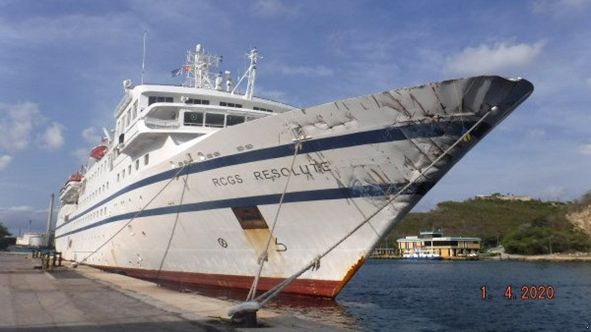

## A farcical sea battle

# Venezuela’s navy battles a cruise ship, and loses

> The sailors had guns, but the unarmed pleasure boat had a thick hull

> Apr 11th 2020

IT WAS, ON the face of it, a mismatched contest. The ANBV Naiguatá, a Venezuelan patrol vessel, was armed with a 76mm naval gun, a German-built anti-aircraft system that sprays a cloud of tungsten bullets and a pair of deck-mounted machine guns, among other weaponry. The RCGS Resolute, a Portuguese-flagged cruise ship with an 80-seat theatre, had the top speed of an oil tanker. But in the early hours of March 30th it was Venezuela’s Bolivarian navy whose ship ended up on the seabed—in the first decisive naval skirmish in the Caribbean for 75 years.

The Resolute, en route to Curaçao, a Dutch island in the Caribbean, had been drifting for a day in international waters near La Tortuga, a Venezuelan island, as it tinkered with its starboard engine. At midnight it was approached by the Naiguatá and ordered to come into port. As the Resolute contacted its head office for instructions, the Naiguatá opened fire—a video released by the Venezuelan navy shows a sailor firing an AK-47 in the howling wind and darkness with Rambo-like enthusiasm—and rammed the cruise ship, according to its parent company.

Unfortunately for the Naiguatá, the Resolute’s placid appearance belies the fact that its strengthened hull, built for polar cruising, can smash through metre-thick ice—and, it turns out, puny patrol boats. The Resolute brushed off the collision with “minor damages”, whereas the Naiguatá rapidly took on water and sank, leaving 44 sheepish sailors to be rescued.

Venezuela disputes this account. Its armed forces accused the Resolute of “cowardly and criminal behaviour” by initiating the collision in Venezuela’s national waters. The Bolivarian navy insisted that its gallant sailors put in an “impeccable performance” against the unarmed cruise ship, presumably by sinking with particular panache. The navy darkly added that the Resolute, which boasts a jacuzzi and sauna, might have been carrying mercenary commandos to attack Venezuelan bases. As evidence, it pointed to nefarious inflatable boats on its deck.

Venezuela’s thuggish regime may be especially touchy now. In January the  uss Detroit, an American warship, conducted “freedom-of-navigation” operations close to Venezuela’s coastline. On March 26th the United States indicted Nicolás Maduro, the dictator, and his inner circle for drug-running and “narco-terrorism”.

On April 1st Donald Trump announced that the United States was launching an “enhanced counter-narcotics operation” in the eastern Pacific and Caribbean, involving an impressive array of warships and spy planes. The operation would “choke off the funds that go to that corrupt regime”, said Robert O’Brien, Mr Trump’s national security adviser. The Bolivarian navy will be ready to repel any invaders—just as soon as its sailors dry off.■