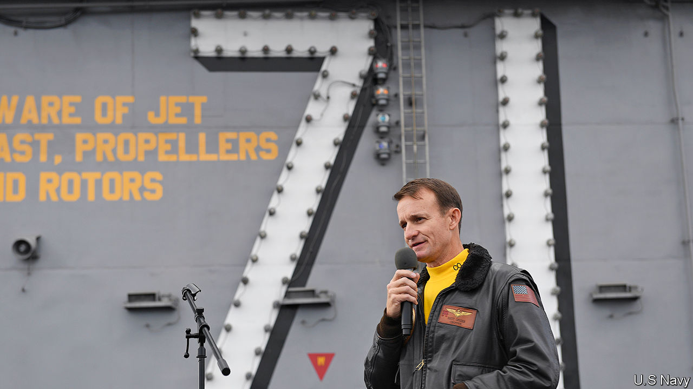

## Seasickness

# Covid-19 takes out an aircraft-carrier, and a navy secretary

> Thomas Modly, America’s acting secretary of the navy, offered to resign after a coronavirus controversy

> Apr 8th 2020

Editor’s note: The Economist is making some of its most important coverage of the covid-19 pandemic freely available to readers of The Economist Today, our daily newsletter. To receive it, register [here](https://www.economist.com//newslettersignup). For more coverage, see our coronavirus [hub](https://www.economist.com//coronavirus)

SEVERAL HUNDRED sailors thronged the cavernous belly of the USS Theodore Roosevelt, a 100,000-tonne nuclear-powered aircraft-carrier. “Captain Crozier! Captain Crozier!” they chanted, as the commanding officer, Brett Crozier, walked forlornly down the gangway into a warm Guam evening on April 3rd, bidding farewell to his warship. “Now that’s how you send out one of the greatest captains you ever had,” remarked a sailor in the crowd. The result is the latest civil-military calamity of this administration, culminating in the departure of Donald Trump’s second navy secretary in five months.

In mid-March the Roosevelt was exercising in the South China Sea, fresh from a visit to Vietnam. Then covid-19 struck, forcing the ship to Guam. On March 30th, as the virus raged through a crew of over 5,000, Captain Crozier sent an imploring four-page letter to his colleagues. The spread of the disease was “ongoing and accelerating”, he warned, and sailors had to be evacuated from the confined quarters. “We are not at war,” he urged. “Sailors do not need to die.”

At first navy leaders expressed support, insisting that Captain Crozier would not face retaliation for sounding the alarm. A day later he was removed. Thomas Modly, America’s acting secretary of the navy, offered a jumble of reasons. The captain had “undermined the chain of command” and “created…panic on the ship” by copying 20-30 people on his letter. He had created “the perception that the Navy is not on the job, the government’s not on the job.” And he might also have “emboldened our adversaries to seek advantage”.

Then, in an intemperate speech aboard the Roosevelt on April 6th, Mr Modly told its incredulous crew that Captain Crozier had either deliberately leaked the letter to the media, or was “too naive or too stupid to be a commanding officer”. Mr Modly mockingly called the captain—who had tested positive for covid-19 a day earlier—a “martyr” and accused him of “betrayal”. Worst of all, he said, the letter had caused “a big controversy in Washington, DC”.

Mr Modly later apologised for his remarks, but they reinforced the sense that Captain Crozier’s offence was to have embarrassed the administration rather than violated protocol or undermined readiness. On April 7th, under pressure from lawmakers, and largely disowned by the Pentagon, Mr Modly resigned.

Even before this episode, it was clear that America’s globe-girdling navy was not in tip-top shape. In January the Pentagon’s inspector-general scrutinised a dozen destroyers and found deficiencies with training. In one case it concluded that “the ship will not be able to conduct gunnery support”—including trifling matters “such as identifying where the ship is shooting”. Shoddy seamanship in the Seventh Fleet, based in Japan, resulted in two warship collisions that killed 17 people in 2017. The fleet was also rocked by a separate corruption scandal, leading to reprimands for at least ten captains and admirals, and the first-ever conviction of a serving admiral for a federal crime.

American warships are ageing—57% are more than 20 years old. Crumbling shipyards and relentless operations have made it harder to maintain them. The navy is also short of more than 6,000 sailors, though recruitment, retention and morale are unlikely to be helped by Mr Modly’s instruction to sailors that “you’re under no obligation to like your job, only to do it”.

Then came covid-19, which has spread across several vessels. Tight quarters make warships “a Petri dish of virus”, says a former carrier strike group commander. Sailors aboard the uss Ronald Reagan, a carrier moored in Japan, have also tested positive. That does not mean America’s fleet would be paralysed in a crisis—warships can lose much of their crew and remain viable—but it may keep many in port.

Mr Modly’s own brief tenure only came about because of the last mess. In November his predecessor, Richard Spencer, was fired after resisting what he called Mr Trump’s “shocking and unprecedented intervention” in the case of a Navy Seal who had been accused of war crimes. In a parting letter to the president, Mr Spencer said that this meddling had put at risk “good order and discipline”. The navy now looks more rudderless than ever.■

Dig deeper:For our latest coverage of the covid-19 pandemic, register for The Economist Today, our daily [newsletter](https://www.economist.com//newslettersignup), or visit our [coronavirus hub](https://www.economist.com//coronavirus)

## URL

https://www.economist.com/united-states/2020/04/08/covid-19-takes-out-an-aircraft-carrier-and-a-navy-secretary
