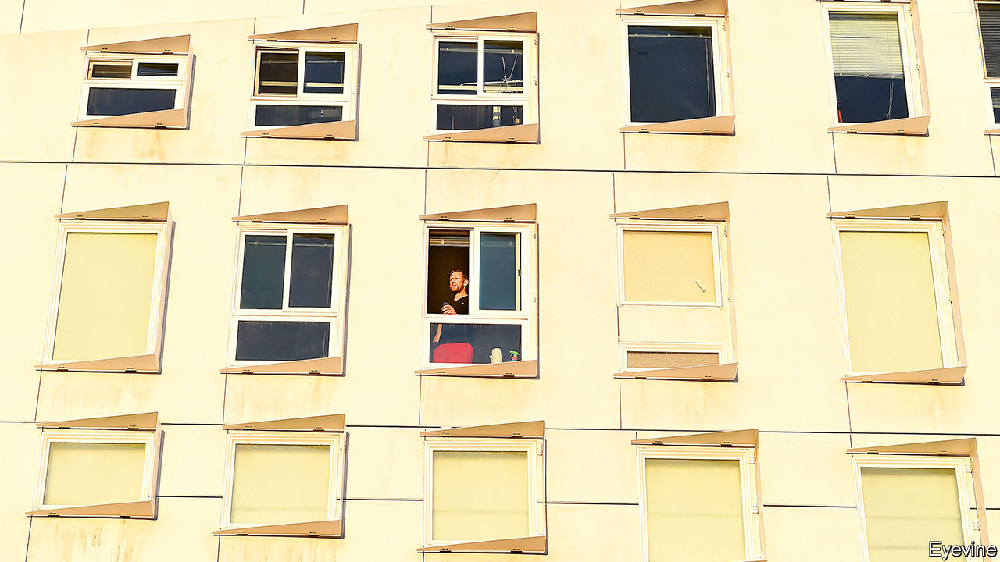

## Please shower on entry

# House-sharers find covid-19 restrictions especially hard to deal with

> More American adults now share living spaces, but not necessarily the same understandings of orders to stay at home

> Apr 11th 2020

Editor’s note: The Economist is making some of its most important coverage of the covid-19 pandemic freely available to readers of The Economist Today, our daily newsletter. To receive it, register [here](https://www.economist.com//newslettersignup). For our coronavirus tracker and more coverage, see our [hub](https://www.economist.com//coronavirus)

IN LATE MARCH, a text message appeared on Twitter from a student at Brigham Young University in Salt Lake City. She asked her flatmate not to invite guests to their shared space during the coronavirus epidemic, since her immune system was compromised. “I’m glad that you are seeking to stay safe,” came the reply, “however, you can’t prevent me from having people over. So you can expect to see Brett over often, and if that’s an issue for you, you can stay in your room.” Not surprisingly, this was retweeted everywhere, the Salt Lake City health department weighed in (“Brett could do his part in flattening the curve by visiting virtually,” it scolded) and by the next day #StayHomeBrett was one of the top ten trending hashtags nationally.

This small episode caught people’s attention because it highlights the broader problems that a swathe of Americans have in coping with the coronavirus. These are house-sharers. According to the Pew Research Centre, in 2017 just under a third of adults lived in households with other adults who are not their spouses or partners, up from just over a quarter in 2004.

Over the past 15 years, household sharing—think of the sitcom “Friends”—has soared with the rising cost of housing and rent. According to Pew, 30% of those under 35 are house-sharers, compared with 12% of people aged 35 to 54. They are concentrated in the largest cities. Zillow, a property-database company, estimated in 2018 that 40-50% of adults in southern California’s large cities as well as New York lived in shared households, compared with less than 20% in North Dakota and Iowa. Coastal cities also have by far the highest number of coronavirus cases, so the reaction of urban house-sharers will play a vital role in how America copes with the disease.

Which is worrying because they face special difficulties. In families, parents can (in theory) persuade children into good behaviour. But house-sharers are independent adults. As the Salt Lake student put it, “you can’t prevent me.” Yet one roommate can put a whole household at risk.

So house-sharers have suddenly been forced to start thinking about questions like: are visitors allowed? Partners? What happens if someone gets the virus?

Most households are answering such questions piecemeal. “Each of us had slightly different ideas about how to abide by the stay-at-home order,” says Sarah Fredrick, who shares a house in Washington, DC, with five other professional women. They have come to an arrangement based on trust, rather than rules. Partners are allowed, visitors aren’t. But there are no protocols about (for example) shopping.

Others rely on explicit rules. Everyone who enters the house must change clothes and shower, says Brad Marriner. He shares an apartment in New York with another man; both have partners in other two-person apartments, making a circle of six people in three houses, all of whom have signed up to common rules. “There’s a lot of laundry and showering,” he says.

A communal house in Oakland, California, has gone further, drawing up a 12-page list of rules for what Jeremy Blanchard, a house member, describes as “gold-standard quarantine”: no one can be closer than six feet to any outsider for 22 days; everyone must wear a mask outside; no one has covid-like symptoms and so on. If the household reaches the gold standard, its members may visit other households that have achieved it, too. There are also rules for domestic chores, though not as stringent as in another Oakland house, which requires five people to do the shopping: two to buy goods (they wear two layers of clothing, taking off the outer layer after leaving the store); two to disinfect purchases outside the house; one to clean the fruit and vegetables. It takes hours.

That is extreme. But the big public-health problem lies not in shared households that go too far but in irresponsible ones that do not go far enough. How sharers respond will determine not only how quickly covid-19 passes, but also whether, afterwards, millions will continue to live in households that are an infection risk. ■

Editor’s note: The Economist is making some of its most important coverage of the covid-19 pandemic freely available to readers of The Economist Today, our daily newsletter. To receive it, register [here](https://www.economist.com//newslettersignup). For our coronavirus tracker and more coverage, see our [hub](https://www.economist.com//coronavirus)