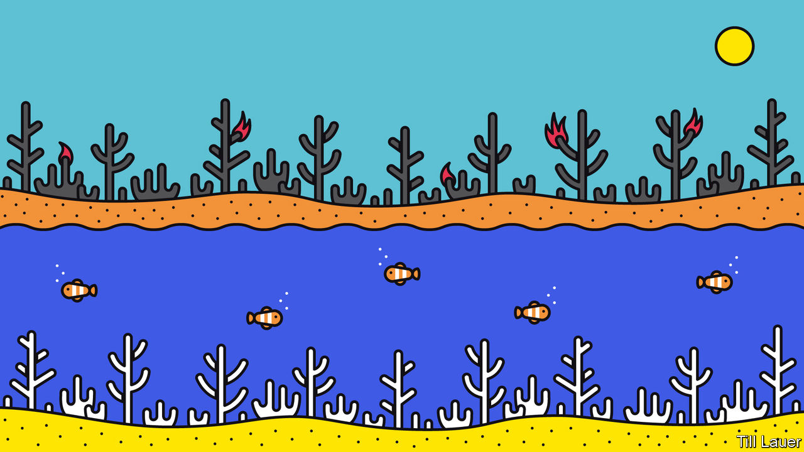

## Banyan

# Big parts of the Great Barrier Reef are dying

> The bleaching adds to Australia’s summer of unnatural calamities

> Apr 18th 2020

OVER THE southern hemisphere’s summer, mercifully now at an end, Australia burned under a pitiless sun. Bush fires down the continent’s eastern flank consumed 46m acres of countryside, destroying homes, taking lives and driving rare animals towards extinction. To many Australians, the satellite pictures showing huge plumes of smoke drifting off to the east over the Great Barrier Reef seemed a portent of life in an age of man-made warming.

It turns out that high temperatures were wreaking havoc under the water as well. This month comes news that exceptionally warm seas have led the Great Barrier Reef, the world’s biggest coral system, to suffer its third mass bleaching in five years. The bush and the reef, both ravaged on a gargantuan scale: Australians almost define themselves by these two ecosystems, which once seemed boundless.

Coral bleaching takes place when sea temperatures spike, causing the coral polyps that make up reefs to eject the algae that generate their food via photosynthesis. Without the pigmented algae, coral soon dies, leaving the intricate colonies a ghostly white. Reefs can recover from occasional bleachings: the fastest-growing corals regenerate in a decade or so. But mass bleachings on the Great Barrier Reef are becoming ever more frequent. The first occurred only in 1998. There have since been four more: in 2002, 2016, 2017 and now this year. They have become so common that the Bureau of Meteorology issues forecasts for them.

The latest bleaching is not as severe as the worst one, in 2016, when about half of the northern part of the 2,300km-long reef died. But the run of recent bleachings had already killed off relatively heat-intolerant coral species. What is striking this year, says Terry Hughes of James Cook University in Queensland, who led a recent aerial survey of the reef, is that for the first time the bleaching extended to the southern part of the reef. There, closer to the pole, waters should be cooler. Not this year. February saw the highest sea-surface temperatures across the reef since monitoring began 120 years ago.

The biblical rains that recently extinguished the bush fires have also helped to lower water temperatures over the reef. The rains are proof to climate-change deniers—who are given a platform by Rupert Murdoch’s press and who are represented on the ruling coalition’s backbenches—that recent fires, droughts and floods are simply part of the natural cycle. They point with glee to the bush springing back to life. Yet while important habitats, such as those dominated by eucalypts, depend upon fire to regenerate, this summer’s fires, exceptionally, destroyed temperate rainforests too. They also incinerated perhaps a third of koalas in New South Wales—hardly a run-of-the-mill dip in the population.

Regarding the reef, the deniers play down the damage and insist on the ability of “nature to fix nature”. That is despite the cumulative effect of successive bleachings from which reefs struggle to recover. Mr Hughes says the Great Barrier Reef can no longer return to its state of even five years ago; in the coming decades, healthy coral is likely to be confined to ever smaller patches.

The bush fires threw the prime minister, Scott Morrison, off balance. Holidaying in Hawaii made him look out of touch, while his Liberal Party’s cosy links to oil, gas, coal and iron-ore interests came under closer scrutiny. Among big economies Australia ranks behind only Saudi Arabia in terms of greenhouse-gas emissions per head—and that does not count the emissions when its exports of coal and gas are consumed elsewhere.

Perhaps in this respect, the new coronavirus is a tonic for Mr Morrison. His polls, hurt by the fires, have risen as Australia has escaped an epidemic on a par with Europe or America. Meanwhile, the government intones it is on course to “meet and beat” national commitments under the Paris agreement on climate to cut emissions—although that is thanks in part to an accounting gimmick.

As for the latest bleaching, the government has largely ignored the news. Mr Morrison’s official “envoy” to the Great Barrier Reef, Warren Entsch, a Queensland politician, points out that “bleached corals are not dead corals” and predicts that many will recover. Although he admits climate change is a concern, he once complained that “indoctrinating” youngsters to be worried about it is a form of “child abuse”. Most Australians care both about climate change and about the Great Barrier Reef—but not enough, alas, to call their government out over such ambivalence.

Sign up to our fortnightly climate-change newsletter [here](https://www.economist.com//theclimateissue/)

## URL

https://www.economist.com/asia/2020/04/18/big-parts-of-the-great-barrier-reef-are-dying
