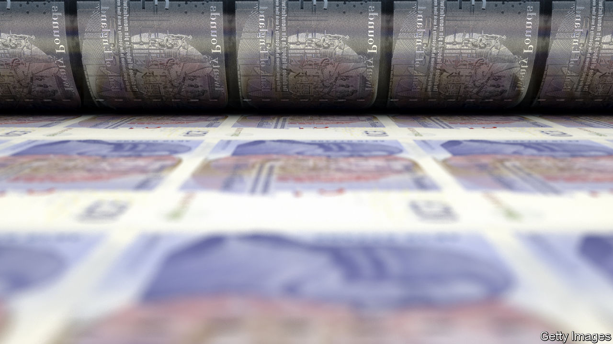

## Deficit finance

# Why the Bank of England is directly financing the deficit

> The Bank is doing what it hates, but what needs to be done

> Apr 18th 2020

Editor’s note: The Economist is making some of its most important coverage of the covid-19 pandemic freely available to readers of The Economist Today, our daily newsletter. To receive it, register [here](https://www.economist.com//newslettersignup). For our coronavirus tracker and more coverage, see our [hub](https://www.economist.com//coronavirus)

MONETARY FINANCING is a modern term for one of the oldest taboos for central banks: printing money to fund government spending. On April 5th Andrew Bailey, governor of the Bank of England, insisted in the Financial Times that the bank would not directly fund the government since such action would damage its credibility. Four days later the bank announced that some monetary financing would in fact take place via an expansion of the so-called Ways and Means facility.

Mr Bailey had described the facility, which is as old as the bank itself, as a “historical feature”. It is a bit like an overdraft. The bank will create new money and transfer it to the government, which will later, it says, borrow in financial markets to pay the balance down. During the global financial crisis of 2007-09 some £20bn ($25bn) of borrowing was funded this way.

Monetary financing, with its echoes of Zimbabwe and Weimar Germany, raises fears that investors will lose confidence in a central bank seen to be under the thumb of a finance ministry—hence Mr Bailey’s earlier caution. But modest use of the Ways and Means facility is not likely to lead to inflation, let alone hyperinflation.

The bank’s actions so far look like sensible support for the government in exceptional circumstances. Tax receipts are plummeting just as spending is rising to cushion the economic impact of covid-19. The Office for Budget Responsibility, a watchdog, reckons this year’s deficit could reach 14% of GDP. Even with its new line of credit from the bank the government plans to issue £45bn of gilts in April alone, well above the previous monthly peak of £28bn in September 2009. The overdraft at the bank allows the government to smooth its borrowing in markets over a longer period, rather than risk investors choking on the sudden surge in its debt.

Mr Bailey’s volte-face is unlikely to do him much harm. During a crisis “being right is more important than being consistent,” argues a fund manager. Gilt investors are relaxed about the temporary use of the facility and confident about the bank’s independence; government bond yields barely budged on the news. Mr Bailey can afford to relax a little, too.

Dig deeper:For our latest coverage of the covid-19 pandemic, register for The Economist Today, our daily [newsletter](https://www.economist.com//newslettersignup), or visit our [coronavirus tracker and story hub](https://www.economist.com//coronavirus)