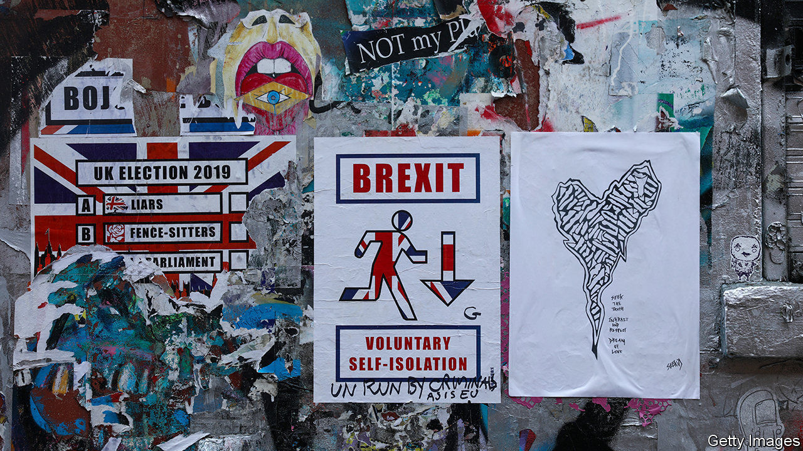
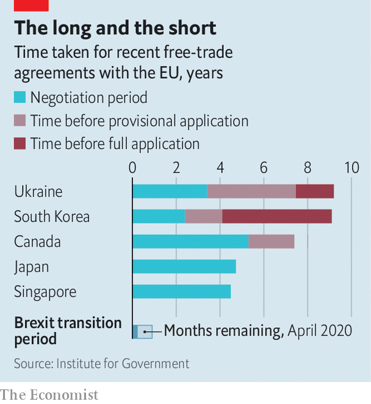

## Brexit negotiations

# Why the government will not ask for a Brexit extension

> Despite widespread support for an extension to the transition period, the government insists it will not ask for one

> Apr 18th 2020

Editor’s note: The Economist is making some of its most important coverage of the covid-19 pandemic freely available to readers of The Economist Today, our daily newsletter. To receive it, register [here](https://www.economist.com//newslettersignup). For our coronavirus tracker and more coverage, see our [hub](https://www.economist.com//coronavirus)

ON APRIL 15th the Brexit negotiators, Michel Barnier for the European Union and David Frost for Britain, resumed their talks by video. They agreed that both teams should now restart online negotiations, after two months with little contact. Yet few diplomats expect the process to narrow the wide gaps between the two sides.

That makes the end-December deadline for a trade deal more problematic. When a transition period was first proposed, it was due to last for 21 months. Little more than six months are now left to strike a deal, which experience suggests is too short a period both to negotiate and to ratify one (see chart). Covid-19 has already led to the postponement of much else, from the Olympics to the COP26 climate summit. So why not use the clause in the Brexit withdrawal treaty providing that, before end-June, the deadline can be extended by mutual agreement for up to one or two years?

Officials on both sides now think this would be sensible, given the likely economic damage, on top of that from covid-19, of a December departure with no trade deal. Opinion polls suggest that a clear majority of voters would accept an extension. But the government insists that it will not ask for one.

The objections are purely political. When it comes to Brexit, Boris Johnson’s team are allergic to missed deadlines. They link them to Theresa May and the former parliament. The point of winning a big majority in December was to avoid being trapped by fears of no deal into endless rounds of negotiation on the EU’s terms.

Many Brexiteers also see transition as a form of vassalhood, because it entails observing almost all EU rules without a say—and paying for the privilege. Any extension beyond December 2020 could require further British contributions to the EU budget of up to £800m ($1bn) a month. Another 12 months of talks might not be long enough to produce an agreement, because of both sides’ entrenched positions. As for the costs of walking away with no trade deal, Brexiteers think they are exaggerated—and might anyway be swamped by the consequences of covid-19.

Meanwhile staying in the EU single market and customs union into 2021 would preclude early trade deals with America and others, as well as prolonging EU regulations in Britain. Some point to renewed strains in the euro zone as an additional reason for getting clear of it. That those calling for extension are mostly Remainers who are still questioning Mr Johnson’s choice of the hardest possible Brexit reinforces many Leavers’ doubts about any deadline extension.

Is there a way through? Mujtaba Rahman of the Eurasia Group, a consultancy, expects an extension as his base forecast, on the grounds that the mood among politicians may have changed by June. He suggests that the EU could facilitate the process by making clear that an extension of, say, 12 months, could be curtailed if a deal were reached in early 2021.

Another idea would be to fudge the question of who has to call for an extension. The EU has said it would welcome one, but it has also made clear that it is up to the British government to propose it. To ward off the risk of an impasse, Georgina Wright of the Institute for Government, a think-tank, suggests that the joint committee overseeing Brexit could, at its meeting in early June, quietly agree to suggest an extension, without either side being seen to have been the demandeur.

More flexibility in Brussels might indeed help. Yet the chances of the British government being ready to accept an extension even in June still look small. And sadly, the let-out of waiting until November or December may not be available. The provision in the withdrawal treaty will expire in June. Thereafter any extension would require an entirely new treaty, which might have to be ratified by all EU parliaments, a tortuous process at best. It looks like end-June or bust—and, for now, bust is as likely an outcome as any. ■

Dig deeper:For our latest coverage of the covid-19 pandemic, register for The Economist Today, our daily [newsletter](https://www.economist.com//newslettersignup), or visit our [coronavirus tracker and story hub](https://www.economist.com//coronavirus)

## URL

https://www.economist.com/britain/2020/04/18/why-the-government-will-not-ask-for-a-brexit-extension
