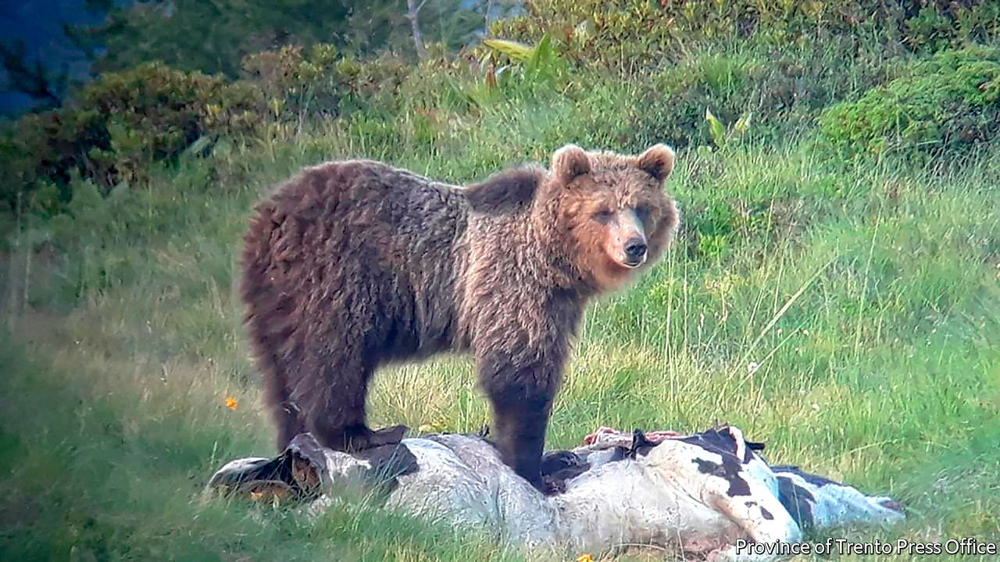

## Wildlife in Italy

# Covid-19 has emboldened Italy’s fauna

> A pilfering bear named after a convict isn’t welcome, though

> Apr 16th 2020FLORENCE

Editor’s note: The Economist is making some of its most important coverage of the covid-19 pandemic freely available to readers of The Economist Today, our daily newsletter. To receive it, register [here](https://www.economist.com//newslettersignup). For our coronavirus tracker and more coverage, see our [hub](https://www.economist.com//coronavirus)

A WOLF SLINKS out of a park in Sesto Fiorentino, an industrial centre near Florence. Goslings waddle behind their mothers along deserted thoroughfares in Treviso. Fallow deer invade a golf course on Sardinia and take a dip in the clubhouse swimming pool. As Italians entered the sixth week of Europe’s longest covid-19 lockdown on April 13th, one thing they had to cheer them up was the sight of animals in spaces that humankind had temporarily abandoned.

At Cagliari on Sardinia, bottlenose dolphins have long been known to wait at the mouth of the port to play in the wake of departing motor vessels. But since the lockdown some have entered right into the port, where they have been filmed swimming up and down under a quay, looking at the humans above. A similar phenomenon has been observed at Trieste. “A non-scientist might speculate that the dolphins are thinking: ‘Why aren’t you moving around in your boats any longer?’” says Giuseppe Bogliani, formerly a University of Pavia professor.

Mr Bogliani cautions against assuming that nature is reclaiming its own. Some mammals, like foxes, may have been in the cities already, prowling undetected at night. A golden eagle spotted gliding above a main road in Milan posed a different question: “Is it there because of the lockdown, or did we just see it because of the lockdown?”

Not all reappearances have been welcomed. Residents in Alpine areas of the province of Trento have been advised not only to stay at home, but to refrain from leaving out rubbish that might attract Italy’s most wanted animal, a brown bear known to scientists as M49 and to the public as “Papillon” (because of his escape last year over three electrified fences). Papillon is nicknamed after Henri Charrière, the only man to escape from the French penal colony on Devil’s Island. Like the late Mr Charrière, the bear has a substantial criminal record. It includes breaking and entering (Alpine cottages and refuges) and attacks on cattle. Last year the government of Trento issued an order for Papillon’s capture. He has now been spotted heading for Veneto, which has not (yet) issued a warrant. Smart bear.

Dig deeper:For our latest coverage of the covid-19 pandemic, register for The Economist Today, our daily [newsletter](https://www.economist.com//newslettersignup), or visit our [coronavirus tracker and story hub](https://www.economist.com//coronavirus)