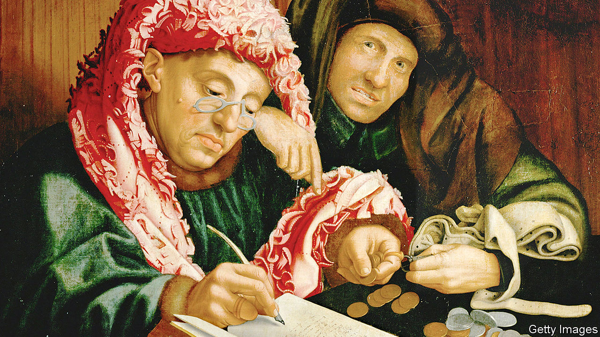

## A euro row

# The Dutch grumble over Europe's coronavirus cheque

> The rest of the euro zone is getting fed up

> Apr 18th 2020AMSTERDAM

Editor’s note: The Economist is making some of its most important coverage of the covid-19 pandemic freely available to readers of The Economist Today, our daily newsletter. To receive it, register [here](https://www.economist.com//newslettersignup). For our coronavirus tracker and more coverage, see our [hub](https://www.economist.com//coronavirus)

THE DUTCH Golden Age fell apart in 1672, when surrounding powers—England, France and a pair of German principalities—teamed up to sack the Netherlands and seize its colonies. Ever since, the small country’s diplomats have made it a principle never to become isolated against a united European front. Yet as the Eurogroup (the finance ministers of the 19 countries that use the euro) planned their response to covid-19 this month, the Netherlands found itself alone. For 36 hours the thrifty Dutch were the sole holdouts against a deal to help afflicted countries tackle recession.

On April 9th, after two teleconferences, the Eurogroup compromised. There will be a €200bn ($215bn) European Investment Bank programme and a €100bn fund from which governments can borrow to support unemployment benefits and salaries. For medical expenses, countries can unconditionally borrow up to 2% of their GDP from the European Stability Mechanism (ESM), an emergency fund set up during the euro crisis of 2010-12. But the Dutch refusal to go further has made lots of Europeans angry.

The target of their ire is the blunt-spoken finance minister, Wopke Hoekstra. Before the negotiations, he sententiously chided southern Europe for failing to cut deficits to prepare for a downturn, as the Netherlands had. (In fact, Italy’s spending cuts were comparable to the Netherlands’, but the Dutch economy grew faster.) In the Eurogroup meeting he rejected a proposal by nine countries, including France, Italy and Spain, to issue collective euro-zone debt (eurobonds, or in this case “coronabonds”). In this he was joined by Austria, Finland and Germany. But on the ESM he stood alone, insisting that countries that tapped it for non-medical spending had to agree to economic reforms.

Italy and Portugal were incensed. Both have national debts of well over 100% of GDP, and neither wants its budget picked apart in the midst of a pandemic. Before the negotiations, Portugal’s prime minister called Mr Hoekstra’s criticism “disgusting”. Afterwards, he wondered whether it would be possible for the euro zone to continue with all 19 members (“and I am talking about the Netherlands”).

Yet while Mr Hoekstra was criticised abroad, he was lauded at home. The Dutch, like the Germans, have a cultural aversion to debt, especially when shared with those they do not trust. Mr Hoekstra told a parliamentary committee that eurobonds are unacceptable because the European Union “has no central authority that can force countries to reform”. The euro crisis reinforced the Dutch conviction that credit without conditions is not solidarity but irresponsibility.

Cynics note that the Netherlands faces elections next year, and that Mr Hoekstra will be vying for the leadership of his Christian Democratic party as well as competing against the Liberal prime minister, Mark Rutte. Both parties must fend off challenges from Eurosceptic outfits. Yet Mr Hoekstra’s stance is popular because it reflects beliefs he shares with most Dutch voters. “Dutch foreign policy is often deeply moralising: because we are wealthy we know the truth, and we are going to tell you how to reform,” says Rem Korteweg of the Clingendael Institute, a Dutch think-tank.

Olaf Scholz, Germany’s finance minister, may be secretly grateful for Mr Hoekstra’s stubbornness, which allows him to play the role of peacemaker. But as the response to covid-19 evolves, other forms of collective spending will be on the table, notably at a videoconference of EU leaders on April 23rd. Self-righteousness is not winning the Netherlands many friends. ■

Dig deeper:For our latest coverage of the covid-19 pandemic, register for The Economist Today, our daily [newsletter](https://www.economist.com//newslettersignup), or visit our [coronavirus tracker and story hub](https://www.economist.com//coronavirus)