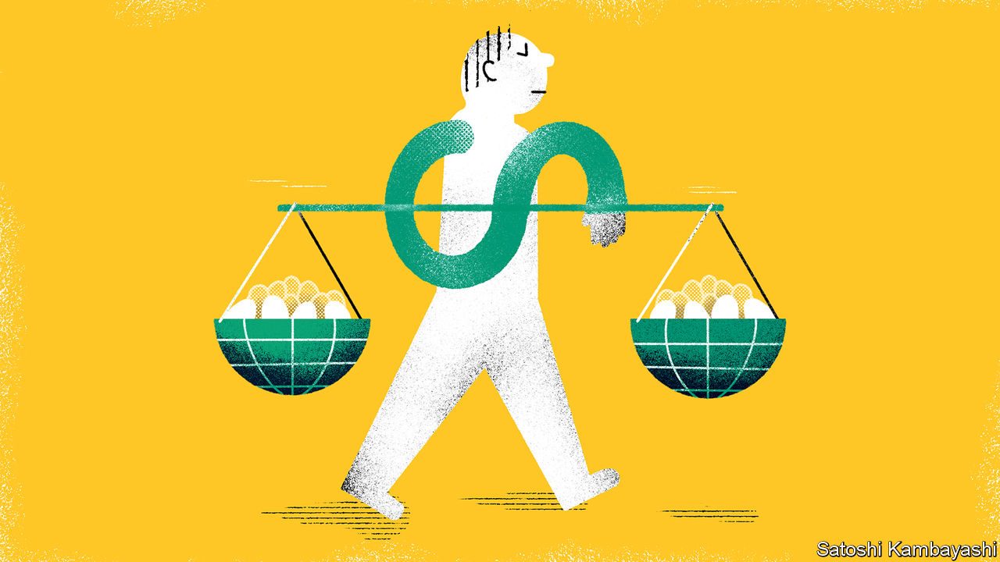

## Buttonwood

# The case for emerging-market stocks

> The ideal diversifier is something that contrasts with what you own

> Apr 18th 2020

Editor’s note: The Economist is making some of its most important coverage of the covid-19 pandemic freely available to readers of The Economist Today, our daily newsletter. To receive it, register [here](https://www.economist.com//newslettersignup). For our coronavirus tracker and more coverage, see our [hub](https://www.economist.com//coronavirus)

YOU KNOW by now, if you’ve been paying attention, that the coronavirus pandemic is, if not a turning point in history, then the midwife to profound change or, at the very least, an opportunity for a bit of a rethink. Everything has changed—except, perhaps, minds. Those who expected China (or the European Union or shareholder capitalism) to blow up are now more convinced it will. Believers in globalisation’s retreat, or inflation’s comeback, have fewer doubts.

And if you were chary of emerging markets you might be more so now. In March, when there was a mad scramble for cash, the cash everyone wanted was dollars. When the dollar gets bid up, it hurts emerging markets. If inflation returns, meanwhile, it will surely show up first in the developing world.

Yet if these vices seem more apparent, so does the virtue of diversification. The ideal diversifier is not just something other than what you own, but something that contrasts with it. The typical portfolio is rich in dollar assets—in Treasuries and the leading American shares. It needs a counterweight, an anti-dollar trade. A benchmark basket of emerging-market stocks is a good one.

It helps that such stocks are cheap. Valuations based on company earnings are often misleading at the start of recessions. Recent earnings figures flatter the appraisal; forward-looking estimates of profits take time to reflect grim reality. A way around this is to use a measure that takes in company profits over the cycle: the CAPE (cyclically adjusted price-earnings ratio) popularised by Robert Shiller of Yale University. A snapshot taken at recent market lows by James Montier of GMO, an asset-management firm, shows a healthy margin of safety. Emerging-market shares look very cheap relative to both their history and to America’s S&P 500 index of shares.

Rich-world investors must also consider exchange-rate risk. Forecasting currencies is a mug’s game. Even so, a shrewd investor should at least check she is not buying a currency that is obviously riding high, and thus at greater risk of a dramatic fall. A broad analysis by Charles Robertson of Renaissance Capital, an investment bank, finds that after recent declines, emerging-market currencies are as cheap in real terms as they have been since the mid-2000s.

Should inflation pick up faster in the developing world than in the rich one, the reckoning would change. Currencies would then need to fall further in nominal terms to keep the exchange rate steady in real terms, so that exports stay competitive. Emerging-market economies tend to be more inflation-prone than richer ones. Because of that, central banks have generally been vigilant. A weaker currency has been typically met with higher interest rates to counter imported inflation—even if that hurts an already weak economy. But a lot of central banks in the developing world have relaxed monetary policy recently—understandable, given the severity of the economic shock.

For some countries, though, the dangers of inflation are not great. These more closely resemble rich-world economies, where a weak currency leads to a temporary burst of inflation. The wealthier parts of Asia are like this. But in other places inflation sticks around if not stomped upon. That tends to be because wages are indexed to prices; industry is somewhat cartelised; or trust in the currency is low, encouraging the local use of the dollar. Parts of Latin America come to mind. So does Turkey. Indeed the options a country has when its currency falls define its status, says Eric Lonergan of M&G, a fund-management group. If it must raise interest rates to counter inflation, it is an emerging market; if it has the room to cut rates without fear, it is developed.

Definitions matter, of course. Part of the appeal of indices of emerging-market stocks is that they are dominated by Asian economies that are fairly rich and well-run. They count as emerging markets, because the buying and selling of financial assets is not quite frictionless. Taiwan and South Korea together make up a quarter of the MSCI index. China accounts for a further third. All may prove quite resilient as the world emerges from lockdown. At the very least, the way they perform is likely to be different from rich-world economies.

That feature alone should be appealing to a certain kind of investor. If the world is indeed changed radically by this health crisis, it may be in ways that are hard to imagine today. And if you are unsure of the future, it makes all the more sense to spread your bets.

Dig deeper:For our latest coverage of the covid-19 pandemic, register for The Economist Today, our daily [newsletter](https://www.economist.com//newslettersignup), or visit our [coronavirus tracker and story hub](https://www.economist.com//coronavirus)