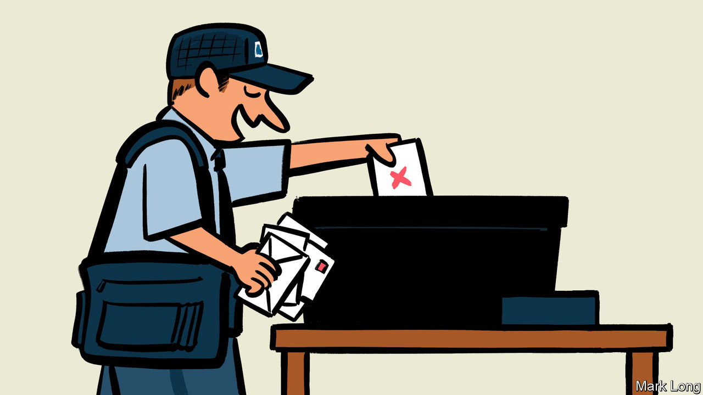

## Two myths

# America should prepare now for voting by mail in November’s election

> Opposition to absentee voting is based on a pair of misconceptions

> Apr 18th 2020

ONE OF Donald Trump’s special talents is to hold every conceivable position on a given subject at the same time. So it is with voting by mail in American elections. The president used a postal ballot to vote in Florida’s Republican primary last month. He has also denounced postal voting as an invitation to fraud. He has said voting by mail “doesn’t work out well for Republicans”. And he has said that postal voting should be expanded for older voters and for members of the armed forces, two groups he assumes would favour him in November.

The president’s interventions have turned something that should be uncontroversial into yet another excuse for partisan warfare. America has a presidential election this year. It also has thousands of congressional, state, county and mayoral elections. As the country with the most recorded cases of covid-19, it needs to start planning in case voters cannot get to polling stations. There is only one practical way to hold elections under these circumstances: to expand the use of voting by mail.

This ought not to be hard. All states let ill or absent voters post their ballots. Five states already allow everyone to post their vote in any election. A further 16 states allow it for some elections or in some remote counties where getting to a polling station requires a long drive. These states have accumulated experience that others can learn from, in particular when it comes to reducing the opportunities for voting fraud that can come with mail-in elections.

In 2018 a Republican strategist in North Carolina allegedly collected and spoiled absentee ballots, which led to a re-run of a congressional election. Back in 1998, 18 people were arrested over a scam involving postal votes in Miami’s mayoral election. Such incidents are serious but exceptionally rare. Between 2000 and 2012, a period in which billions of votes were cast, America saw 491 cases of absentee-voting fraud. During that same period 497 Americans were killed by lightning. In Britain, where anyone can request a postal vote, the electoral commission has warned of the possibility of electoral fraud, though it has not recently found much evidence of it actually taking place.

If Americans had to choose between a slightly increased risk of electoral fraud or cancelling the elections altogether, it would be a straightforward decision. But they don’t. States such as Oregon and Colorado, which allow everyone to vote by mail in every election, have developed sophisticated techniques, which make fraud even more unlikely.

In Colorado, for example, voters can track their ballots through each stage of the electoral process, opting to receive a text message when their ballot is mailed, when it is returned, and when it has been counted. Oregon reckons that it has dispatched 100m postal ballots since 2000, and seen fewer than a dozen cases of electoral fraud.

The second argument against postal voting—that it is supposedly better for Democrats—ought not to matter. Both parties should want as many people as possible to participate in their democracy. Politically, though, it does—because if Republicans think that voting by mail will disadvantage them, they will block federal efforts to fund it, or state-level initiatives to introduce it.

Fortunately the suspicion that postal voting is a Democratic plot is unfounded, too. The most comprehensive recent study of the political effects of introducing voting by mail, which comes from academics at Stanford, compared results from elections as absentee voting was rolled out across the states that now use it, between 1996 and 2018. It found that the reform increased turnout but did not benefit either party disproportionately.

How to hold an election in less than seven months’ time might not seem like a pressing problem when there is so much else going on. Yet election officials from states that already know how to run socially distanced elections warn that it takes time to build the systems needed to make voting by mail secure, and to train people to use them. If America wants to be certain of carrying out a proper national election in November the time to start preparing is not October. It is now.■ 

Dig deeper: