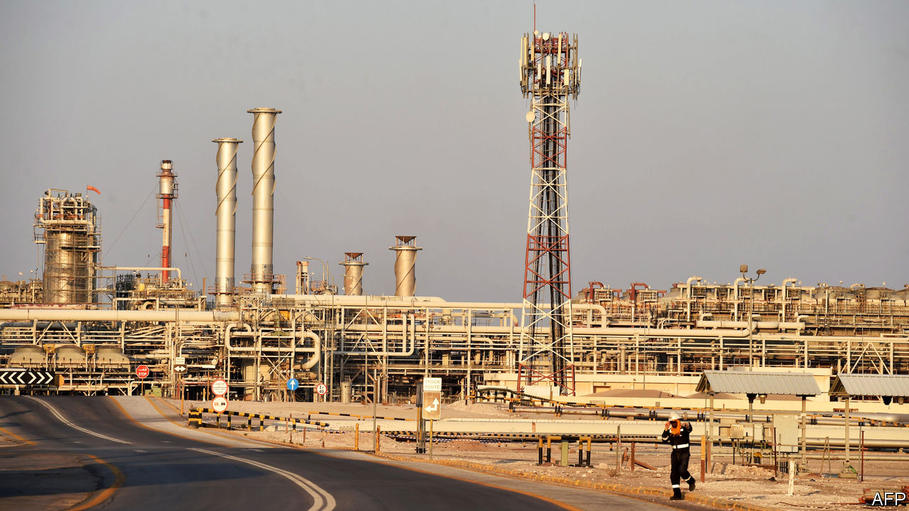
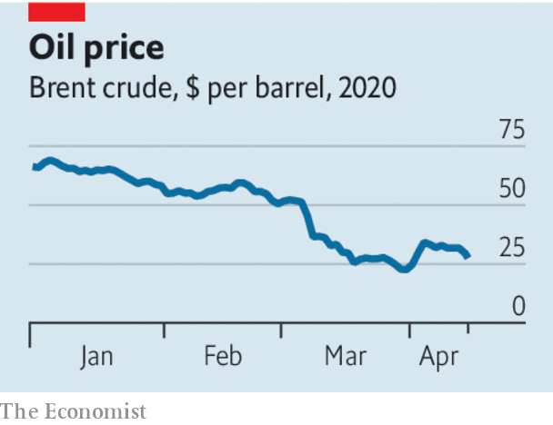

## The OPEC oil deal

# The future of the oil industry

> The oil slump is a glimpse of what is to come

> Apr 18th 2020

OIL, IT HAS been said, is the blood coursing through the veins of the world economy. In 2020 the economy is bleeding red. As covid-19 keeps workers at home and planes on the ground, demand for oil has fallen faster and further than at any point in its history. Amplifying the shock, a furious row between Saudi Arabia and Russia set off a price war in early March. Last month oil prices fell by more than half, leaving a giant industry reeling.

On April 12th the world’s energy superpowers broke bread and reached a new deal to try to prop up prices. The Organisation of the Petroleum Exporting Countries (OPEC) and its allies, including Russia, said they would slash production by 9.7m barrels a day from May to the end of June, a record, and restrain output for two years. In the 20th century Uncle Sam was keen to undermine OPEC, but in 2018 America became the biggest oil producer, ahead of Saudi Arabia and Russia. President Donald Trump’s re-election depends on the shale states of Texas, Pennsylvania and Ohio. He argued for the pact and said the industry would recover “far faster” than expected.

In fact private oil firms, state-controlled companies and countries that rely on energy exports should brace themselves for a long period of pain, and use the crisis to begin the restructuring that will have to take place if the planet is to deal with climate change.

This week’s grand bargain is unlikely to work. For a start the sums don’t add up. Global demand may fall by 29m barrels a day this month, three times the OPEC deal’s promised cuts. Private firms outside the alliance may reduce output, too, but by how much is uncertain. And no one knows when demand will pick up. Oil stockpiles are rising and storage capacity could be exhausted within weeks.

The alliance is shaky. Russia, the world’s second-biggest producer, has worked with OPEC since 2016 but routinely ignored the terms of deals. It is unlikely that America will permanently join OPEC in creating a new energy order. The new pact involves assurances that output will fall in America but Texan frackers respond to price signals and the profit motive, not government quotas. The deal almost fell apart when Mexico refused Saudi Arabia’s terms, illustrating how one country can prompt an unravelling. And Saudi Arabia continues to offer deep discounts on crude bound for Asia, a sign of its eagerness to defend its powerful position in oil’s most important market.

A last reason for scepticism is that the covid-19 crisis could further dampen long-term oil demand. Hundreds of millions of people are living through an experiment with home-working, fewer flights and less urban pollution. This could help change public opinion about the desirability of a faster shift from an economy built on fossil fuels.

Rather than stability, then, oil producers face volatile demand and production. Iran and Venezuela, already squeezed by American sanctions, will see more unrest. Countries with high costs and poor governance, such as Nigeria and Angola, face capital flight and balance-of-payments crises. Last year bankruptcies among American oil producers jumped by 50%. In 2020 that figure will soar.

Beyond this year a deeper adjustment awaits. Volatility will dampen investors’ appetite for new projects. Oil companies have already slashed capital spending by about 25% this year. Some pricey oil will be left underground for good. Shale’s frenetic growth will abate. Big oil exporters, including Saudi Arabia, will have to cut public spending and diversify.

For years the oil industry has faced the possibility that demand might fall, as governments moved to limit climate change. That threatened to heap chaos on oil producers, as capital dried up and companies battled for their share of a dwindling market. A peak in demand may still be years away. But oil producers should see covid-19’s turmoil for what it is: not an aberration, but a sign of what is to come.■

Sign up to our fortnightly climate-change newsletter [here](https://www.economist.com//theclimateissue/)