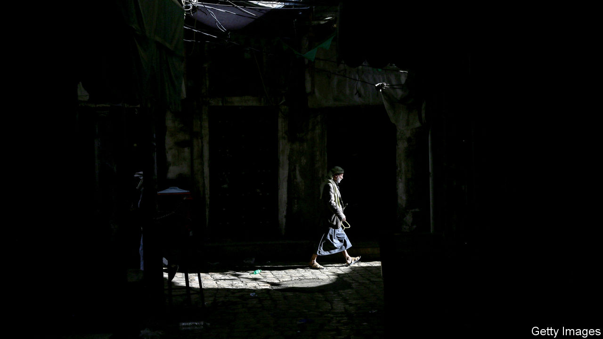
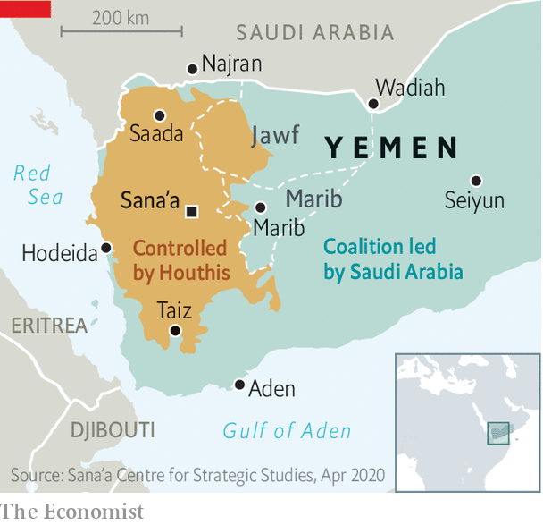

## The kingdom’s quagmire

# Saudi Arabia looks for an exit to the war in Yemen

> But after years of fighting, the Houthi rebels have the upper hand

> Apr 18th 2020

RARELY HAS Saudi Arabia sounded so magnanimous. For five years it has been fighting the Houthis, a group of Shia rebels in Yemen, on behalf of the government they toppled. The war has devastated Yemen’s infrastructure and killed more than 100,000 people. But on April 8th Saudi Arabia and its allies promised to lay down their arms for two weeks. The reason for the ceasefire, said a Saudi official, was “to alleviate the suffering of the brotherly Yemeni people and maintain their health and safety”. Two days later Yemen, the region’s poorest country, announced its first confirmed case of covid-19.

Cynics doubt that compassion is truly motivating Saudi Arabia, a majority Sunni nation. For years its bombs have hit hospitals, houses and schools in Yemen—often, it seemed, on purpose. Rather, the war is turning and the Saudis are losing heart.

Despite its vicious air campaign, Saudi Arabia has been unable to dislodge the Houthis from most of Yemen’s population centres, including the capital, Sana’a (see map). Its main international ally, the United Arab Emirates, began scaling back its involvement in the war last year. The Saudis themselves are bombing less: their air strikes are down by more than 90% compared with 2015. In recent months they have held secret talks with the Houthis. Gone is the hope of returning Abd Rabbo Mansour Hadi, the exiled Yemeni president, to Sana’a. Now the kingdom’s goal is to stop Houthi missile strikes on its own territory. “The Saudis want a way out and are using the coronavirus as a figleaf,” says Abdulghani al-Iryani, a Yemeni analyst.

The Saudi intervention began as a vanity project for Muhammad bin Salman, the crown prince, who sought to flex his muscles in the face of rival Iran. But the Houthis stood tough and Shia Iran, sensing an opportunity, increased its support for the rebels. Prince Muhammad is now looking at a quagmire that is diverting resources at a time of plummeting oil revenues. Houthi attacks on the kingdom threaten its reputation for stability. Their missiles have struck oil pipelines and targeted the capital, Riyadh. Saudi Arabia does not want anything to upset its hosting of the G20 summit in November. So Prince Muhammad hopes to disengage and lock the Houthis inside Yemen, much as Israel does with Hamas, a Palestinian militant group, in Gaza.

But the Houthis sense Prince Muhammad’s desperation and want a better deal. They rejected the ceasefire, while putting forward their own peace plan. It demands that Saudi Arabia lift its air and sea blockade of Yemen, pay reparations for the damage it has caused (as well as ten years of government salaries) and recognise the Houthis as the legitimate government. If the Saudis do not agree, the Houthis promise “a major escalation inside the kingdom”. Analysts think they are planning a ground assault on Najran, a city in southern Saudi Arabia with a largely Shia population (albeit of a different strain from that of the Houthis).

The Houthis are already pushing deeper into the Yemeni provinces on the border with Saudi Arabia. They have made gains in Jawf and are fighting in the crags above Marib, an oil-and-gas hub. Control of Marib would not only hand the Houthis valuable resources; it would also make it harder for the government and allied tribes to wage war. Government-aligned forces use bases in Marib city to launch air and ground attacks in the north. The city sits on a road linking Saudi Arabia to the Indian Ocean and its anti-Houthi allies in the south. Marib would bring the Houthis closer to the main Saudi crossing at Wadiah, the airport in Seiyun and the border with Oman.

Mr Hadi has had to move some of his ragtag army from the north to deal with separatists and jihadists in the south. That leaves Marib largely in the hands of Sunni tribes that support Islah, an Islamist movement. Many fiercely oppose the Houthis, fearing they will try to revive the country’s ancient Shia imamate. But they also worry that Prince Muhammad might soon withdraw. Some therefore think that they should follow the lead of the tribesmen in Jawf who negotiated with the Houthis and helped them push into the province.

Hanging over all of this is the threat of covid-19. The war has knocked out half of Yemen’s clinics and hospitals. Over three-quarters of its 28m people need some kind of humanitarian aid. An outbreak of cholera last year was one of the world’s worst, says the UN. An outbreak of covid-19 could be even deadlier. ■

## URL

https://www.economist.com/middle-east-and-africa/2020/04/18/saudi-arabia-looks-for-an-exit-to-the-war-in-yemen
