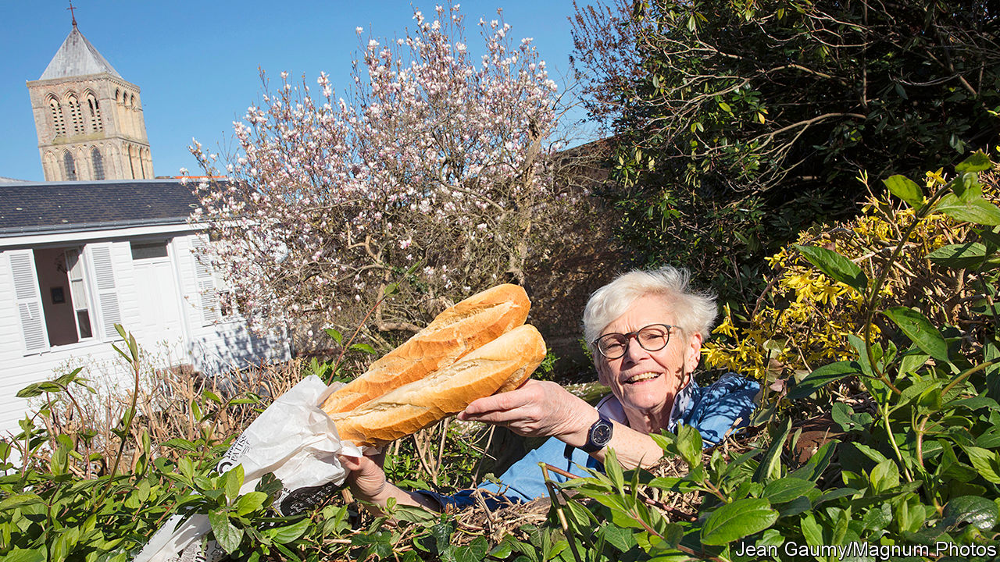

## Combating loneliness

# Acts of kindness prevent a downward spiral from solitude to loneliness

> To be alone and to be lonely are not the same thing

> Apr 18th 2020

LONELINESS IS BAD for your health—certainly as bad as being obese, and possibly as bad as being a moderate smoker. So, in these days of plague, when enforced solitude is the order of the day in many places, how to stop solitude turning into loneliness is a pressing medical question.

One part of the answer is to try to understand the physiology of the change. And that has, for the past few years, been the objective of Steven Cole of the University of California, Los Angeles. Dr Cole began his work with a study he published in 2015, in collaboration with John Cacioppo of the University of Chicago. The pair led a team of psychologists, neuroscientists and immunologists who found that the pattern in people’s blood of immune cells called myeloid cells is notably different in those who score as “very lonely” on loneliness tests compared with those who do not.

Lonely people have unusually low numbers of a type of myeloid cell that generates what are known as interferon responses, which hamper viral replication. This makes them particularly vulnerable to viral infections. They also have an abundance of a second type of myeloid cell, one that promotes the activity of genes which drive inflammation—and it has been known for years that those who feel lonely experience more inflammation than those who do not.

These correlations are intriguing, but do not explain which comes first, the loneliness or the myeloid response. Dr Cole and Dr Cacioppo addressed that question by repeatedly measuring perceptions of social isolation in individual volunteers, while simultaneously tracking, from blood samples, their gene-expression patterns and other changes in their physiology. They found that, initially, volunteers’ feelings of isolation coincided with an increase in their inflammation genes’ activity and a concomitant increase in the circulation of immature immune cells, called monocytes, that are involved in inflammation—and which are also known to travel into the brain and promote anxiety. They noted, too, increased levels in the brain of signalling molecules associated with both inflammation and behaviours such as social withdrawal, feelings of suspicion towards the outside world and a tendency to act more defensively by making decisions that involve few risks. That, of course, promotes further feelings of loneliness. Which, in turn, trigger a further myeloid response. And so on.

It seems, therefore, that though loneliness starts with solitude, it can quickly take on a physiological life of its own. Dr Cole thus worries that the enforced isolation, brought about by current circumstances, of those who are already living alone may create in many people a state of chronic loneliness that is difficult to escape from when things start returning to normal.

Dealing with this will not be a simple matter of allowing people to socialise once again. Because the myeloid feedback loop makes those affected more defensive and suspicious, the mere presence of others is not enough to restore the status quo. Something else is needed, too.

In search of that something Dr Cole carried out—this time in collaboration with Sonja Lyubomirsky, a psychologist at the University of California, Riverside—a series of experiments that encouraged healthy people to direct simple acts of kindness towards their fellow creatures: things like running an errand for an elderly neighbour or helping a colleague with a computer problem. Participants had their blood drawn in order to examine their myeloid responses. Those directed to show kindness to others on a weekly basis had precisely the opposite gene-expression activity to that previously seen in the lonely by Dr Cole and Dr Cacioppo.

Dr Lyubomirsky now picked up the baton. In collaboration with Dr Cole and with Megan Fritz, a colleague at Riverside, she repeated the study, but with a twist. Instead of looking only at participants’ myeloid responses, she also asked them specific questions about loneliness.

As she and her colleagues reported to this year’s conference of the Society for Personality and Social Psychology, held in New Orleans in February, they found that in the case of loneliness, the saying about it being more blessed to give than to receive is true. Asking lonely people to perform acts of kindness to others significantly reduced the offerer’s feelings of loneliness, as well as the myeloid response that drives inflammation. Also, and perhaps portentously given the meeting’s timing, Dr Fritz and Dr Lyubomirsky reported the preliminary results of a second study. This compared the effect on a lonely person’s feelings of acts of kindness he or she performed face to face with those performed online: donating money to a gofundme effort, for example, or writing a thank-you note to a friend.

The study’s results suggest that online kindness has the same beneficial effect as the face-to-face variety. And that could help to address Dr Cole’s fears of a post-covid loneliness epidemic. No doubt (though this was beyond the scope of these studies) merely having contact with others while staying in isolation is beneficial to those at risk of loneliness. But asking lonely people to use those means to commit random acts of kindness to others might go beyond this, and be just what the doctor ordered.■

## URL

https://www.economist.com/science-and-technology/2020/04/18/acts-of-kindness-prevent-a-downward-spiral-from-solitude-to-loneliness
