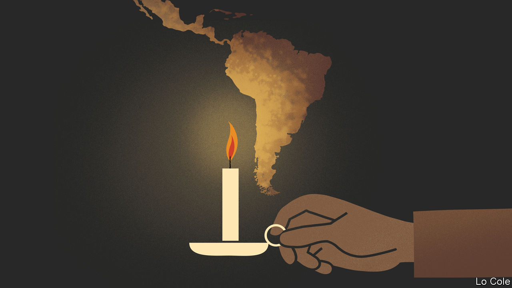

## Bello

# The flickering light of liberalism in Latin America

> Do liberal ideas suffer in the region because they are imported?

> Apr 16th 2020

IN “THE LIGHT THAT FAILED”, an influential recent book, Ivan Krastev, a Bulgarian political thinker, and Stephen Holmes, an American law professor, argue that the rise of populist nationalisms in central and eastern Europe is in large part due to frustration with the way that liberalism was foisted on these countries after the fall of the Berlin Wall in 1989. The practice of copying a foreign model, presented to citizens as if there were no alternative, is a humiliating one that denies national traditions and identities, they write. For Latin America their argument raises an interesting question. It, too, formed part of the global wave of democratisation in the 1980s and 1990s, and it, too, has seen a recent resurgence of populist nationalisms. So are the troubles of liberalism in Latin America down to it being a foreign import, with few local roots?

The answer must start with liberalism’s long history in Latin America, a region that has seen waves of copying of foreign ideas and of their rejection. It achieved political independence two centuries ago under the twin inspirations of the European enlightenment and the constitutionalism and republican values of the fledgling United States. But those Latin American founders who set out to build nations, ravaged by the independence wars, on liberal principles quickly ran into crude local realities of power and social and racial inequality. They yielded to caudillos (strongmen, often military), who embodied “the will of the popular masses”, according to Juan Bautista Alberdi, an Argentine political theorist.

Liberalism came into its own in the region from the mid-19th century until the 1930s. Civilian governments, albeit often elected fraudulently, became the norm. They suppressed church privileges and opened economies to the world. Yet then Latin American liberalism lost its way. It partly morphed into positivism, which exalted science but denigrated freedom, while industrialisation posed new challenges. The region’s new mass societies became more interested in social than political or civil rights. Leaders and intellectuals embarked on a search for “authentic” national formulae incorporating indigenous cultures. For Mexico, European liberalism was “a philosophy whose beauty was exact, sterile and in the long run empty”, complained Octavio Paz, a poet and thinker, in 1950.

The desire for national authenticity reached its apogee with the Cuban revolution of 1959. Fidel Castro, its leader, claimed to be at war against American imperialism in the name of egalitarian national liberation. In fact, to stay in power he became the biggest copycat of all, slavishly imitating the Soviet Union. His disciples elsewhere were opposed by military dictators of the right.

Despairing scholars began to argue that Latin America’s Catholic, corporatist heritage made it impervious to liberalism. Yet the failure of dictatorships, nationalists and Castroism brought liberals (who by then included Paz) back in, with democratisation and pro-market economic reforms from the 1980s. The liberal achievement has been mixed, and politically fragile. Electoral democracy and constitutional rule have generally held up. But the separation of powers is often more notional than real. Liberalism’s opponents on the left have damned its economic recipes, often called the “Washington consensus”, as an alien import, even as many have continued to follow them.

Contemporary Latin American liberalism suffers from two weaknesses. It has failed to shed the damning characterisation that it is heartless “neoliberalism”. In part that is because some who call themselves “liberals” in Latin America (and Iberia) are in fact conservatives, who oppose efforts to reduce unacceptable inequalities from which they benefit. Second, genuine liberalism tends to be the preserve of an upper-middle-class elite, with degrees from foreign universities. They have failed to produce a new generation of effective leaders to replace those who steered democratisation.

Yet it is liberalism that is best placed to provide many of the things that Latin Americans want: justice systems that check the powerful; equality of opportunity; the public good rather than the protection of private privilege; better public services at an affordable fiscal cost; the defence of minority rights and tolerance in the face of renewed religious bigotry; and science rather than ideological quackery. Covid-19 makes all these things more urgent. This should be Latin American liberalism’s hour.

## URL

https://www.economist.com/the-americas/2020/04/16/the-flickering-light-of-liberalism-in-latin-america
