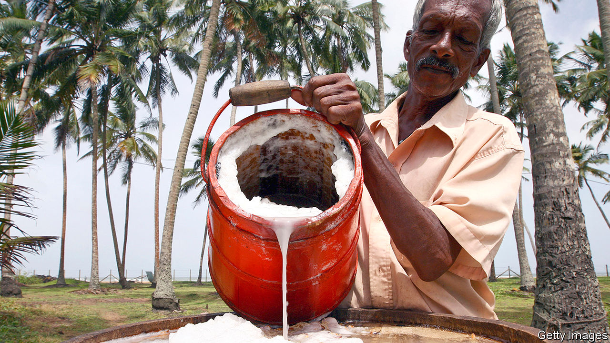

## Worth a shot

# Faced with a ban on booze, Sri Lankans have been making moonshine

> The closure of shops selling alcohol was supposed to curb covid-19

> Apr 23rd 2020COLOMBO

Editor’s note: The Economist is making some of its most important coverage of the covid-19 pandemic freely available to readers of The Economist Today, our daily newsletter. To receive it, register [here](https://www.economist.com//newslettersignup). For our coronavirus tracker and more coverage, see our [hub](https://www.economist.com//coronavirus)

“DATES, JAGGERY?” asked the grocer, offering the main ingredients for brewing palm wine. His customer bought both, tucking them away with his onions and lentils before disappearing down a narrow lane in a suburb of Colombo, Sri Lanka’s capital.

On March 21st the government closed all bars and liquor shops as part of a series of restrictions to curb the spread of covid-19. The intention, it said, was to prevent “drink parties” at which the virus might spread and to reduce unnecessary shopping trips. Small wonder: when the government first began introducing countrywide measures to slow the spread of the disease, “wine shops”—ubiquitous small stores selling mainly beer and liquor—were mobbed (social distancing be damned) by customers frantically stocking up.

Since then, booze has been hard to obtain. Supermarkets offer deliveries, but few have a licence to sell alcohol. For a time, enterprising distributors arranged deliveries of liquor, too, until the authorities made it clear that these were banned. A black market has sprung up, but sellers are hard to find and prices are prohibitive. A bottle of “gal”, which is distilled from coconut-palm sap, goes for almost three times its normal price of about 1,850 rupees ($9.75).

The obvious, albeit illegal, solution is home-brewing. Sri Lankans desperate for a tipple are mixing everything from beets to pineapple with sugar, water and yeast, and leaving the cocktail to ferment. The result can be cloudy, fizzy and sickly sweet, but is at least mildly alcoholic. The more ambitious are trying to distil these brews into something stronger. One home-distiller describes fending off inquiries from the man who delivers cooking-gas canisters, who wants to know why his consumption has shot up. The next wave of hospital admissions, a common joke runs, won’t be victims of the virus, but of alcohol poisoning.

The police say they have uncovered 18,000 instances of illicit alcohol production. On April 13th, for instance, officials arrested two men making liquor in 36 barrels in a swamp. Home-brewers are harder to catch. The government, which is losing some 500m Sri Lankan rupees ($2.6m) a day in forgone tax, has asked the telecoms regulator to find some way to stem the sharing of recipes on social media. “They are using Grade Six science knowledge to manufacture alcohol at home,” complains Kapila Kumarasinghe of the excise department. All the same, he admits, “We can’t very well go house to house, raiding kitchens.”

Dig deeper:For our latest coverage of the covid-19 pandemic, register for The Economist Today, our daily [newsletter](https://www.economist.com//newslettersignup), or visit our [coronavirus tracker and story hub](https://www.economist.com//coronavirus)

## URL

https://www.economist.com/asia/2020/04/23/faced-with-a-ban-on-booze-sri-lankans-have-been-making-moonshine
