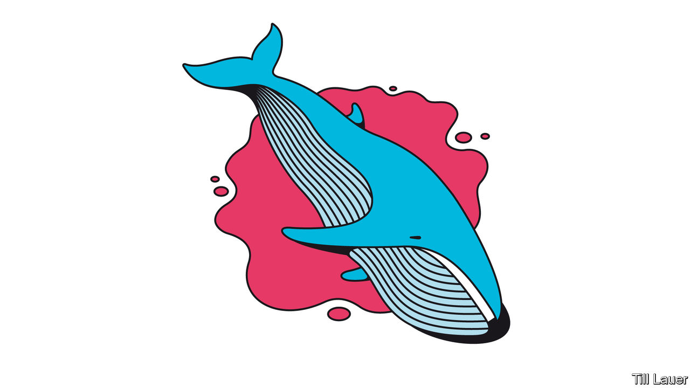

## Banyan

# Japan wants to catch whales. But who will eat them?

> Whalers depend on subsidies, as there is little demand for their catch

> Apr 23rd 2020

FROM BEHIND the counter of their tiny restaurant in Shimonoseki, Kojima Junko and her octogenarian mother place before Banyan some of the very last bits of the very last fin whale mankind is ever likely to catch. In the background, Billie Holiday is singing “No Regrets”. The four thin slices look and taste like well-done beef—wolfed down with microgreens and a baguette in the name of objective inquiry.

Scientific “research” was also the reason Japan’s government gave for continuing to kill whales in the vast Southern Ocean after a global moratorium on commercial whaling came into force in 1985. But international criticism along with environmental groups’ attempts to sabotage the annual hunt proved too costly to Japan’s reputation and purse (the government bankrolled the hunt). In late 2018 Japan declared it was giving up killing in the Southern Ocean, where the fin whale on which Banyan snacked had been caught.

For environmentalists, it is a great victory. The Southern Ocean is now a sanctuary. But it comes at a cost. Japan walked out of the International Whaling Commission (IWC), accusing the anti-whaling members of failing to appreciate the cultural significance of whaling in Japan and of imposing their values on others. Freed from the IWC’s strictures, the government said commercial whaling would resume in Japan’s own extensive waters.

The government rightly calculated that this would attract far less attention (Japan has a tiny anti-whaling lobby). But from a conservation standpoint, whaling in home waters is troubling. Most whale populations in the Southern Ocean are healthy. In Japanese waters, stocks are less bountiful—and far less researched.

This grim irony was borne out earlier this year. From Shimonoseki in western Japan, the state-owned whaling company, Kyodo Senpaku, sent out its two ships in search of their quota of Bryde’s whales. After fossicking for weeks, the vessels finally stumbled on some whales on the hunt’s last day. Regrettably, says the government’s pointman on whaling, Moronuki Hideki, the three animals killed were very thin. Was Mr Moronuki disappointed or embarrassed? “Both,” he replies.

One obvious lesson is not to kill Bryde’s whales when, hungry after breeding, they are on their way north to their summer feeding grounds around the Sea of Okhotsk. Far better to get them, fit and fat, on their way back in the autumn. Yet whaling, like much else in Japan, follows the logic of the fiscal year, which ends in March. Whalers had to spend their allocated ¥5bn ($46.5m) before then.

The whaling lobby is powerful—Shimonoseki sits within the parliamentary district of the prime minister, Abe Shinzo. In the Southern Ocean the fleet counted on subsidies: commercial sales of meat were never enough to keep it afloat. For now, the subsidies continue, supposedly to help ease the switch to nakedly commercial whaling. But, Mr Moronuki predicts, they will be gone in two or three years. Other fleets complain that whaling gets far more than its fair share of subsidies for fisheries.

Once the whalemen get to know Japanese waters better, hunting close to home will cut costs. Southern Ocean whaling was expensive. The fleet had to guard against saboteurs. And to maintain an air of research, vessels followed predetermined zigzag courses, taking nearly everything in their path. In future they can just steam out and make their kill.

Yet the challenges are immense. Whalemeat consumption has fallen from 230,000 tonnes a year in the early 1960s to 3,000 tonnes today, and whale is no longer cheap. Local whales have higher accumulations of toxins than those in the Southern Ocean. One packager of sashimi admits he sources his whale meat from Norway.

Morishita Joji, a former whaling diplomat at Tokyo University of Marine Science and Technology, says Kyodo Senpaku is hampered by government requirements to distribute whalemeat to all regions, even though demand is concentrated near a few ports with long traditions of hunting and eating whales. In such places, tiny operators never stopped catching small species of whale that did not fall under the IWC’s remit. These local enterprises are more likely to survive, Mr Morishita predicts.

As for the national fleet, perhaps it was just a piece of kabuki theatre to bring it back with such fanfare from the Southern Ocean. In reality, the prospects of the whales look slightly better than those of their predators.