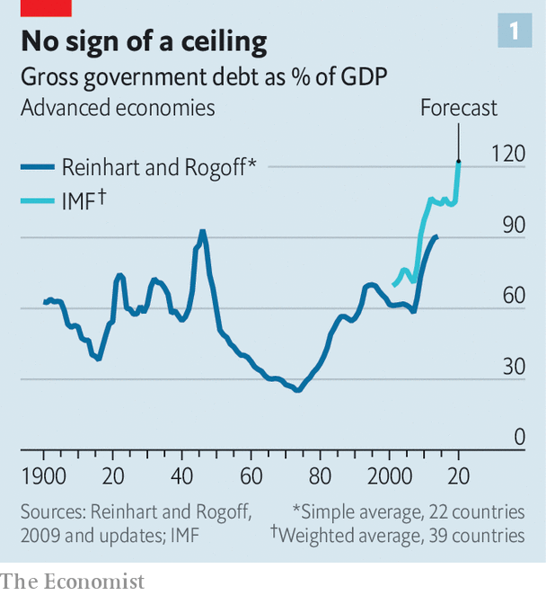
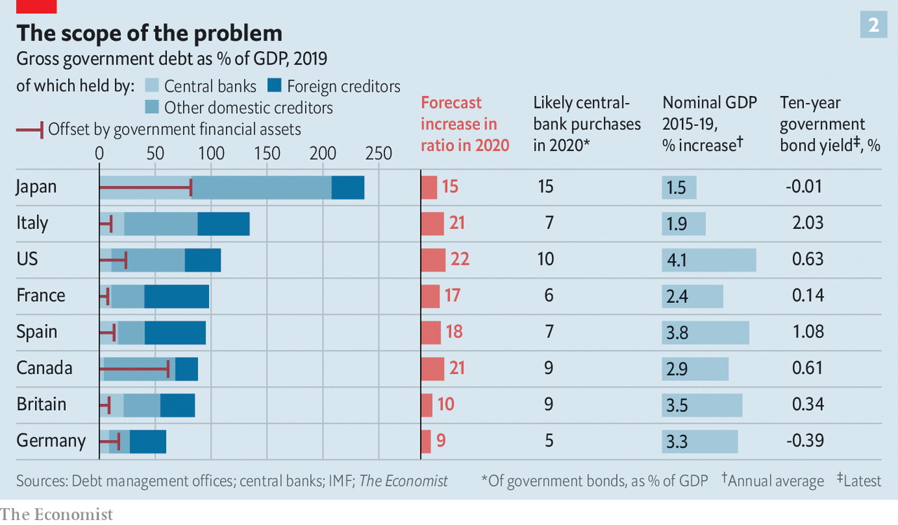

## What would Keynes do?

# The pandemic will leave the rich world deep in debt, and force some hard choices

> Who takes the pain, and can there be gain

> Apr 23rd 2020

Editor’s note: The Economist is making some of its most important coverage of the covid-19 pandemic freely available to readers of The Economist Today, our daily newsletter. To receive it, register [here](https://www.economist.com//newslettersignup). For our coronavirus tracker and more coverage, see our [hub](https://www.economist.com//coronavirus)

IN “HOW TO PAY FOR THE WAR”, a pamphlet published in 1940, John Maynard Keynes looked back on the way that the British government had, in the late 1910s, tried to pay off enormous quantities of debt with a combination of higher taxes and inflation. Wages had not kept up with inflation, meaning “that consumers’ incomes pass[ed] into the hands of the capitalist class”. Meanwhile the rich, as bondholders, had benefited from interest on the loans.

This time, Keynes argued, it would be better to take money from the workers directly by forcing them to lend to the government while the war was on and there was little to spend money on anyway. Later the government could pay the workers back the money they had lent it with interest, using the proceeds of a substantial wealth tax. “I have endeavoured”, Keynes wrote, “to snatch from the exigency of war positive social improvements.”

Like a war, the fight against covid-19 has seen governments, particularly those in the rich world, rack up debts so large that the way in which they are paid off could have a long-lasting effect on their economies, and significantly affect the distribution of wealth. There are deep differences between today’s circumstances and those which Keynes surveyed, perhaps foremost among which is that advanced economies now routinely shoulder a level of debt that Keynes would have seen as an unmanageable burden (see chart 1). But those dealing with the aftermath of this year’s remarkable borrowing should still heed his example in looking for the right way to distribute the pain as they do so.

The numbers involved are enormous. Advanced economies will run an average deficit this year of 11% of GDP, according to the IMF, even if the second half of the year sees no more lockdowns and a gradual recovery. Rich-world public debt could run to $66trn, which might be 122% of GDP by year’s end.

Governments wishing to see such debt burdens diminish must tread one of three broadly defined paths. First, they can pay back the borrowing using taxation. Second, they can decide not to pay, or agree with creditors to pay less than they owe. Third, they can wait it out, rolling over their debts while hoping that they shrink relative to the economy over time.

The likely constraint on paying off debt with future tax revenues is politics. Such a strategy requires some mix of raising taxes—which upsets quite a few people—and cutting spending on other things—which also upsets quite a few people, including some who will not have liked the tax increases either. Nevertheless, after the global financial crisis of 2007-09, which increased debt levels by about a third in advanced economies, many countries chose to reduce public spending as a share of the economy. Between 2010 and 2019 America and the euro zone cut their public-spending-to-GDP ratios by about 3.5 percentage points. Britain’s fell by 6 percentage points. Taxation, meanwhile, rose by between 1 and 2 percentage points of GDP.

Public appetite for paying off pandemic debts through a return to such austerity seems likely to be scant. The emotional, as opposed to economic, logic of austerity—people had spent too much, and must rein themselves in—does not apply. What is more, post-covid publics are likely to want more spent on their health, not less. More than half of Britons supported tax increases that would pay for more spending on the National Health Service even before the pandemic struck. Ageing populations are also increasing the demand for public spending, as are investments needed to tackle climate change.

The second option—defaulting or restructuring debts—may be forced on to emerging economies which lack any other way out. If it is, that will cause significant suffering. In advanced economies, though, such things have been increasingly rare since Keynes’s day, and look unlikely to make a comeback. A modern economy integrated into global financial markets has a huge problem if capital markets lock it out as a bad risk.

That said, there may be more than one way to default. Kenneth Rogoff of Harvard University argues that promises to increase health-care and pension spending in coming decades should also be viewed as government debt of a sort, and that this sort of debt is easier to back out of than obligations to bondholders. It is hard to ascertain whether the “default” risk in these debts—ie, the risk that politicians cut health-care and pension spending, reneging on their promises to ageing populations—is rising. Unlike bonds they are not traded on financial markets that provide signals of such things. But it almost surely is, especially in countries, like Italy, where pension spending is already enormous.

Rich-country politicians unwilling to shift away from spending and towards taxing, or to risk finding out how terrible a default would be, are likely to choose to grow their way out of hock. The secret to this is ensuring that the economy’s combined level of real economic growth and inflation stays handily above the interest rate the government pays on its debt. That allows the debt-to-GDP ratio to shrink over time.

In a much-noted speech in 2019 which called for a “richer discussion” about the costs of debt, Olivier Blanchard of the Peterson Institute for International Economics, a think-tank, argued that such a strategy was more plausible than many might think. In the United States, he pointed out, nominal growth rates higher than interest rates are the historical norm.

Many rich-world governments pursued this sort of strategy after the second world war with some success. At its wartime height, America’s public debt was 112% of GDP, Britain’s 259%. By 1980 America’s debt-to-GDP ratio had fallen to 26% and Britain’s to 43%. Achieving those results involved both a high tolerance for inflation and an ability to stop interest rates from following it upwards. The second of these feats was achieved by means of a regulatory system which, by depriving citizens of better investment options, forced them in effect to lend to governments at low interest rates. By the 1970s economists were calling this “financial repression”.

In a paper published in 2015, Carmen Reinhart of Harvard University and Belen Sbrancia of the IMF calculated that France, Italy, Japan, Britain and America spent at least half of that period in so-called “liquidation” years in which interest rates adjusted for inflation were negative. They estimated that the average annual “liquidation tax” to governments resulting from real interest kept low by inflation and financial repression ranged from 1.9% of GDP in America to 7.2% in Japan.

To attempt such repression today, though, would require redeploying tools used by post-war governments—tools such as capital controls, fixed exchange rates, rationed bank lending and caps on interest rates. This would be offensive to lovers of economic freedom. It would also be sufficiently contrary to the interests of investors and savers to be politically very demanding. That said, the coming years could prove to be politically demanding times. But if governments did enact such changes, they would spur responses unavailable to investors of the 1950s and 1960s, such as investment in cryptocurrencies and other immaterial products.

Even without a mechanism for keeping interest rates low, inflation can go some way to lessening the debt burden. “My gut instinct is that we will need higher inflation to wash away some of the debt,” says Maurice Obstfeld of the University of California, Berkeley (who, like Mr Blanchard and Mr Rogoff, was once chief economist at the IMF). Yet though inflation may be necessary if debt burdens are to shrink, it may not be readily forthcoming. A few economists think inflation will surge of its own accord when the enormous economic stimulus they expect butts up against the supply disruptions imposed by lockdowns. But Mr Obstfeld and many others worry instead about deflation, or at least less inflation than they would like.

For some, the cause of this is “debt overhang”—the idea that debts sap the economy of demand. Wealthy bondholders, by definition, prefer saving to spending. Many others make a simpler judgment. The circumstances of the pandemic which made massive borrowing necessary in the first place—such as surging unemployment—are also likely to cause a deflationary slump. Since the pandemic started, the cost of insuring against inflation through financial markets has fallen, reflecting a belief that there is unlikely to be much of it about. Investors seem to be predicting that five to ten years from now the Bank of Japan, the European Central Bank (ECB) and the Federal Reserve will all be undershooting their inflation targets.

Low inflation is bad for nominal growth. But it does at least reduce borrowing costs. Central banks can cut interest rates, if they have any room left to do so, and create money with impunity. In the five weeks leading up to April 16th, the Fed bought $1.3trn of American government debt: 5.9% of 2019 GDP and more than the entire budget deficit.

Thanks in part to the Fed’s actions, the American government can borrow for ten years at an interest rate of just 0.6%. In low-growth, lower-inflation Japan ten-year bonds are pegged at around 0%. Only in indebted countries in the euro zone, such as Italy, do bond yields threaten to exceed recent nominal growth rates.

These low interest rates make the fiscal picture seem less bleak. Vitor Gaspar, a senior official at the IMF, says the fund expects a combination of low rates and rebounding growth to see debt burdens stabilise or decline in the “vast majority” of countries in 2021. And bond-buying by central banks takes much of the worry out of some of the debt.

Take Japan. Its gross-debt-to-GDP ratio in 2019 was around 240% of GDP, which sounds truly astonishing. But years of quantitative easing (QE) have left the Bank of Japan with government bonds worth nearly 85% of GDP. And the government could, in theory, sell financial assets of a similar magnitude if it had to. Adjust the debt to take these things into account and what remains is a little over 70% of GDP—less than a third of the gross figure and roughly comparable to what the figure is for America if you make the same adjustments (see chart 2).

Well before the pandemic such analysis had led many influential economists to start treating higher public debt as sustainable in a low-inflation, low-interest-rate world. Because the pandemic has pushed both inflation and interest rates the same way—down—their logic still holds. However, there are reasons for scepticism.

Start with central-bank debt holdings. QE does not really neutralise public debt. Central banks buy government bonds by creating new money which sits in the banking system in the form of reserves. And central banks pay interest on those reserves. Because the central bank is ultimately owned by the government, QE replaces one government debt-interest bill, interest payments on bonds, with another, interest payment on bank reserves. And although the latter are very low today—negative, in fact, in several places—they will stay so only so long as central banks do not need to raise rates to fight inflation.

Since the global financial crisis, betting on low rates has paid off; some have gone so far as to see them as a new normal, part of a low-growth economy in which demand needs constant stimulation. But that brings out another flaw in the sanguine view of public debt: it assumes that the future will be like the past. Although markets expect rates to remain low, it is not a sure thing. There is, for example, the possibility that lockdowns and stimulus in close succession do indeed bring on price rises. There is also the possibility that a great deal of the deflationary pressure has been due to oil prices, which as of today really do seem to have no further to fall.

An alternative critique is that the past may not offer the reassurance some might seek there. A preliminary working paper by Paolo Mauro and Jing Zhou of the IMF, riffing on Mr Blanchard’s theme, examines borrowing costs and economic growth for 55 advanced and emerging economies over, in some cases, as much as 200 years.

The 24 advanced economies they study have on average benefited from interest rates which are below the nominal growth rate 61% of the time. Yet they find that such differentials are “essentially useless” for predicting sovereign defaults. “Can we sleep more soundly” with interest rates below growth rates? they ask. “Not really,” they answer.

The first sign of any debt trouble in the rich world would probably be rising inflation. At first, that might be a relief, given the present deflationary risk and the recent history of persistently insufficient inflation. It would be a sign that the economy was recovering. By reducing real interest rates it would further boost growth. And central banks that have long fallen a percentage point or so short of their inflation targets might feel comfortable seeing inflation ride a percentage point or so proud of it. But a somewhat relaxed attitude to 3% does not mean a willingness to accept 6%.

Inflation rising further above targets than it has been below them would bring on a stark choice for heavily indebted governments. Should they leave the central bank alone, let it raise rates to keep inflation at target, and look to taxpayers—or pensioners—to pay for the resulting rise in debt-interest costs? Or should they lean on their central banks to keep interest rates low, permitting inflation to rise and thereby easing their debt burdens?

Some context for that question comes from the blurring between fiscal and monetary policy the pandemic has already seen. Steve Mnuchin, America’s treasury secretary, has said that on some days he has spoken to Jerome Powell, chairman of the Federal Reserve, more than 30 times. The Bank of England has co-ordinated interest-rate cuts with Britain’s treasury and recently agreed to increase the government’s overdraft. The Bank of Japan has long been an enthusiastic partner in the economic agenda of Abe Shinzo, the prime minister. The outlier is the euro zone where, because of the horror of inflation found in countries such as Germany and the Netherlands, political pressure on the ECB is just as likely to result in hawkish policy.

Conveniently for politicians, some of the pain of high inflation would be borne by foreign investors, whose share of public debt exceeds 30% in many rich countries. “In a crunch, will Chinese debt-holders be treated as senior to US pensioners?” asks Mr Rogoff. But less foreign investment in years to come would need to be set against that advantage. A perception that a nominally independent central bank was in fact a creature of politicians would create a risk premium on investment that would slow growth throughout the economy.

Inflation would bring arbitrary redistributions of wealth to the disadvantage of the poor, just as Keynes observed it to have done in the late 1910s. Richer people are more likely to hold the houses and shares that rise in value with inflation, not to mention mortgages that would be inflated away alongside government debt. Higher inflation would also provide a bail-out that favoured more indebted companies over the less indebted.

Higher taxes, tried a little in the wake of the financial crisis, could be targeted more precisely to reduce inequality—much as they were in some countries after the second world war. Wealth taxes, as favoured by Keynes back then and increasingly discussed by academics and left-wing politicians today, could find that their time had come. Post-pandemic populations may welcome the sort of cost-free-to-most all-in-it-togetherness they might provide. Less radically, a value-added tax in America (which lacks one), higher taxes on land or inheritance, or new taxes on carbon emissions could be on the cards. Like inflation, however, tax rises inhibit and distort the economy while producing a backlash among those who must pay.

While the world’s chief problem is battling an economic slump in which inflation is falling, such choices are tomorrow’s business. They will not weigh heavily on policymakers’ minds. Even economists with reputations as fiscal hawks tend to support today’s emergency spending, and some want it enlarged. Yet one way or another, the bills will eventually come due. When they do, there may not be a painless way of settling them. ■

Dig deeper:For our latest coverage of the covid-19 pandemic, register for The Economist Today, our daily [newsletter](https://www.economist.com//newslettersignup), or visit our [coronavirus tracker and story hub](https://www.economist.com//coronavirus)