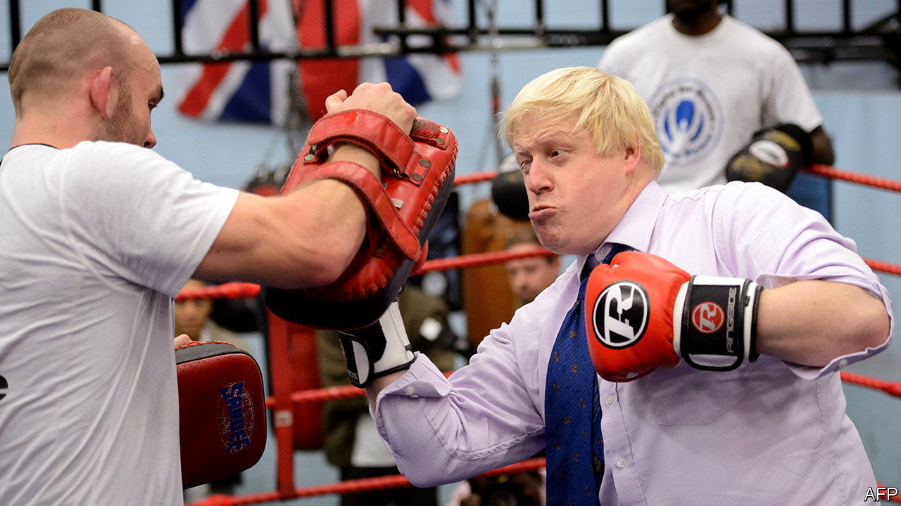

## Jolly difficult

# Covid-19 exposes flaws in Britain’s good-times government

> Boris Johnson promised prosperity and levity. Now he just hopes to deliver enough virus tests

> Apr 25th 2020

Editor’s note: The Economist is making some of its most important coverage of the covid-19 pandemic freely available to readers of The Economist Today, our daily newsletter. To receive it, register [here](https://www.economist.com//newslettersignup). For our coronavirus tracker and more coverage, see our [hub](https://www.economist.com//coronavirus)

IT WAS AN unusual error for a diplomat of Sir Simon McDonald’s experience. On April 21st the foreign-office boss told MPs that ministers had spurned an EU scheme to procure ventilators and protective kit. “It was a political decision,” he said. Later, he “clarified” that Britain had in fact missed the invitation thanks to a mix-up. This repeated a claim first made by Downing Street in March, but which is still met with incredulity in Brussels. Britain has now, somewhat belatedly, joined the scheme.

Boris Johnson’s team have not had a good week. The Sunday Times angered ministers with a story concluding that a complacent government, led by an absent prime minister, had squandered five weeks when it should have prepared for the pandemic. An airlift of protective kit from Turkey arrived days later than had been promised due to paperwork hitches. Despite some progress, the government remains far short of its target of carrying out 100,000 tests a day by April 30th. And it continues to resist calls to clarify how the country will leave lockdown.

At first glance, the prime minister is politically strong. As with other leaders, his approval ratings jumped immediately after the covid-19 lockdown. His own hospitalisation has wedded him to the struggle—and to the National Health Service. He commands a mighty majority. Yet the pandemic is beginning show up flaws in his government that could dog it for a long time to come.

The first stems from the prime minister’s character. The charge that early this year he was preoccupied with country weekends and his private life corresponds, fairly or not, with a view common among critics that he is work-shy and resents the burdens of office. At the election, Mr Johnson’s gameness for a pint and a laugh was an asset after Theresa May’s mirthlessness. It could now become a liability.

The second is his agenda. Mr Johnson idolises Winston Churchill, Britain’s wartime leader, of whom he has written a biography. But he campaigned as a peacetime prime minister, offering prosperity, stability and levity rather than good governance in a crisis. Mr Johnson’s promise to end “arguing about arguing” over Brexit, reverse austerity and “unleash Britain’s potential” resembles not the Churchill of the second world war, but that of the general election of 1951, who promised to end “evenly balanced party strife”, uphold the welfare state and allow Britain’s “native genius to flourish and fructify”.

The government’s about-turn on the EU scheme shows how quickly the political weather has changed. So did Rishi Sunak’s budget on March 11th. Delivered just as the World Health Organisation declared a pandemic, and 12 days before Britain’s lockdown, it earmarked £12bn ($15bn) to deal with covid-19, and £640bn for infrastructure spending over five years. Yet spending on covid-19 already stands closer to £100bn. The original agenda will be difficult to resuscitate. Indeed, Mr Johnson may have to scale back his ambitions, with cash and optimism in shorter supply.

Then there is Mr Johnson’s governing philosophy: that voters should get what they want, when they want it. Supporters say this is humility before the wisdom of the electorate. Critics call it populism. In policy, it points to things such as tougher penalties for sex offenders, a hard Brexit, and the reopening of dismantled rural railways, whatever the Treasury may think. Covid-19 exposes the limits of such an approach. Though simple to understand, Mr Johnson’s philosophy is not an easy one by which to govern. The struggle to find gowns and masks shows how ostensibly simple tasks can prove complex. A government adept at sloganeering now faces delicate trade-offs with imperfect evidence.

Rushing to build field hospitals and ventilators chimed with Mr Johnson’s ideal of a fast and muscular government. But unwinding the shutdown will be a frustrating process. Mr Johnson, his scientific advisers and public opinion are aligned behind the lockdown today. Over time they will probably diverge. Mr Johnson is said to fear a second spike in cases if social distancing is relaxed too soon. Thanks to covid-19, his supporters who voted for a return of the good times will be waiting rather longer. ■

Dig deeper:For our latest coverage of the covid-19 pandemic, register for The Economist Today, our daily [newsletter](https://www.economist.com//newslettersignup), or visit our [coronavirus tracker and story hub](https://www.economist.com//coronavirus)