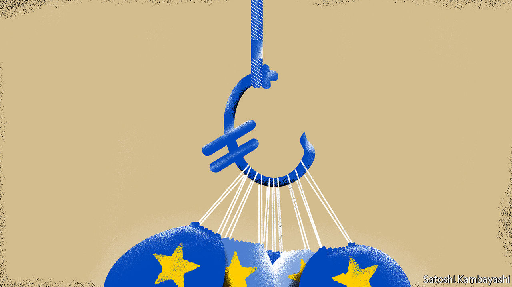

## Buttonwood

# Why the euro is more durable than it looks

> The commitments of a shared currency are not so easily shaken off

> Apr 25th 2020

Editor’s note: The Economist is making some of its most important coverage of the covid-19 pandemic freely available to readers of The Economist Today, our daily newsletter. To receive it, register [here](https://www.economist.com//newslettersignup). For our coronavirus tracker and more coverage, see our [hub](https://www.economist.com//coronavirus)

IN THE WEEKS following the bankruptcy of Lehman Brothers in 2008, there was naturally concern about the security of deposits. Many judged cash was safer kept in hand than parked with a wobbly bank. Demand for banknotes surged. Discerning German hoarders were said to be stuffing their mattresses with euros with serial numbers prefixed by an “X”, indicating they were printed in Germany. Numbers starting with a “Y” (Greece) or an “S” (Italy) were shunned.

This made little sense. A euro banknote is a euro banknote, wherever it is printed. But in troubled times people look to strong states for security. “Europe” doesn’t cut it. Tellingly, in the present crisis, sovereign prerogatives—to close borders; to backstop businesses; to spend freely—have been asserted, regardless of the European Union’s rules. This has left Europe looking weak. Whenever that happens, a bout of anxiety about the euro can’t be far off.

A widely held view is that a common currency cannot survive without a common budget. But the burden-sharing that would strengthen the euro always seems too big a step. Low-debt countries, notably Germany, do not fully trust high-debt ones, such as Italy, to play fair. Eurosceptics believe the lack of a fiscal centre will tear the currency zone apart. This downplays the pull of a monetary union. It has been sufficient in Europe to ensure that enough fiscal union follows—hesitantly, grudgingly, murkily—in its train. The euro is a lot more durable than it sometimes looks.

History says that political union is the essential glue of any currency union. This invariably entails a centralised system of taxation and public spending. It offers a way to deal with economic disruptions that have an uneven effect across the currency zone. A shared fiscal policy automatically directs support to where the economic hurt is greatest. The coronavirus is one such “asymmetric shock”. It hit Italy and Spain first, and hardest, within Europe. A country with its own money could in principle absorb such shocks through a weaker currency or with a monetary policy tailored to its needs. This is not possible in a currency union.

The picture becomes fuzzier in today’s setting. A bond is a government liability; but so is money. In a world of near-zero interest rates, cash and bonds are indistinct. As central banks print money to buy ever more bonds the lines between fiscal and monetary policy become increasingly blurred. This is true even in the euro zone, which has tried hard to keep the lines clear. Quantitative easing by the European Central Bank (ECB) is, in effect, mutualisation: a shared liability (cash) has been swapped for the sovereign bonds of individual euro-zone countries. The ECB is a collective endeavour. An explicit fiscal union of some kind would of course be helpful. But some implicit burden-sharing already takes place.

None of this makes the euro zone a powerhouse. Its bourses are laden with the stocks of seemingly doomed industries, such as carmaking and banking. But the euro itself is not obviously doomed. Indeed it is not too fanciful to imagine a future in which it survives even if the EU loses its sway.

The commitments of a shared currency are not easily shaken off. The complexity of the financial super-structure built upon the euro makes break-up a terrifying prospect. And the ECB, the institution at the heart of the euro, has muscle. It can swiftly bring to bear powerful tools in a crisis. The EU, by contrast, is a rule-setter. The exigencies of the present crisis led to the suspension of many of its strictures: on the free movement of labour; on state aid to industry, and spending limits. But people have not stopped using the euro. Its reach is a lot harder to reverse.

The sight of politicians squabbling over who should bear the budgetary cost of coronavirus is not a great advertisement for Europe. But for once the euro zone is ahead of the game. Who bears the fiscal burden incurred by the recession is a question that all economies must answer eventually. Some combination of taxpayers, consumers and bondholders will have to foot the bill in the end.

In most places, this reckoning will take place within a country’s borders. In the euro zone, by contrast, the burden-sharing would ideally be across borders. Some countries will lose; others will win. That is what makes the argument so bitter. For all the bickering, the euro zone has become good at lasting another day. It never quite does enough to resolve all its contradictions. But they have never quite proved fatal.

Dig deeper:For our latest coverage of the covid-19 pandemic, register for The Economist Today, our daily [newsletter](https://www.economist.com//newslettersignup), or visit our [coronavirus tracker and story hub](https://www.economist.com//coronavirus)

## URL

https://www.economist.com/finance-and-economics/2020/04/25/why-the-euro-is-more-durable-than-it-looks
