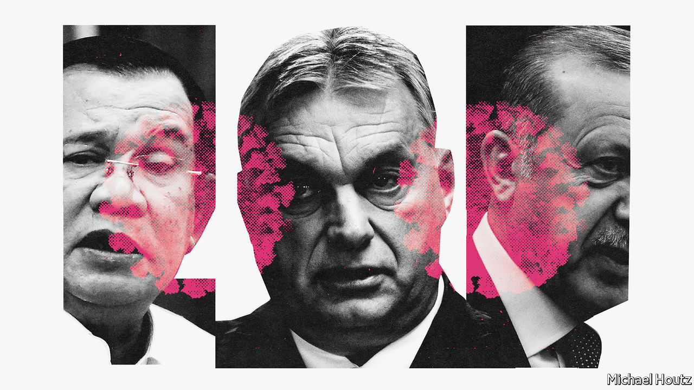
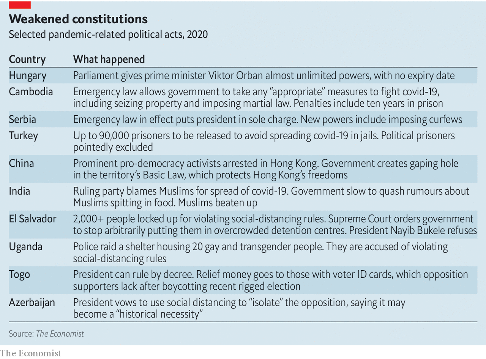
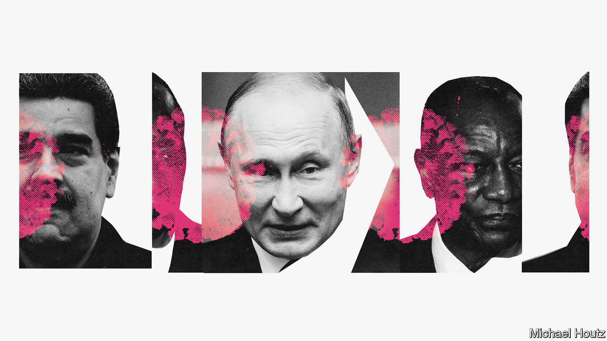

## Protection racket

# Would-be autocrats are using covid-19 as an excuse to grab more power

> Strong measures are needed to keep the public safe, they insist

> Apr 23rd 2020DELHI, ISTANBUL, JOHANNESBURG, KAMPALA AND SINGAPORE

Editor’s note: The Economist is making some of its most important coverage of the covid-19 pandemic freely available to readers of The Economist Today, our daily newsletter. To receive it, register [here](https://www.economist.com//newslettersignup). For our coronavirus tracker and more coverage, see our [hub](https://www.economist.com//coronavirus)

ON APRIL 13TH, during a discussion about when and how America should ease covid-19 lockdowns, Donald Trump claimed to have “absolute power” to decide, overriding state governors. Within a day, he was forced to retreat. No serious legal scholar agreed with him—America’s constitution is admirably clear on the limits to presidential authority.

Contrast that with Viktor Orban’s efforts. On March 30th Hungary’s parliament issued a “coronavirus law”, giving the prime minister almost unlimited powers to rule by decree, with no expiry date. Parliament can repeal Mr Orban’s new powers, but since his party has an impregnable majority, it probably won’t. Mr Orban has in effect become a dictator—in the heart of Europe. He may relinquish some of his new powers after the pandemic, just to prove his critics wrong, but perhaps not all.

Covid-19 is creating opportunities for autocrats and would-be autocrats to tighten their grip. They must assume extraordinary powers, they insist, to protect public health. No fewer than 84 countries have declared a state of emergency since the pandemic began, says the Centre for Civil and Political Rights, a watchdog in Geneva. Some will surrender these powers when the emergency is over. Others plan to hang on to them. The danger is greatest not in mature democracies with strong checks and balances, such as America, but in places where such safeguards are weak, such as Hungary.

Mr Orban has spent the past decade eroding checks on his power, nobbling the courts, tilting the electoral system and urging his cronies to gobble up independent radio and television stations. Mr Trump’s claim of absolute power was laughed at; Hungarian media welcomed Mr Orban’s corona coronation, and Hungarian institutions did nothing to block it.

Unscrupulous politicians have seen opportunity in disaster before. Vladimir Putin grabbed extra powers after a school siege involving terrorists in Beslan, a town near Russia’s border with Georgia. Turkey’s President Recep Tayyip Erdogan imposed a state of emergency after a failed coup in 2016, and has since ruled like a sultan. This pandemic presents an even greater opportunity for mischief, because it is raging everywhere at once. The world’s attention is on the virus. No repressive act in a far-off land is likely to make headlines elsewhere.

China chose now to arrest Hong Kong’s leading pro-democracy activists and puncture its Basic Law (see [article](https://www.economist.com//china/2020/04/23/china-moves-to-squeeze-hong-kongs-freedoms)). “Dictators and others may think there’s no better time to take repressive measures,” says Rob Malley of the International Crisis Group, an NGO in Brussels.

Serbia’s president is in effect in sole charge. Togo’s has the power to rule by decree, though in theory it runs out in a few months. Cambodia’s emergency law gives the government the power to take any “measures that are deemed appropriate” to fight the disease. It can restrict people’s movement, ban public gatherings, censor social media, seize property and declare martial law. Anyone who fails to “respect” the law faces up to ten years in prison. The prime minister, Hun Sen, can act without any real oversight. Though his ministers say the measures will last for only three months, they can be extended indefinitely.

Such powers far exceed any that democratic governments have assumed to fight covid-19, but the regimes in question try to portray them as normal. “The purpose of making this law for Cambodia is not unique, as there is this law already in many other democratic countries,” says a spokesman for the ministry of justice.

Some curbs on freedom are reasonable given the scale of the emergency. Large gatherings can spread infection, so limiting them for a while makes sense. But it also helps regimes keen to snuff out protests. Algeria banned street marches that have lasted, off and on, for a year, threatening the elderly ruling elite. India’s lockdown has squashed nationwide rallies against the government’s mistreatment of Muslims. In Russia even lone protesters against Mr Putin have been arrested.

Social-distancing rules can be applied selectively. Azerbaijan’s president says the “isolation” of members of the opposition may “become a historical necessity”. Several have been locked up for supposedly violating a lockdown. Unpopular minorities are also at risk. In Uganda police raided a shelter housing 20 gay and transgender people and later charged them with “congesting in a school-like-dormitory setting within a small house”.

Defeating the virus will require tracking who has been infected, tracing their contacts and quarantining them. This may involve intrusive surveillance. Most people will surrender some privacy temporarily to save lives. Good governments will take only the data they need from their citizens and do so only when they need it. Others will not.

Cambodia’s emergency law allows for unlimited surveillance of private citizens. Moscow is mulling a scheme whereby everyone would have to register their personal details on an official website. Every time they want to go out, they would have to provide a reason and the address of their destination. They will then be sent an electronic message to show to the police if they are stopped. The authorities would monitor everyone’s geolocation and even financial records to make sure they comply. The potential for abuse is obvious.

Spreading rumours during a pandemic can be dangerous. Many regimes have used this as an excuse to crack down on critics. Reporters without Borders, a watchdog, cites 38 countries that have used covid-19 as a pretext to harass the media. It stresses that the list is not exhaustive.

In Turkey at least eight journalists have been arrested on charges of “spreading misinformation”. Hundreds of others have been investigated for critical posts on social media. In Bolivia the interim president, Jeanine Áñez, decreed that those who “misinform or cause uncertainty to the population” can be jailed for one to ten years. Since she has a record of forcing opposition radio stations off the air, critics fear this will become a tool to lock them up.

Some governments have criminalised almost any disparagement of their response to the pandemic. A Thai artist called Danai Ussama faces up to five years in prison after griping that no one took his temperature at Bangkok airport.

“Censorship kills,” says Kenneth Roth of Human Rights Watch. “When governments suppress the free flow of information, it is terrible for public health, as we saw in Wuhan. The Chinese government’s muzzling of the doctors who sounded the warning gave the virus a three-week head-start to go global.” A study by the University of Southampton found that if interventions in China had started three weeks earlier, the number of coronavirus cases would have been 95% lower at the end of February, “significantly limiting the geographical spread of the disease.”

Some governments are enforcing lockdowns harshly. Several Indian states now allow the police to arrest people without charge. In Fiji there have been more coronavirus-related arrests than diagnostic tests. Kenyan cops have beaten health workers on their way to work.

In El Salvador more than 2,000 people have been locked up for violating strict social-distancing rules, often defeating their purpose. Its Supreme Court has told the government to stop arbitrarily detaining people in inhumane conditions that are likely to spread the disease. But its fiery president, Nayib Bukele, has refused (via Twitter) to obey it. Thus, covid-19 has precipitated a constitutional crisis in one of Latin America’s most violent countries.

Indonesia and the Philippines have given the army prime responsibility for fighting the novel coronavirus. In some ways this is pragmatic: only the armed forces can operate effectively across these two archipelago states. They are also popular. “They abhor useless debates. They are silent workers, not voracious talkers. They act without fanfare. They get things done,” said a spokesman for Rodrigo Duterte, the president of the Philippines. Even so, there are worries. Mr Duterte has publicly urged the security forces to shoot troublemakers dead. Fortunately, they appear to have ignored him, but in the long run, turning to the men in uniform during a public-health crisis risks weakening civilian oversight.

The pandemic is seriously disrupting elections. South Korea showed in April that a well-governed rich country can organise a vote while maintaining social distance. Poorer, less orderly places find it harder. For some leaders, that is a welcome excuse to delay their reckoning with voters.

Court-ordered re-runs of rigged elections in Bolivia have been postponed. Those in Malawi could be delayed, too. That would leave the presidency with Peter Mutharika, whose victory last year was ruled invalid after his supporters used Tipp-Ex to alter vote tallies.

Some leaders are holding votes on schedule, knowing that the opposition will barely be able to campaign, whereas the incumbent can look statesmanlike on television. Poland’s ruling party wants to go ahead with a presidential election in May for this reason, though it could still be delayed. Guinea held a referendum on March 22nd to allow President Alpha Condé to run for two more terms. The proposal passed easily. Guinea now has almost 700 covid-19 cases and possibly 12 more years of Mr Condé, who has advised Guineans to inhale menthol and drink hot water to ward off the virus.

Ethiopia’s elections, which are set for August, were supposed to herald the dawn of a new democratic era. They have been postponed and the government has assumed emergency powers. During previous states of emergency in 2016 and 2018, tens of thousands of dissidents were locked up in re-education camps or tortured. The current prime minister, Abiy Ahmed, has promised that such abuses are all in the past. But if elections are not held by September, his government will no longer have a mandate, and Ethiopia’s ethnic insurgencies could explode.

Some governments have used the disease itself to intimidate the opposition. Crowded jails are hotbeds of infection. Dissidents understand that detention could be lethal. Turkey has ordered a mass release of up to 90,000 prisoners to spare them from contracting covid-19. The country’s thousands of political prisoners are conspicuously excluded from the amnesty.

Some governments are looking for scapegoats. In India that means Muslims. After it was discovered that a Muslim religious meeting on March 15th was the source of more than 1,000 infections, the Hindu nationalist government made every effort to publicise this fact. For several days the ministry of health counted separately covid cases tied to the event. A cabinet member likened it to a crime by the Taliban. Health authorities assiduously traced every single case from the Delhi meeting, ultimately putting some 25,000 people under quarantine. They have made no such effort with any other vector, such as the huge wedding party of a ruling-party bigwig. #CoronaJihad proliferated on social media, along with rumours that Muslims were spitting in people’s food to spread the virus. Muslims have been attacked in the streets. A cancer hospital in Meerut said that it would not take Muslim patients unless they tested negative for covid-19.

Blaming Muslims is a handy way to fire up Hindu nationalist voters and distract attention from the fact that, at the time of the notorious Muslim prayer meeting, the government had yet to take the virus seriously. “Having spent years painting [Muslims] as a demographic, cultural, sexual, and security threat, it is now busily painting them as a biohazard,” complains Mitali Saran in the Deccan Herald.

Such bigotry not only stokes violence; it also harms public health. Many Muslims are now so suspicious of the government that they are unwilling to co-operate with quarantine rules. In Muslim slums medics have been attacked because of rumours that they are gathering data on Muslims in order to harm them. It was not until April 19th that the prime minister, Narendra Modi, made any effort to soothe sectarian tempers. “Covid-19 does not see race, religion, colour, caste, creed, language or borders,” he tweeted. “We are in this together.”

Many leaders want credit for handing out taxpayers’ cash to tide people over during the crisis. Mr Modi is leaning on rich Indians as well as government workers to donate to a special “PM-CARES” relief fund. It is unclear how the new pot differs from an emergency relief fund that Indian prime ministers have run since 1948, except that it has less oversight and Mr Modi can claim to have launched it.

Some rulers are equally keen that their opponents should get no credit for helping the needy. Turkey is investigating the opposition mayors of Istanbul and Ankara for trying to raise funds to fight covid-19. Mr Erdogan likened them to terrorists. In Uganda President Yoweri Museveni cautions that “opportunistic politicians who try to distribute food will be arrested and charged with attempted murder.” His government claims that chaotic food distribution will draw crowds that will spread the virus. His foes think he wants to stop them from looking good by doing good.

For now, covid-19 is helping autocrats grab more power. But it poses big risks for them, too. The damage it wreaks will be vast and painful, especially in poor countries. Many despots will struggle to protect their subjects from disease and deprivation. Mr Putin is losing popularity because of his aloof response to the virus. Brazil’s Jair Bolsonaro, who scoffs at lockdowns and recently led a rally where placard-wavers called for a coup, could be impeached for incompetence after this crisis. Some are flailing. President Alexander Lukashenko of Belarus said the best way to fight the virus was to drink vodka and drive a tractor.

Some regimes may run out of money. Venezuela’s dictator, Nicolás Maduro, looks particularly vulnerable. The combination of covid-19 and an oil-price crash may leave his regime without enough cash to fund its patronage network—and to keep the army loyal. Covid-19 challenges many regimes that rely on the security forces to suppress dissent.

Where governments are seen as legitimate, and where they try to ease the economic pain, people are more likely to comply with lockdowns. In many countries, however, the state is seen as predatory and the police as bullies. In them a backlash is brewing that thuggish cops will struggle to control. Protests against lockdowns have erupted in many countries, including parts of China. More may follow if the pandemic lasts for months, as it probably will.

Many autocrats fear losing control. An incident in Cambodia is suggestive. Mr Hun Sen admitted in an unguarded moment that his government lacks the money to tide people over during the outbreak. “If motorbike-taxi drivers go bankrupt, sell your motorbikes for spending money,” he said. When a director of a news site accurately quoted this insensitive comment, it was shut down and he was arrested.

Seven years ago Mr Hun Sen was rattled by huge protests by disgruntled factory workers. Cambodia’s garment factories are now laying off workers, who are more desperate and angry than before. In many countries covid-19 may foster instability. Autocracies have no immunity. ■

Dig deeper:For our latest coverage of the covid-19 pandemic, register for The Economist Today, our daily [newsletter](https://www.economist.com//newslettersignup), or visit our [coronavirus tracker and story hub](https://www.economist.com//coronavirus)

## URL

https://www.economist.com/international/2020/04/23/would-be-autocrats-are-using-covid-19-as-an-excuse-to-grab-more-power
