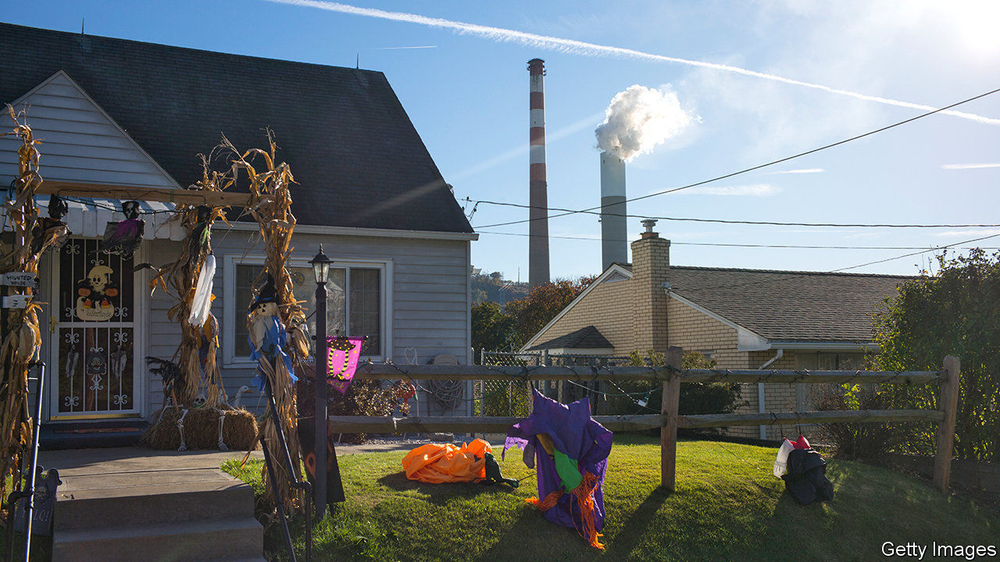

## Mercury rising

# Think a respiratory virus pandemic is a good time to cut air-quality regulations?

> If so, the White House agrees with you

> Apr 25th 2020WASHINGTON, DC

Editor’s note: The Economist is making some of its most important coverage of the covid-19 pandemic freely available to readers of The Economist Today, our daily newsletter. To receive it, register [here](https://www.economist.com//newslettersignup). For our coronavirus tracker and more coverage, see our [hub](https://www.economist.com//coronavirus)

IS THE MIDDLE of a global pandemic of covid-19, a respiratory illness, a sensible time for America to roll back air-pollution regulations? The White House seems to think so. On April 16th the Environmental Protection Agency (EPA) issued a final recommendation that it was no longer “appropriate and necessary” to regulate the emissions of mercury and other toxins from coal- and oil-fired power plants. Though existing limits remain in place for now, they could well be challenged in court and struck down. Excessive exposure to mercury in utero produces birth defects and lifelong brain damage in children.

The mercury move is not an aberration. Two weeks before, on March 31st, as the country was transfixed by covid-19, the EPA and a federal transport agency finalised another deregulation—this one to substantially cut fuel-efficiency standards for future fleets of cars. If these rules ever come into force, and there will be legal challenges to them, they would be consequential. The laxer car rules will, according to the government’s own projections, lead to an additional 923m tonnes of carbon-dioxide emissions. Given that the country as a whole emitted 5.4bn tonnes in 2018, the effect would be considerable.

Though the two actions represent a continuation of Donald Trump’s effort to unravel existing environmental regulations of all kinds, the rush now may be prompted by a more concrete concern: a somewhat arcane law known as the Congressional Review Act. This allows Congress to revoke recently issued regulations without going through the typically lengthy bureaucratic fuss. Before Mr Trump’s presidency, the rule had been used just once before. But in the early days of his administration, the Republican-led Congress used it to great effect—cancelling Obama-era rules on the environment, labour and consumer protection. The administration seems to be rushing now to inoculate its actions against future repeal, says Ann Carlson, a professor of environmental law at the University of California, Los Angeles.

Any new regulations—including repeals—must be rigorously costed, or else they risk being overturned in the courts. The environmental rules that the Trump administration is rewriting were signed just a few years ago. Their costings then showed social benefits vastly exceeding the compliance costs.

To show the opposite now, the Trump administration is employing funny maths. The direct benefits of mercury-pollution reduction are counted very narrowly (only for the children of recreational freshwater fishermen), while the side benefits of pollution controls (such as reduced emissions of particulate fine matter which is especially damaging to human lungs) are not counted. Similar head-scratching assumptions plague the justifications for reduced car-emissions standards. In both cases the EPA’s own scientific advisory board wrote long critiques of the methodologies used, which seem to have been roundly ignored.

Carmakers have tepidly welcomed the reduced fuel-economy standards, which will oblige cars to become 1.5% more efficient each year (measured by miles per gallon) instead of 5%. Electricity utilities have ranged from receptive to outright hostile to the mercury-rule decision—in part because they have already implemented the costly pollution controls.

The benefits of these rules, which the EPA maintains should not be considered, are also of unfortunately topical importance. Scientists at Harvard have noted that increased exposure, of one microgram per cubic metre, to the fine particulate matter generated by cars and power plants in American counties is associated with a 15% rise in covid-19 deaths. The consequences add up, even if the EPA does not.■

Dig deeper:For our latest coverage of the covid-19 pandemic, register for The Economist Today, our daily [newsletter](https://www.economist.com//newslettersignup), or visit our [coronavirus tracker and story hub](https://www.economist.com//coronavirus)

## URL

https://www.economist.com/united-states/2020/04/25/think-a-respiratory-virus-pandemic-is-a-good-time-to-cut-air-quality-regulations
