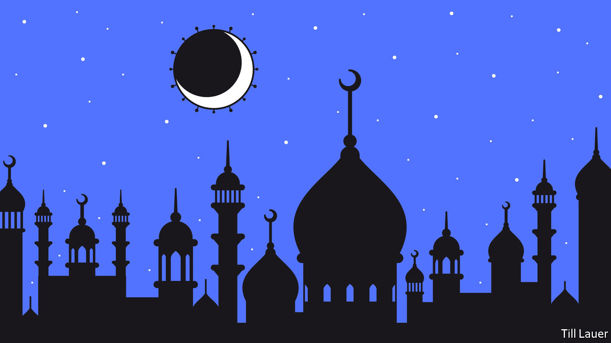

## Banyan

# Many of Asia’s Muslims are celebrating Ramadan in the normal way

> Few Asian governments are brave enough to put public health before piety

> Apr 30th 2020

Editor’s note: The Economist is making some of its most important coverage of the covid-19 pandemic freely available to readers of The Economist Today, our daily newsletter. To receive it, register [here](https://www.economist.com//newslettersignup). For our coronavirus tracker and more coverage, see our [hub](https://www.economist.com//coronavirus)

IN NORMAL TIMES, Chawkbazar in the heart of old Dhaka, the capital of Bangladesh, is heaving during Ramadan, the Muslim month of prayer, daytime fasting and night-time feasting which began a week ago. Thousands of street hawkers sell biryani, kebabs and jilapis—sticky spirals of deep-fried batter, drenched in syrup, that most Bangladeshis consider essential for iftar, the evening meal breaking the day’s fast. But this year Chawkbazar is nearly deserted. The few vendors who attempt to set up are chased off by baton-wielding soldiers. And at home nearby, Nuzhat, who prides herself on her cooking, is making jilapis for the very first time, because the family’s favourite sweet shop is closed. Asked how they taste, her husband, Tarif, will not pass judgment. If he did, he adds in a grave aside, “My wife would kill me.”

Bangladesh, like other Asian countries with large Muslim populations, has announced restrictions on the celebration of Ramadan to contain the covid-19 epidemic. The government, which in early April urged people to stay away from mosques and pray at home, has become more specific for Ramadan, restricting attendance at prayers to 12. In Malaysia the government recently extended its lockdown to mid-May. On the eve of Ramadan, the prime minister, Muhyiddin Yassin, claimed the jihad against the pandemic was achieving results but that the country must keep up its guard. Mosques are live-streaming worship. Zakat, the alms all Muslims are supposed to donate, is collected at drive-throughs and online. Singapore has closed mosques until further notice.

Yet crisply issued and enforced rules are the exception. Jakarta, the capital of Indonesia, the world’s biggest Muslim-majority nation, has been under a partial lockdown since April 10th. But only on April 21st did the government of President Joko Widodo, or Jokowi, announce a national ban on mudik, the return home of vast numbers of migrants for the holiday that marks the end of Ramadan. The ban did not come into force for three days, by which point many were already on the move. One survey found nearly a quarter of migrants intended to return home, surely bringing the virus with them. Meanwhile, though some clerics have issued fatwas against praying in big groups, many small-town mosques operate as usual. In Banda Aceh, on Sumatra, thousands crowd daily into the Baiturrahman Grand Mosque, lots of them without face masks.

In Pakistan restrictions on the faithful promulgated by the prime minister, Imran Khan, have been late and half-hearted. Prominent clerics have pressed the government to declare that lockdowns do not apply to mosques, bringing out doctors in protest. A list of distancing measures was agreed, but four-fifths of mosques appear not to be enforcing them. In Bangladesh, Dhaka’s rigour is not mirrored elsewhere. In a recent video, the mayor of Gazipur, whose garment factories are coronavirus hotspots, declared its mosques open for business. In the countryside, as well as in camps housing Rohingya refugees from Myanmar, many believe the virus to be a punishment from God—for which more attendance at mosques, not less, is the fitting response. Across Asia, poorly paid imams have a powerful financial incentive to welcome the devout, who are at their most generous during Ramadan.

Religious gatherings earlier this year have already shown how worshippers can be vectors for the novel coronavirus. Huge jamborees organised by Tablighi Jamaat, a missionary movement with tens of millions of followers, are responsible for big clusters in India, Malaysia and Pakistan.

Across much of the Arab world, secular authorities have hobbled religious ones. But most of Asia’s billion-odd Muslims live in countries where religious leaders have more clout, and politicians are reluctant to stand up to them.

Jokowi has long pandered to conservatives who accuse him of insufficient piety or even of being a closet Christian. Mr Khan knows the snap of a cleric’s finger can bring tens of thousands of protesters out on the streets. And however eagerly Sheikh Hasina Wajed, Bangladesh’s prime minister, locks up critics, she makes an exception for religious leaders. She trembles before Hefazat-e-Islam (“Protectors of Islam”), a puritanical group founded in the country’s madrassas whose boss, Shah Ahmad Shafi, recently reversed course and called for mosques to remain open during Ramadan. The pandemic terrifies governments across Asia. But for some, the self-declared emissaries of God are even more frightening.

Dig deeper:For our latest coverage of the covid-19 pandemic, register for The Economist Today, our daily [newsletter](https://www.economist.com//newslettersignup), or visit our [coronavirus tracker and story hub](https://www.economist.com//coronavirus)