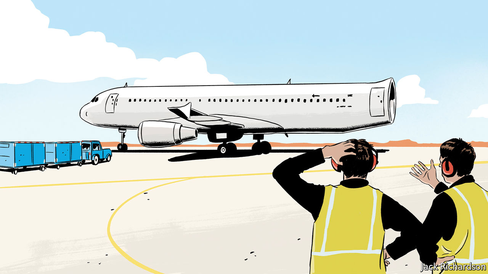
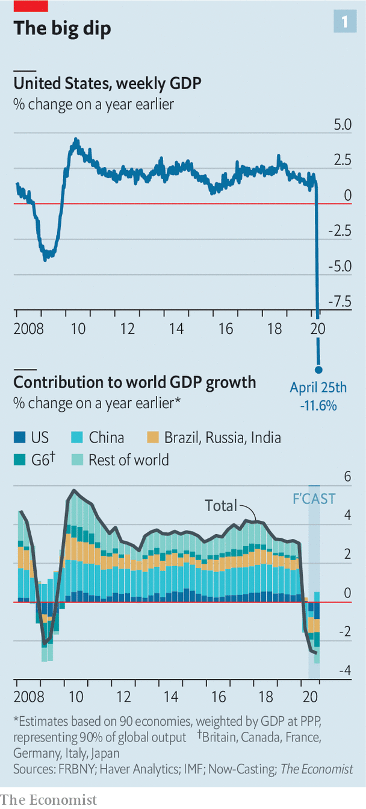
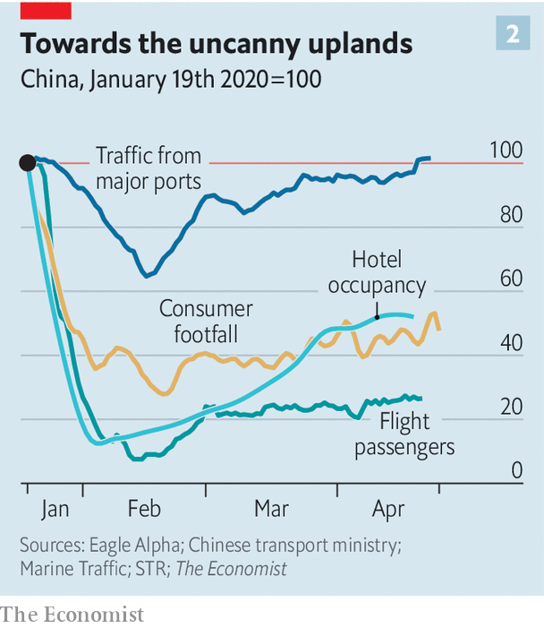
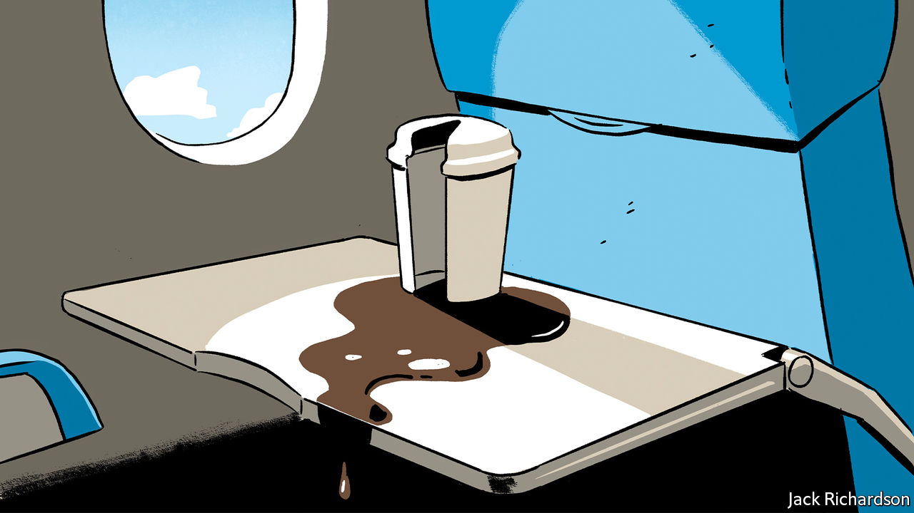

## Not quite all there

# The 90% economy that lockdowns will leave behind

> It will not just be smaller, it will feel strange

> Apr 30th 2020

Editor’s note: The Economist is making some of its most important coverage of the covid-19 pandemic freely available to readers of The Economist Today, our daily newsletter. To receive it, register [here](https://www.economist.com//newslettersignup). For our coronavirus tracker and more coverage, see our [hub](https://www.economist.com//coronavirus)

IN THE 1970s Mori Masahiro, a professor at the Tokyo Institute of Technology, observed that there was something disturbing about robots which looked almost, but not quite, like people. Representations in this “uncanny valley” are close enough to lifelike for their shortfalls and divergences from the familiar to be particularly disconcerting. Today’s Chinese economy is exploring a similarly unnerving new terrain. And the rest of the world is following in its uncertain steps.

Whatever the drawbacks of these new lowlands, they are assuredly preferable to the abyss of lockdown. Measures taken to reverse the trajectory of the pandemic around the world have brought with them remarkable economic losses.

Not all sectors of the economy have done terribly. New subscriptions to Netflix increased at twice their usual rate in the first quarter of 2020, with most of that growth coming in March. In America, the sudden stop of revenue from Uber’s ride-sharing service in March and April has been partially cushioned by the 25% increase of sales from its food-delivery unit, according to 7Park Data, a data provider.

Yet the general pattern is grim. Data from Womply, a firm which processes transactions on behalf of 450,000 small businesses across America, show that businesses in all sectors have lost substantial revenue. Restaurants, bars and recreational businesses have been badly hit: revenues have declined some two-thirds since March 15th. Travel and tourism may suffer the worst losses. In the EU, where tourism accounts for some 4% of GDP, the number of people travelling by plane fell from 5m to 50,000; on April 19th less than 5% of hotel rooms in Italy and Spain were occupied. 

According to calculations made on behalf of The Economist by Now-Casting Economics, a research firm that provides high-frequency economic forecasts to institutional investors, the world economy shrank by 1.3% year-on-year in the first quarter of 2020, driven by a 6.8% year-on-year decline in China’s GDP. The Federal Reserve Bank of New York draws on measures such as jobless claims to produce a weekly index of American economic output. It suggests that the country’s GDP is currently running about 12% lower than it was a year ago (see chart 1). 

These figures fit with attempts by Goldman Sachs, a bank, to estimate the relationship between the severity of lockdowns and their effect on output. It finds, roughly, that an Italian-style lockdown is associated with a GDP decline of 25%. Measures to control the virus while either keeping the economy running reasonably smoothly, as in South Korea, or reopening it, as in China, are associated with a GDP reduction in the region of 10%. That chimes with data which suggest that if Americans chose to avoid person-to-person proximity of the length of an arm or less, occupations worth approximately 10% of national output would become unviable.

The “90% economy” thus created will be, by definition, smaller than that which came before. But its strangeness will be more than a matter of size. There will undoubtedly be relief, fellow feeling, and newly felt or expressed esteem for those who have worked to keep people safe. But there will also be residual fear, pervasive uncertainty, a lack of innovative fervour and deepened inequalities. The fraction of life that is missing will colour people’s experience and behaviour in ways that will not be offset by the happy fact that most of what matters is still available and ticking over. In a world where the office is open but the pub is not, qualitative differences in the way life feels will be at least as significant as the drop in output.

The plight of the pub demonstrates that the 90% economy will not be something that can be fixed by fiat. Allowing pubs—and other places of social pleasure—to open counts for little if people do not want to visit them. Many people will have to leave the home in order to work, but they may well feel less comfortable doing so to have a good time. A poll by YouGov on behalf of The Economist finds that over a third of Americans think it will be “several months” before it will be safe to reopen businesses as normal—which suggests that if businesses do reopen some, at least, may stay away.

Some indication that the spending effects of a lockdown will persist even after it is over comes from Sweden. Research by Niels Johannesen of Copenhagen University and colleagues finds that aggregate-spending patterns in Sweden and Denmark over the past months look similarly reduced, even though Denmark has had a pretty strict lockdown while official Swedish provisions have been exceptionally relaxed. This suggests that personal choice, rather than government policy, is the biggest factor behind the drop. And personal choices may be harder to reverse.

Discretionary spending by Chinese consumers—the sort that goes on things economists do not see as essentials—is 40% off its level a year ago. Haidilao, a hotpot chain, is seeing a bit more than three parties per table per day—an improvement, but still lower than the 4.8 registered last year, according to a report by Goldman Sachs published in mid-April. Breweries are selling 40% less beer. STR, a data-analytics firm, finds that just one-third of hotel beds in China were occupied during the week ending April 19th. Flights remain far from full (see chart 2). 

This less social world is not necessarily bad news for every company. UBS, a bank, reports that a growing number of people in China say that the virus has increased their desire to buy a car—presumably in order to avoid the risk of infection on public transport. The number of passengers on Chinese underground trains is still about a third below last year’s level; surface traffic congestion is as bad now as it was then.

Wanting a car, though, will not mean being able to afford one. Drops in discretionary spending are not entirely driven by a residual desire for isolation. They also reflect the fact that some people have a lot less money in the post-lockdown world. Not all those who have lost jobs will quickly find new ones, not least because there is little demand for labour-intensive services such as leisure and hospitality. Even those in jobs will not feel secure, the Chinese experience suggests. Since late March the share of people worried about salary cuts has risen slightly, to 44%, making it their biggest concern for 2020, according to Morgan Stanley, a bank. Many are now recouping the loss of income that they suffered during the most acute phase of the crisis, or paying down debt. All this points to high saving rates in the future, reinforcing low consumption. 

A 90% economy is, on one level, an astonishing achievement. Had the pandemic struck even two decades ago, only a tiny minority of people would have been able to work or satisfy their needs. Watching a performance of Beethoven on a computer, or eating a meal from a favourite restaurant at home, is not the same as the real thing—but it is not bad. The lifting of the most stringent lockdowns will also provide respite, both emotionally and physically, since the mere experience of being told what you can and cannot do is unpleasant. Yet in three main ways a 90% economy is a big step down from what came before the pandemic. It will be more fragile; it will be less innovative; and it will be more unfair. 

Take fragility first. The return to a semblance of normality could be fleeting. Areas which had apparently controlled the spread of the virus, including Singapore and northern Japan, have imposed or reimposed tough restrictions in response to a rise in the growth rate of new infections. If countries which retain relatively tough social-distancing rules do better at staving off a viral comeback, other countries may feel a need to follow them (see [Chaguan](https://www.economist.com//china/2020/04/30/china-plans-to-crush-new-covid-outbreaks-with-tough-measures)). With rules in flux, it will feel hard to plan weeks ahead, let alone months.

The behaviour of the economy will be far less predictable. No one really knows for how long firms facing zero revenues, or households who are working reduced hours or not at all, will be able to survive financially. Businesses can keep going temporarily, either by burning cash or by tapping grants and credit lines set up by government—but these are unlimited neither in size nor duration. What is more, a merely illiquid firm can quickly become a truly insolvent one as its earnings stagnate while its debt commitments expand. A rise in corporate and personal bankruptcies, long after the apparently acute phase of the pandemic, seems likely, though governments are trying to forestall them. In the past fortnight bankruptcies in China started to rise relative to last year. On April 28th HSBC, one of the world’s largest banks, reported worse-than-expected results, in part because of higher credit losses.

Furthermore, the pandemic has upended norms and conventions about how economic agents behave. In Britain the share of commercial tenants who paid their rent on time fell from 90% to 60% in the first quarter of this year. A growing number of American renters are no longer paying their landlords. Other creditors are being put off, too. In America, close to 40% of business-to-business payments from firms in the spectator-sports and film industries were late in March, double the rate a year ago. Enforcing contracts has become more difficult with many courts closed and social interactions at a standstill. This is perhaps the most insidious means by which weak sectors of the economy will infect otherwise moderately healthy ones. 

In an environment of uncertain property rights and unknowable income streams, potential investment projects are not just risky—they are impossible to price. A recent paper by Scott Baker of Northwestern University and colleagues suggests that economic uncertainty is at an all-time high. That may go some way to explaining the results of a weekly survey from Moody’s Analytics, a research firm, which finds that businesses’ investment intentions are substantially lower even than during the financial crisis of 2007-09. An index which measures American nonresidential construction activity 9-12 months ahead has also hit new lows.

The collapse in investment points to the second trait of the 90% economy: that it will be less innovative. The development of liberal capitalism over the past three centuries went hand in hand with a growth in the number of people exchanging ideas in public or quasi-public spaces. Access to the coffeehouse, the salon or the street protest was always a partial process, favouring some people over others. But a vibrant public sphere fosters creativity.

Innovation is not impossible in a world with less social contact. There is more than one company founded in a garage now worth $1trn. During lockdowns, companies have had to innovate quickly—just look at how many firms have turned their hand to making ventilators, if with mixed success. A handful of firms claim that working from home is so productive that their offices will stay closed for good. 

Yet these productivity bonuses look likely to be heavily outweighed by drawbacks. Studies suggest the benefits of working from home only materialise if employees can frequently check in at an office in order to solve problems. Planning new projects is especially difficult. Anyone who has tried to bounce ideas around on Zoom or Skype knows that spontaneity is hard. People are often using bad equipment with poor connections. Nick Bloom of Stanford University, one of the few economists to have studied working from home closely, reckons that there will be a sharp decline in patent applications in 2021.

Cities have proven particularly fertile ground for innovations which drive long-run growth. If Geoffrey West, a physicist who studies complex systems, is right to suggest that doubling a city’s population leads to all concerned becoming on aggregate 15% richer, then the emptying-out of urban areas is bad news. MoveBuddha, a relocation website, says that searches for places in New York City’s suburbs are up almost 250% compared with this time last year. A paper from New York University suggests that richer, and thus presumably more educated, New Yorkers—people from whom a disproportionate share of ideas may flow—are particularly likely to have left during the epidemic.

Wherever or however people end up working, the experience of living in a pandemic is not conducive to creative thought. How many people entered lockdown with a determination to immerse themselves in Proust or George Eliot, only to find themselves slumped in front of “Tiger King”? When mental capacity is taken up by worries about whether or not to touch that door handle or whether or not to believe the results of the latest study on the virus, focusing is difficult. Women are more likely to take care of home-schooling and entertainment of bored children (see [article](https://www.economist.com//international/2020/04/30/closing-schools-for-covid-19-does-lifelong-harm-and-widens-inequality)), meaning their careers suffer more than men’s. Already, research by Tatyana Deryugina, Olga Shurchkov and Jenna Stearns, three economists, finds that the productivity of female economists, as measured by production of research papers, has fallen relative to male ones since the pandemic began.

The growing gender divide in productivity points to the final big problem with the 90% economy: that it is unfair. Liberally regulated economies operating at full capacity tend to have unemployment rates of 4-5%, in part because there will always be people temporarily unemployed as they move from one job to another. The new normal will have higher joblessness. This is not just because GDP will be lower; the decline in output will be particularly concentrated in labour-intensive industries such as leisure and hospitality, reducing employment disproportionately. America’s current unemployment rate, real-time data suggest, is between 15-20%.

The lost jobs tended to pay badly, and were more likely to be performed by the young, women and immigrants. Research by Abi Adams-Prassl of Oxford University and colleagues finds that an American who normally earns less than $20,000 a year is twice as likely to have lost their job due to the pandemic as one earning $80,000-plus. Many of those unlucky people do not have the skills, nor the technology, that would enable them to work from home or to retrain for other jobs. 

The longer the 90% economy endures, the more such inequalities will deepen. People who already enjoy strong professional networks—largely, those of middle age and higher—may actually quite enjoy the experience of working from home. Notwithstanding the problems of bad internet and irritating children, it may be quite pleasant to chair fewer meetings or performance reviews. Junior folk, even if they make it into an office, will miss out on the expertise and guidance of their seniors. Others with poor professional networks, such as the young or recently arrived immigrants, may find it difficult or impossible to strengthen them, hindering upward mobility, points out Tyler Cowen of George Mason University.

The world economy that went into retreat in March as covid-19 threatened lives was one that looked sound and strong. And the biomedical community is currently working overtime to produce a vaccine that will allow the world to be restored to its full capacity. But estimates suggest that this will take at least another 12 months—and, as with the prospects of the global economy, that figure is highly uncertain. If the adage that it takes two months to form a habit holds, the economy that re-emerges will be fundamentally different. ■

Dig deeper:For our latest coverage of the covid-19 pandemic, register for The Economist Today, our daily [newsletter](https://www.economist.com//newslettersignup), or visit our [coronavirus tracker and story hub](https://www.economist.com//coronavirus)

## URL

https://www.economist.com/briefing/2020/04/30/the-90-economy-that-lockdowns-will-leave-behind
