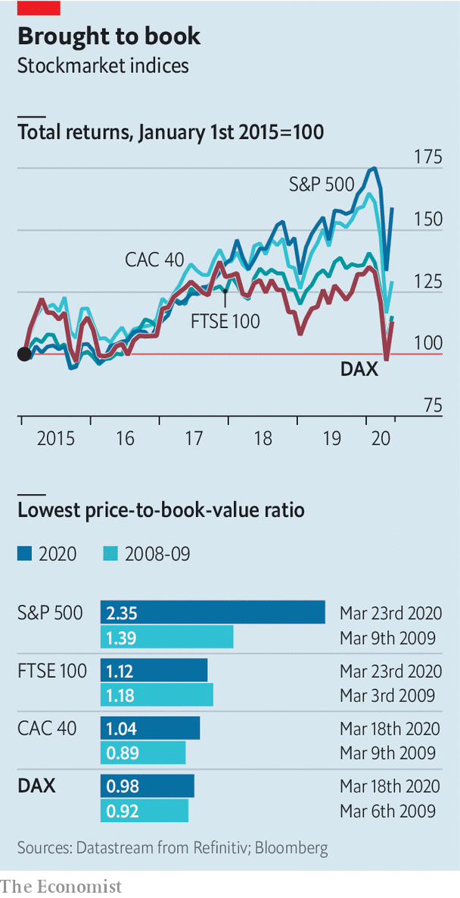

## Despondent DAX

# The covid-19 crisis exposes the frailties of Germany’s biggest firms

> The main German stockmarket index holds up a mirror to the world’s fourth-biggest economy

> May 2nd 2020BERLIN

Editor’s note: The Economist is making some of its most important coverage of the covid-19 pandemic freely available to readers of The Economist Today, our daily newsletter. To receive it, register [here](https://www.economist.com//newslettersignup). For our coronavirus tracker and more coverage, see our [hub](https://www.economist.com//coronavirus)

THE DAX INDEX of Germany’s 30 most valuable listed companies holds up a mirror to the world’s fourth-biggest economy. The reflection isn’t pretty. In mid-March the average “price-to-book” ratio of DAX firms’ market capitalisation to the book value of their assets fell below one, which has previously only happened in 2009 and 2011, amid the global financial crisis and the euro crisis, respectively. It is now hovering barely above one.

The pandemic has hit all of the world’s big stockmarkets. But it is shining a particularly brutal light on the weaknesses of Germany’s flagship index, which has underperformed those in other advanced markets (see chart).

On April 29th Volkswagen, Europe’s biggest carmaker (price-to-book ratio: 0.6) reported that its operating profit sank by 81% in the first quarter, year on year. The day before Lufthansa, which is trading at two-fifths of book value, said it may seek bankruptcy protection, as talks with the government over aid for the airline stalled. Days earlier Deutsche Bank reported a 67% fall in quarterly profits. That this beat analysts’ estimates is damning with faint praise. Its ratio of 0.2 suggests investors don’t think much of its prospects.

Germany’s business-software champion, SAP, is doing well enough. The DAX’s only other tech firm, Wirecard, is not. On April 28th the payments processor’s share price fell by 26% when it published incomplete findings of a special audit, commissioned after reports of allegations of accounting fraud. Wirecard also delayed the publication of results for last year, which were due on April 30th.

The MDAX, which consists of the next 60 biggest listed companies, looks perkier, thanks to digital darlings such as Delivery Hero and HelloFresh (online food), TeamViewer and Nemetschek (software), Zalando (online fashion), Scout24 (digital classifieds) and Freenet (telecoms), as well as biotech firms like Evotec, Morphosys and Qiagen. Delivery Hero or Qiagen may soon ascend to the DAX, possibly pushing out Lufthansa.

“We think obituaries for the DAX are premature,” insists Ulrich Stephan, chief investment officer at Deutsche Bank. He is right. But it would look considerably less morbid with fewer corporate oldies stuck in the pre-digital economy.■

Dig deeper:For our latest coverage of the covid-19 pandemic, register for The Economist Today, our daily [newsletter](https://www.economist.com//newslettersignup), or visit our [coronavirus tracker and story hub](https://www.economist.com//coronavirus)