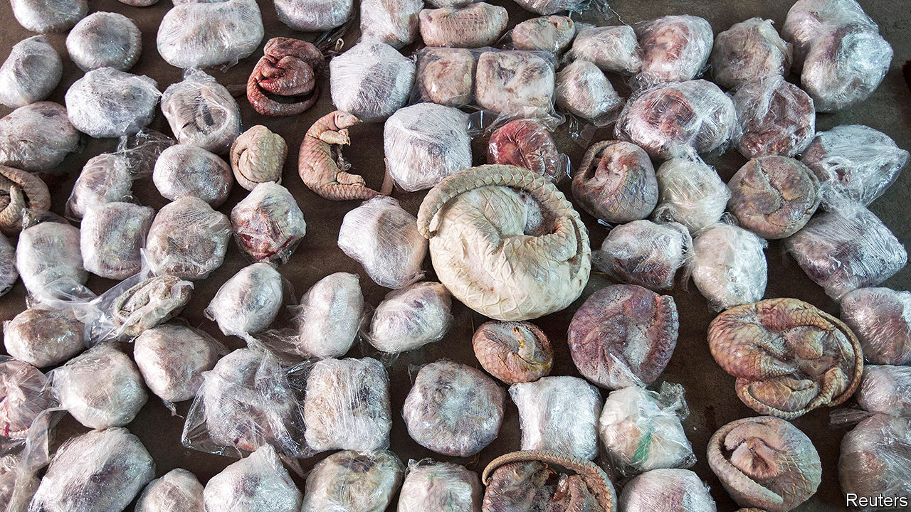

## Tilting the scales

# Covid-19 has put pangolins in the spotlight

> The scaly anteaters may benefit from the attention

> May 2nd 2020

Editor’s note: The Economist is making some of its most important coverage of the covid-19 pandemic freely available to readers of The Economist Today, our daily newsletter. To receive it, register [here](https://www.economist.com//newslettersignup). For our coronavirus tracker and more coverage, see our [hub](https://www.economist.com//coronavirus)

PITY THE pangolin. With its hard covering and ability to roll into a small ball when threatened, the scaly anteater, as it is also known, has an advantage over most predators. But it cannot repel humans. Pangolins, which are endangered, are the most trafficked wild mammals in the world. Most end up in China.

Practitioners of traditional Chinese medicine claim the scales have properties that can help with breastfeeding and poor circulation. Some Chinese consider the flesh a delicacy. Live specimens occasionally appear in China’s wildlife markets. Scientists speculate that a pangolin could have spread the covid-19 virus to humans. This idea has thrust the animals into the global limelight. The attention is badly needed.

Pangolins are found in the wild in several Asian countries, including China. But China’s demand, particularly for scales, has taken a heavy toll on those populations. So the smuggled animals are now mainly from Africa. The UN estimates that the equivalent of 142,000 whole pangolins was seized by various countries in 2018, more than ten times more than in 2014 (when police in the southern Chinese city of Guangzhou found the haul pictured here).

Eating pangolins is illegal in China, but putting their scales into medical concoctions is not. More than 700 hospitals in China are allowed to prescribe pangolin scales, which they can buy from the government. This use provides cover for illegal trading. So too does the government’s approval of pangolin farms. These are an unlikely source for many scales—pangolins are very hard to breed in captivity—but they can help with pangolin-laundering.

Campaigners see encouraging signs. On World Pangolin Day in February, the Communist Party’s main mouthpiece, the People’s Daily, used social media to appeal for pangolin love and to remind people that the scales are no more useful as medicine than human fingernails. That month the government temporarily banned wildlife trading and closed wildlife farms. China’s parliament says it will hold its covid-delayed annual session next month. It may decide to make these measures permanent. But conservationists worry that exceptions for medicine will still be made. In October 2018 China lifted a 25-year ban on the medicinal use of tiger bone and rhino horn. It quickly put this plan on hold after an international uproar. A similar outcry over pangolins is needed. 

Correction (May 6th 2020): In an earlier version of this story we reported that, in October 2018, China had lifted its ban on the medicinal use of tiger bone and rhino horn. We should have noted that it later decided to postpone doing so for an indefinite period. The story has been amended to reflect this.

Dig deeper:For our latest coverage of the covid-19 pandemic, register for The Economist Today, our daily [newsletter](https://www.economist.com//newslettersignup), or visit our [coronavirus tracker and story hub](https://www.economist.com//coronavirus)