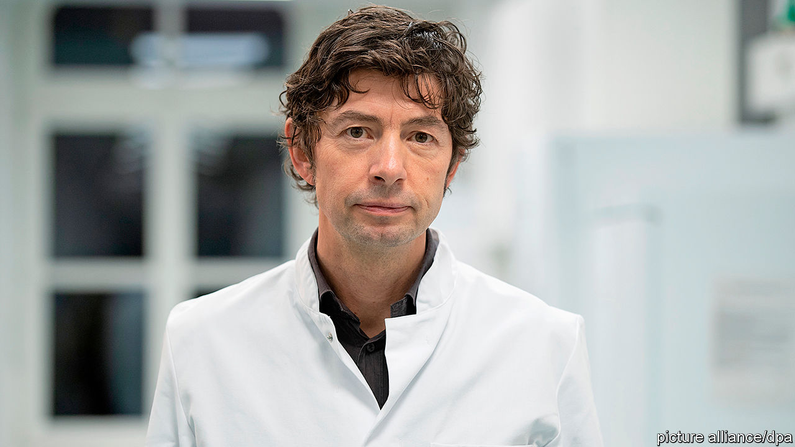

## Fighting microbe with mike

# Christian Drosten, Germany’s covid-19 explainer-in-chief

> A virologist’s podcast helps Germans make sense of the pandemic

> Apr 30th 2020

Editor’s note: The Economist is making some of its most important coverage of the covid-19 pandemic freely available to readers of The Economist Today, our daily newsletter. To receive it, register [here](https://www.economist.com//newslettersignup). For our coronavirus tracker and more coverage, see our [hub](https://www.economist.com//coronavirus)

CHRISTIAN DROSTEN of Berlin’s Charité—Germany’s most renowned hospital—knows a thing or two about going viral. Despite his busy schedule advising Chancellor Angela Merkel and her government, Charité’s head of virology has regularly spoken with two journalists from NDR, a public broadcaster, since February 26th. Their 30-minute-plus podcast went out every weekday for the first six weeks of the crisis, and still goes out twice a week.

When the podcast launched, Germany had just 21 recorded cases of covid-19 and the producers planned just ten to 15 episodes. There have now been 161,539 cases, and 36 episodes to date, which together have received 34m plays. It is the most popular podcast in Apple’s iTunes store across Germany and Austria, and number two in Switzerland.

Dr Drosten’s credentials are second to none. He was part of the team that discovered SARS in 2002 and on January 13th his team released a new diagnostic test for covid-19, since adopted by medical practitioners from Lithuania to Iran. His inimitably Germanic explanations can span five minutes or more, something which the producers say he insisted on prior to launch.

His appeal to Germans is similar to that of Mrs Merkel. Both are measured speakers with scientific backgrounds (she has a PhD in physics). But despite that their fans are often younger than one would expect. Memes of Dr Drosten and GIFs of Mrs Merkel, who occasionally appear at press conferences together, have lit up social-media channels frequented by the young.

Dr Drosten is also good at anecdotes, talking about his father, who wondered how social distancing would affect his shooting-club celebrations, or the struggles of balancing child care and work. And he admits to having enjoyed a drink at the pub before they closed down—but always from the bottle, as it is more hygienic. Of course.

Dig deeper:For our latest coverage of the covid-19 pandemic, register for The Economist Today, our daily [newsletter](https://www.economist.com//newslettersignup), or visit our [coronavirus tracker and story hub](https://www.economist.com//coronavirus)