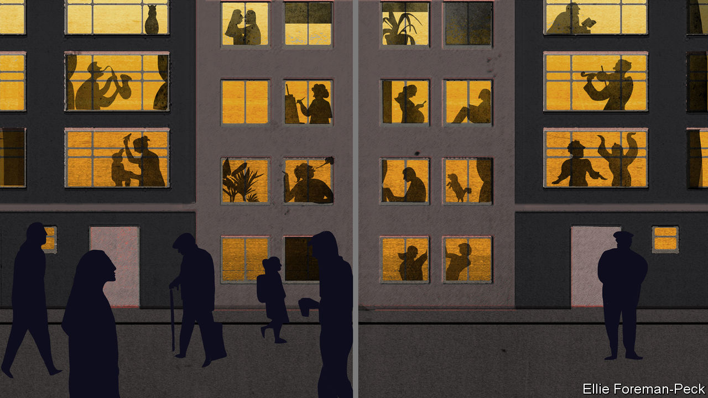

## Infectious suspicion

# Do low-trust societies do better in a pandemic?

> When you don’t trust your neighbours to wash their hands, you stand farther away

> May 2nd 2020AMSTERDAM AND BUCHAREST

Editor’s note: The Economist is making some of its most important coverage of the covid-19 pandemic freely available to readers of The Economist Today, our daily newsletter. To receive it, register [here](https://www.economist.com//newslettersignup). For our coronavirus tracker and more coverage, see our [hub](https://www.economist.com//coronavirus)

SURVEYS CONSISTENTLY find that residents of north-western Europe trust their governments and fellow citizens quite a lot, while those in southern and eastern Europe do not. When the World Values Survey (WVS) asks Swedes whether most people can be trusted, more than 60% answer yes. In Italy only about 30% do so, and in Romania a mere 7%. Another study, the European Social Survey (ESS), asks respondents to rate their trust in politicians on a ten-point scale. In 2018 the Dutch averaged 5.4, the Poles 3.1 and the French and Germans in between. One in eight Bulgarians gave their politicians a zero.

Such results reflect deep sociocultural differences. Higher trust correlates with greater wealth, less crime and other metrics of well-being. It also seems to influence responses to covid-19. Trusting countries have generally implemented less stringent lockdowns. Rather than harshly enforcing social-distancing rules, their governments rely on citizens to observe guidelines voluntarily. Which method is better? The answer is complicated.

Take Romania, where a brutal communist dictatorship followed by decades of corruption has left citizens suspicious of institutions and each other. Unable to rely on public goodwill, the government responded to covid-19 with a harsh lockdown, declaring a state of emergency even before the country’s first official death. Written declarations of purpose are required to leave home. From March 24th to April 19th police issued 200,000 fines (worth $85m) to scofflaws.

Most Romanians are practising social distancing, says Barbu Mateescu, a Romanian sociologist. The fines are not the only reason. Few trust the country’s decrepit health system to treat them if they get the virus. Some recall food shortages in the 1980s, and were quick to shift into crisis mode. Mr Mateescu calls them “uniquely equipped in Europe” to deal with hardship.

Like Romania, many low-trust eastern European countries locked down hard and fast. Serbia, Greece and other Balkan states imposed curfews. Croatia requires a government-issued pass to travel between towns. Poland, among the first countries to shut its borders, bars children under 13 from leaving home without an adult. Shoppers must wear disposable gloves, and face-masks are required in public.

Such quick, tough responses have helped spare eastern Europe the worst of the pandemic. Confirmed death rates in Poland and Romania are less than a tenth those in hard-hit countries such as France, Italy and Spain. Lower testing rates account for only a fraction of the difference.

In western Europe, unsurprisingly, lockdowns are toughest where the pandemic is deadliest. In France, Italy and Spain, public gatherings and social visits are barred, non-essential enterprises are shut and parks and beaches are closed. In France outdoor exercise is allowed within 1km of home; in Italy the limit is 200 metres, and Spain has banned it until May 2nd. French police had issued over 400,000 fines for violating confinement rules by April 3rd. In Spain the total has reached nearly 800,000, with almost 7,000 arrests.

Less obviously, these harsh lockdowns reflect widespread distrust. Even fewer French and Spanish than Italians think most people can be trusted: about 20%, similar to Poland. Some 25-30% trust the government, half as many as in Sweden. Some approve of tough rules because they mistrust fellow citizens. As a news kiosk owner in Madrid put it: “It’s a necessary evil. People here are all kisses and hugs, they eat paella from the same spoon.”

If low-trust countries in the east are doing better than those in the west, it is partly luck. Eastern Europe was generally faster to adopt tough measures, says Thomas Hale, a political scientist at Oxford who helped assemble an index of the stringency of covid-19 responses. But that could be partly because the virus got there later, and Italy served as a warning.

Meanwhile, citizens of Europe’s high-trust countries have had it relatively easy. Germany has had little confrontational policing. The Netherlands implemented what it terms an “intelligent lockdown”, closing schools and restaurants but allowing socialising with up to three visitors. There are no limits on circulating outdoors other than staying 1.5 metres apart. Mark Rutte, the prime minister, says people are “treated as adults, not as children”.

As for Sweden, it has no lockdown at all. Schools and restaurants are open, though citizens are advised to avoid non-essential travel. “We use the phrase ‘freedom under responsibility’,” says Lars Tragardh, a Swedish historian. On Mr Hale’s index Sweden and Germany were the only EU countries that never reached maximum stringency.

The Swedes and Dutch are following government recommendations: mobility is down by about 40%, according to Google data. But in France and Italy it is down about 80%. Worryingly, Dutch and Swedish covid-19 mortality rates outstrip those in neighbouring countries. The Dutch death rate per head is almost four times that in Germany. Sweden’s is double that in Denmark, which has a tight lockdown.

This suggests that during epidemics trust is a double-edged sword. High-trust countries will probably do better economically, as they usually do. But in public-health terms, high trust may have lulled Dutch and Swedes into a false sense of security. For now, most are satisfied with their governments’ responses. But so are most Romanians. Perhaps that will help to close Europe’s trust gap. ■

Dig deeper:For our latest coverage of the covid-19 pandemic, register for The Economist Today, our daily [newsletter](https://www.economist.com//newslettersignup), or visit our [coronavirus tracker and story hub](https://www.economist.com//coronavirus)