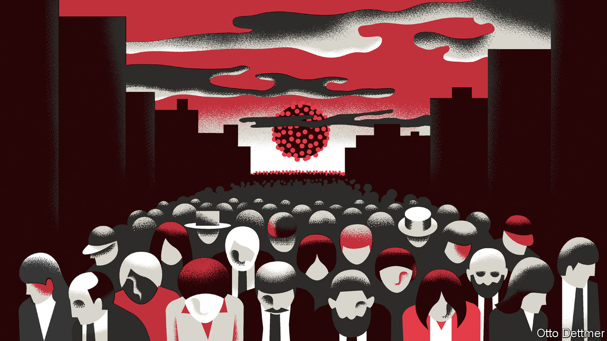
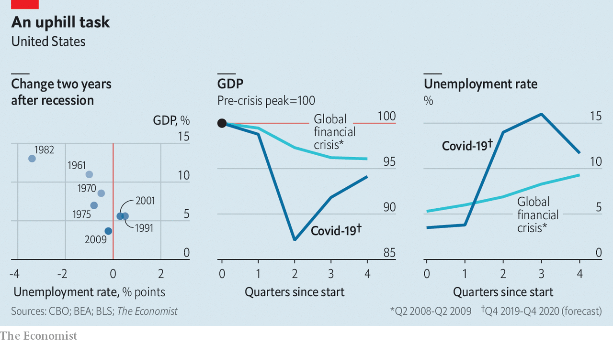

## Free exchange

# Why the unemployed in America could face a lost decade

> Even under the rosiest of assumptions, a labour-market crisis is looming

> May 2nd 2020

Editor’s note: The Economist is making some of its most important coverage of the covid-19 pandemic freely available to readers of The Economist Today, our daily newsletter. To receive it, register [here](https://www.economist.com//newslettersignup). For our coronavirus tracker and more coverage, see our [hub](https://www.economist.com//coronavirus)

THE FIGURES are staggering, even to those hardened by the experience of the global financial crisis. Disney will furlough 100,000 of its hotel and theme-park workers. Uber may slash its staff by a fifth. Fully 26m new claims for unemployment insurance have been filed in America since late March. By April 18th more than a tenth of participants in the labour force were receiving unemployment benefits, the highest rate on record. In March alone American firms shed more than 700,000 jobs, on net. Another 2m may have gone in April, a drop rivalling the record decline in employment that occurred in 1945, as America’s armed forces demobilised. Covid-19 has spread large-scale economic disruption around the world. It is increasingly clear that the pandemic confronts America with a labour-market crisis not seen since the Great Depression of the 1930s.

How severe will the crisis be? America’s unemployment rate rose to around 10% after the global financial crisis and to 25% during the Depression. Recent forecasts, though beset by uncertainty, put the probable peak rate in 2020 somewhere between those figures. Modelling based on recent filings for benefits suggests that the unemployment rate in mid-April may have been around 16%, according to Ernie Tedeschi of Evercore ISI, a consultancy. An analysis of the macroeconomic effects of the coronavirus published on April 24th by America’s Congressional Budget Office (CBO) paints a similar, sobering picture. The CBO reckons that unemployment will rise to 14% in the second quarter of this year, and peak in the third quarter at around 16%. The rate would be even higher, but for the 8m workers it assumes will become discouraged and leave the workforce (in order to count as unemployed, people must participate in the labour market by actively seeking work). Some places and groups will fare worse than others. During the financial crisis, peak unemployment rates across states ranged from just over 4% to nearly 15%. The peak rate for black Americans, at 16.8%, was nearly twice that for whites.

The heights that unemployment reaches will depend on the depths that economic activity plumbs. There is no question that the drop in output through the first half of 2020 will be staggering. Figures published on April 29th showed that GDP fell by 1.2% in the first quarter, compared with the final quarter of 2019 (an annualised rate of -4.8%). The CBO projects that output will fall by about 12% between the first quarter and the second, or an annualised pace of roughly -40% (see chart, middle panel). But the economic and social pain of unemployment rests largely on how persistent the weakness in the labour market proves to be, which in turn depends on the pace of the economic recovery. The CBO, like many forecasters, expects America’s economy to begin growing again in the second half of the year, as restrictive measures are relaxed. They forecast, perhaps optimistically, a robust rate of growth in the third quarter of 5.4% (an annualised rate of 23.5%). A fast initial rebound might well materialise as sectors shut down by pandemic-fighting measures begin to re-open. But growth is expected to moderate thereafter to an annual rate of 2.8% in 2021, in line with America’s recent pre-pandemic performance. If the past relationship between output and job growth is a guide, such a rate will be sufficient only to reduce unemployment to 9.5% by the year’s end. In other words, some 20 months from now, unemployment may still be close to the peak reached in the aftermath of the financial crisis. If GDP growth continued at 2.8% thereafter, America would regain its pre-pandemic unemployment rate only in 2026.

As dire as the CBO’s projections are, it is difficult to see how the economy could do better. The forecast drop in the unemployment rate from the third quarter to the fourth, of 4.3 percentage points, would, if realised, easily be the fastest ever three-month decline. It would achieve in three months what took a year during the early 1940s, when America mobilised for war. In the absence of a miracle treatment or early vaccine, it is the very best America can hope for. Far easier to imagine are ways in which the forecast disappoints. New outbreaks or restrictions on activity could push output lower and delay a turnaround in the jobs market. Though economic recoveries from the 1950s to the 1980s were often V-shaped, recent business cycles have proven more lopsided. Dramatic declines in output and employment have not been followed by correspondingly steep rebounds.

Many of the factors implicated in this change in recovery patterns are likely to apply as the pandemic recedes. Easing could prove insufficient. Though America’s spending on stimulus has been impressive so far, there are some signs of fiscal fatigue. The Federal Reserve has largely succeeded in averting financial-market havoc, but its ability to revive economic growth may be hampered by near-zero interest rates. Household and company debt, already high before the pandemic compared with the early post-war era, will grow more burdensome as the economy shrinks, reducing the scope for new spending once the recovery gets under way. Firms may come to view the pandemic as an opportunity to streamline production—through the use of remote-work and automating technologies, for example—potentially reducing labour demand down the road. Research by Nir Jaimovich of the University of Zurich and Henry Siu of the University of British Columbia finds that such structural shifts during downturns have contributed to the joblessness of recent recoveries.

Even in the rosiest of scenarios, the outlook for those without a job seems grim. Were unemployment to fall as quickly as it did from 1933 to 1937, a return to pre-pandemic jobless rates would still take half a decade. At the rate of improvement experienced after the financial crisis, by contrast, full recovery could take two decades. All that after the hardship of the 2010s seems nearly unthinkable. Yet without a hefty dose of good luck and an aggressive government effort, America’s unemployed face a real risk of another lost decade—or two. ■

Dig deeper:For our latest coverage of the covid-19 pandemic, register for The Economist Today, our daily [newsletter](https://www.economist.com//newslettersignup), or visit our [coronavirus tracker and story hub](https://www.economist.com//coronavirus)

## URL

https://www.economist.com/finance-and-economics/2020/05/02/why-the-unemployed-in-america-could-face-a-lost-decade
