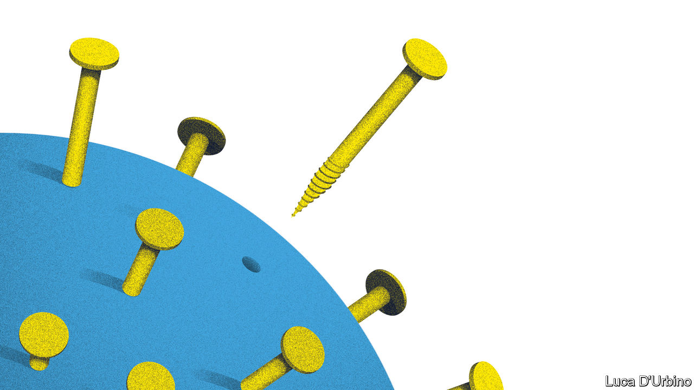

## The origins of the pandemic

# Where did the novel coronavirus come from?

> China’s opacity has allowed dangerous conspiracy theories to flourish

> May 2nd 2020

Editor’s note: The Economist is making some of its most important coverage of the covid-19 pandemic freely available to readers of The Economist Today, our daily newsletter. To receive it, register [here](https://www.economist.com//newslettersignup). For our coronavirus tracker and more coverage, see our [hub](https://www.economist.com//coronavirus)

WHERE DID it come from? After five months and over 225,000 deaths, the question is the subject of a vicious spat between America and China. By far the most likely explanation is that the virus jumped from bats to humans, perhaps via another animal such as a pangolin, at a wet market in Wuhan (see [article](https://www.economist.com//china/2020/05/02/covid-19-has-put-pangolins-in-the-spotlight)). But conspiracy theorists mutter that the bug could have escaped from one of the city’s laboratories, at least two of which research into infectious diseases. Some American politicians, including President Donald Trump, want an investigation; China retorts that the claims are “malicious”. In March one of its spokesmen claimed the virus might have come from America. The row risks corroding public confidence in the crucial work disease laboratories do around the world. It is also a reminder of why China’s official culture of opacity and propaganda is such a profound weakness.

The virus shows no sign of deliberate human construction and there is no reason to doubt that it evolved entirely in the wild (see [article](https://www.economist.com//science-and-technology/2020/05/02/the-pieces-of-the-puzzle-of-covid-19s-origin-are-coming-to-light)). But accidents do happen. Bugs studied during legitimate experiments in laboratories have escaped in the past. SARS, a virus that killed 774 people in 2002-03, slipped out of a lab in Beijing twice in 2004. Foot-and-mouth disease, which required the culling of 6m animals in Britain in 2001, caused £8bn ($11.5bn) of damage. A sample later escaped from a research institute in 2007, but was contained. America suffered 34 laboratory-acquired infections in 2000-09, resulting in four deaths. American labs have accidentally shipped live anthrax, bird flu and Ebola to lower-security facilities in recent years. One health-security index suggests that three-quarters of countries score poorly on biosecurity.

Ending the dispute over covid’s origins is especially important because super-secure bio-labs are becoming more common. There are now around 70 “biosafety level-four” sites—designed to deal with fatal diseases lacking a cure or vaccine—in 30 countries. America has over a dozen. China has two, one at the Wuhan Institute of Virology, and plans to build up to five more by 2025. If handling pathogens is nerve-jangling stuff, tinkering with them is risky, too. One branch of research in particular is specifically aimed at making diseases even more dangerous—better at hopping between humans, for instance, or more resistant to antibiotics. Scientists at the Wuhan lab were engaging in such experiments, known as gain-of-function, in collaboration with American and Italian scientists.

It sounds creepy, but such work brings potential rewards, as scientists might understand better how a new disease might behave, aiding the development of drugs that could save many lives. As a result, it is crucial that governments around the world weigh the trade-offs involved in research, monitor breaches and encourage full transparency.

Sadly, policy has been going in the opposite direction. Since 2017 America has had a dedicated panel to scrutinise its own laboratories, but its membership and workings remain regrettably opaque. On April 27th America cut funding for a group conducting broader research into how bat coronaviruses jump to humans, seemingly because of its collaboration with scientists in Wuhan. China, meanwhile, has ramped up its campaign of propaganda and intimidation. It threatened a consumer boycott of Australian exports after Australia’s government proposed an independent global review into the origins of the crisis. And it bullied the European Union over an official report into Chinese disinformation about the virus, with officials saying its publication would “be very bad for co-operation” and make China “very angry”.

The world would be served by a clear account of how the virus made its way from bats to humans. Without one, conspiracy theories will flourish, jeopardising sensible scientific discovery. What is needed is rationality, co-operation and full transparency from all countries. Right now the world is getting the opposite.■

Dig deeper:For our latest coverage of the covid-19 pandemic, register for The Economist Today, our daily [newsletter](https://www.economist.com//newslettersignup), or visit our [coronavirus tracker and story hub](https://www.economist.com//coronavirus)

## URL

https://www.economist.com/leaders/2020/05/02/where-did-the-novel-coronavirus-come-from
