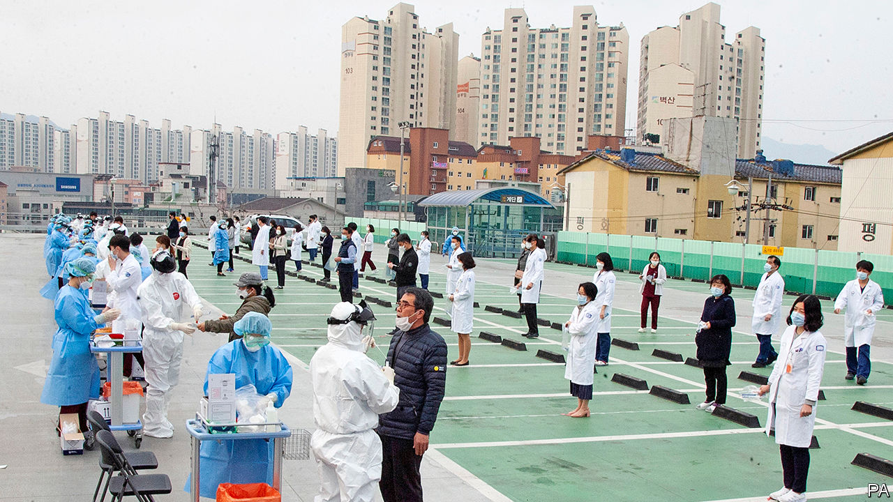
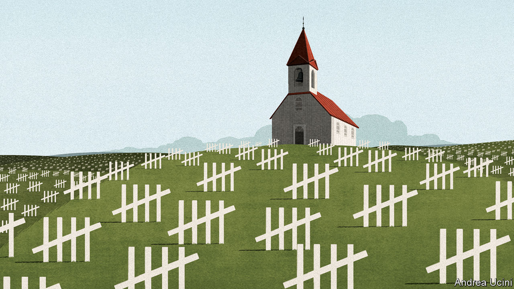
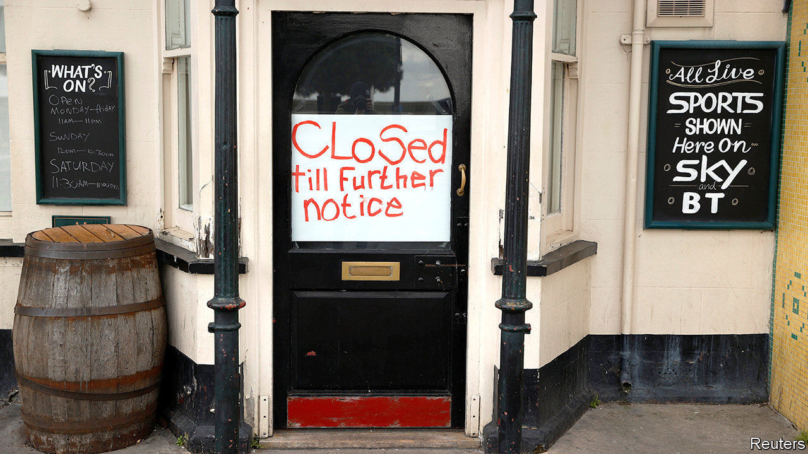

## On testing, stimulus, the three-day week, ancient Athens, coughing

# Letters to the editor

> A selection of correspondence

> May 2nd 2020

I was pleased that you placed the importance of testing at the heart of the response to the covid-19 pandemic (“[Tests of reason](https://www.economist.com//science-and-technology/2020/04/23/how-to-build-and-deploy-testing-systems-at-unprecedented-scale)”, April 25th). However, you did not mention the critical need to slow transmission of the disease in low-income countries with already fragile health systems. We need to do this if we are to achieve an effective exit, mitigate the economic disaster and ensure worldwide health security.

Effective testing strategies are the linchpin for saving lives and getting people back to work. This is especially true in countries where the economic impact threatens to increase extreme poverty for the first time since 1990. High and competing prices, broken supply chains and complex ordering systems have made it impossible for these countries to procure the tests they need in the global marketplace. FIND has been working closely with global bodies, particularly the World Health Organisation, in pushing for universal access to essential tests, accelerating the establishment of a Global Diagnostics Alliance to strengthen procurement systems, increase the availability of tests, reduce prices and build country capacity. As Bill Gates said in the same issue, wealthy nations must include poorer ones in their pandemic preparations (By invitation, “[Learning to fight the next pandemic](https://www.economist.com//by-invitation/2020/04/23/bill-gates-on-how-to-fight-future-pandemics)”, April 25th).

It is vital that public- and private-sector donors show up at the Coronavirus Global Response Summit on May 4th and pledge the funds needed for diagnostics and testing so that poor countries can increase their technical capacity and access simple, low-cost tests. This investment will not only address today’s crisis, but ensure long-term preparedness for future crises.

In a pandemic, no one is safe until everyone is safe.

MARK KESSELChairmanFoundation for Innovative New Diagnostics (FIND)Geneva

Governments must consider how they will manage their finances after the pandemic (“[A grim calculus](https://www.economist.com//leaders/2020/04/02/covid-19-presents-stark-choices-between-life-death-and-the-economy)”, April 4th). Specifically, how do they return to a position that is sustainable for future generations? There are two tools available that governments often overlook. The first is to ensure public finances are managed with the quality of information that is routinely available in the corporate sector. Governments’ financial positions are far too complex to be managed using information that focuses almost exclusively on cashflows and debt. The second is to use both sides of the balance-sheet. Do not focus only on debt, but manage other liabilities, pensions for instance, and more importantly, manage assets. Recent work by the IMF makes it clear how important asset-management can be, contributing revenues potentially equivalent to 3% of GDP.

IAN BALLProfessor of public financial managementVictoria University of Wellington

Regarding stimulus, governments are, in fact, unable to create something from nothing. More than a decade of this predominant philosophy has left us unable to respond to a real crisis without doing untold damage to the next generation by piling on many more trillions in debt. The greatest free lunch of all is slashing interest rates, which takes resources from savers and gives them to borrowers in a bit of financial voodoo. Only by being candid about government’s role as redistributor rather than producer can we have an honest discussion about whether its new-found responsibility to fix every problem is a good thing.

GRANT LEWISReston, Virgina

There is a trade off of money versus lives. But what is the point of being alive if you can’t study, spend time with friends, or just enjoy the sound of water sloshing as you swim? Not everything has to go back to normal immediately, but we are all going to die, so the real question is whether we’re going to live?

TONY BRUGUIERMilpitas, California

There may be some readers, like me, old enough to remember Britain’s three-day week, another event when “record-breaking bad economic news” came flooding in ([“Over the cliff edge](https://www.economist.com//britain/2020/04/11/covid-19-causes-britains-fastest-economic-contraction-on-record)”, April 11th). In early 1974, against the background of an oil crisis and strikes, the government introduced a limited working week to conserve energy. On the first day 885,000 people registered as unemployed. ITV and the BBC took turns on alternate days to broadcast. Most pubs were shut and queues formed outside shops. Half of the country’s streetlights were turned off and heating in commercial and public buildings reduced. Power cuts were common.

Despite the most drastic restructuring of the economy since the second world war, British industry showed remarkable resilience. In the first quarter of that year consumer spending only fell slightly, in part because of a significant increase in alcohol consumption. Nearly every economist of the day predicted a 40% drop in production to match the 40% reduction in working hours, but in the event the loss of production was less than 20% and probably closer to 10%. British industry managed this with the co-operation of British workers, who managed to cram a lot more than three days’ production into three working days through a huge increase in productivity. The long-term impact on the economy was negligible. This may have been by way of a national coming together, or it may have been by way of self-preservation, employees protecting the precious three days’ work they still had.

Today’s economic background is a lot more positive than it was in 1974. The government’s furlough and loan schemes should hopefully help businesses get through.

FRANCIS MAGUIRENew Malden, Surrey

Although the jury may be out on how the Plague of Athens affected ancient democracy, or indeed, how today’s pandemic will affect our own, there are uncanny parallels between Athenian politics and ours (“[How to survive a plague](https://www.economist.com//books-and-arts/2020/03/26/when-athenians-feared-a-disease-would-wreck-their-democracy)”, March 28th). Thucydides remarked that the political leaders of Athens:

He added, in what would not feel out of place today, “In this contest the blunter of the wits were most successful.”

Your article provided cold comfort that, following the plague, Athens “rumbled on, more or less democratically, for another eight decades”. Such a decline, if repeated today, could take place entirely within my children’s lifetime.

JEREMY KUHREIrvine, California

Reading about the abundance of Dutch swear words that relate to disease ([Letters](https://www.economist.com//letters/2020/04/18/letters-to-the-editor), April 18th) reminded me of a saying that my mum, who grew up in London, was fond of: “It’s not the cough that carries you off, it’s the coffin they carries you off in.” Dry (cough) humour indeed.

SCOTT SWINKLos Gatos, California