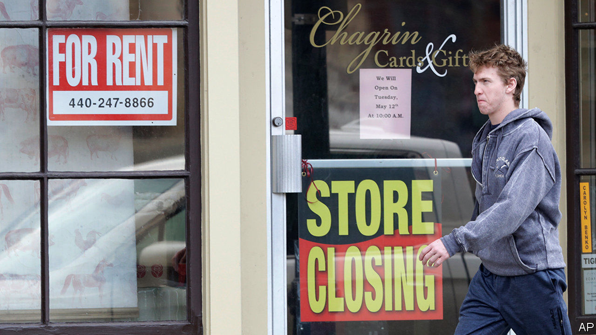

# Business this week

> Apr 30th 2020

The American economy shrank by 4.8% at an annualised rate in the first quarter, the worst decline since the fourth quarter of 2008. It will get worse: pandemic restrictions began in the tail end of the quarter. The news did little to stop the recent bullishness in stockmarkets: the S&P 500 is up by more than 30% since mid-March.

Markets have been buoyed by a sharp rise in the share prices of tech firms. In its quarterly earnings Facebook reported a healthy rise in the number of active users. Microsoft said that the pandemic was having a “minimal impact” on sales and recorded a profit of $10.8bn. Alphabet’s revenues beat market expectations.

The Bank of Japan expanded its bond-buying programme to acquire an unlimited amount of government paper and increase its purchase of corporate debt. The announcement on government bonds was mostly symbolic; in recent years the central bank has bought far less sovereign debt than it had said it would, concentrating instead on pegging long-term yields around zero. Still, it is a signal to markets that the Bank of Japan intends to ramp up stimulus.

In France GDP contracted by 5.8% in the first quarter compared with the previous three months, the steepest decline in the economy by that measure since records began in 1949.

The Federal Reserve took no action at its latest meeting, though it earlier expanded eligibility for its emergency lending programmes to America’s states, counties and cities.

Russia’s central bank cut its benchmark interest rate by half a percentage point, to 5.5%, and hinted at further reductions. The economy has been hit by the collapse of the oil price and a general slump in demand for other commodities. Vladimir Putin extended the country’s lockdown until at least May 11th, warning that a “difficult path lies ahead”.

With oil markets in turmoil, oil companies began reporting their earnings for the first quarter. BP’s underlying replacement-cost profit, its preferred measure of earnings, plunged. It also reported a hefty net loss, but remains committed to paying a dividend to shareholders. After reporting a sharp drop in its headline profit, Royal Dutch Shell reduced its dividend for the first time since the 1940s.

Argentina ended trade negotiations with the other members of Mercosur, a bloc of four South American countries. The government said it wanted to focus on home, but would still work with Mercosur to secure a trade deal with the EU.

InterContinental Hotel Group, which owns the Crowne Plaza and Holiday Inn chains, said it had re-opened nearly all its hotels in China, as bookings continue to improve.

Boeing cancelled its proposed $4.2bn joint venture with Embraer, a Brazilian aerospace firm. The American company said Embraer “did not satisfy the necessary conditions” during talks. Embraer claimed Boeing had “manufactured false claims” and “engaged in a systematic pattern of delay”. Meanwhile, Boeing announced more cuts to jobs and production. The chief executive of Airbus warned staff that his company was “bleeding cash at an unprecedented speed” and to expect job losses.

Air France-KLM looked set to receive a bail-out that could be worth up to €11bn ($12bn) to help it through the crisis. The rescue plan comes with conditions, including commitments to lower emissions. The French finance minister proclaimed that “Air France must become the most environmentally friendly airline on the planet.”

The pain intensified for other airlines. British Airways suggested it would make 12,000 staff redundant, as only a “handful” of its planes were flying; Norwegian Air warned that its fleet is likely to remain grounded for a year; and SAS, a Scandinavian airline, said it was reducing its workforce by half. Southwest Airlines reported its first quarterly loss since 2011.

SoftBank revised its estimate of its earnings in this financial year to account for more losses at WeWork, an ailing startup. The Japanese conglomerate now expects a net loss of ¥900bn ($8.5bn).

Donald Trump used wartime powers to order meat-processing factories to stay open. This came after Tyson Foods, America’s largest meat processor, warned that the closure of slaughterhouses would cause shortages. Sales of plant-based alternatives to meat have soared in America, reportedly by 265% over two months. See [article](https://www.economist.com//united-states/2020/05/02/in-america-the-virus-threatens-a-meat-industry-that-is-too-concentrated).

Tesla made another small quarterly profit, its third in a row. But the news was overshadowed by a rant from Elon Musk, the electric-carmaker’s boss, against lockdowns. He described the restrictions as “fascist”, and urged the government to “Give people back their goddamn freedom.”

## URL

https://www.economist.com/the-world-this-week/2020/04/30/business-this-week
