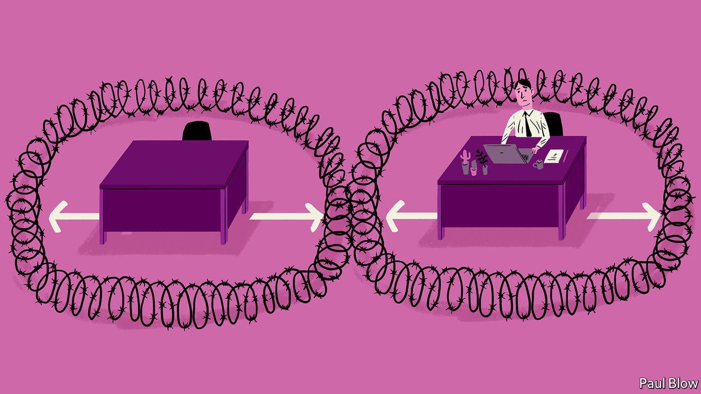

## Bartleby

# Don’t stand so close to me

> Office design may need to change

> May 9th 2020

Editor’s note: The Economist is making some of its most important coverage of the covid-19 pandemic freely available to readers of The Economist Today, our daily newsletter. To receive it, register [here](https://www.economist.com//newslettersignup). For our coronavirus tracker and more coverage, see our [hub](https://www.economist.com//coronavirus)

OFFICE WORKING and social distancing really do not mix. The reason why offices exist is to bring colleagues together so they can collaborate. So when employees start to return as pandemic-related restrictions are lifted, they will face a host of challenges.

Start with the basics: getting into the building. In most offices a lot of people tend to leave and arrive at the same time. Keeping them six feet (two metres) apart as they enter may require a queue in the street. Many workers will want to avoid public transport until the pandemic fades from memory, so may cycle to work. But even where offices have changing rooms, they tend to be fairly cramped; hard to keep employees apart.

Lifts are an even bigger choke-point. In normal circumstances people who work in high-rises are accustomed to a long wait to reach the top floors. If lifts can only carry two or three people at a time, that wait would lengthen. And imagine the hassle if a group of visitors arrives at once.

When workers make it to their desks, there is another problem. In recent years offices have been increasing density. The space per workstation in Britain decreased by around a quarter in the decade to 2018, according to Jon Neale of JLL, a property consultancy. But social-distancing rules may drastically reduce the number of people offices can accommodate. Nick Jackson of Arup, an engineering and architectural group, says a two-metre space between desks in a central London office building may reduce the number of staff it can host to 30-35% of the pre-pandemic total.

In the short term, these problems have an obvious answer: let people work from home, or bring them into the office in shifts (maybe two days a week). This will limit serendipity but is better than nothing. The trickier question is whether office design will change in the longer run.

Some high-tech solutions floated before the pandemic appear newly relevant. Zaha Hadid Architects, a big British firm, has designed an eco-friendly building in Sharjah, a city in the United Arab Emirates, with “contactless pathways”, where employees rarely need to touch the building with their hands. Doors open automatically using motion sensors and facial recognition; lifts (and even a cuppa) can be ordered from a smartphone.

Other ideas emerged in response to covid-19. Besides hand sanitiser at the entrance and touch-free doors, an office in Amsterdam designed by Cushman & Wakefield, a property-services group, has desks surrounded by a zone of colour-coded carpet to let people know when they are getting too close. At the start of the day workers pick up a paper deskpad on which to rest their laptop, and which is discarded when they leave. Arrows on the floor guide them to move around clockwise.

All very clever. You could even imagine it working—for a few weeks. But after a while the rules would surely be broken. Bert wants to talk to Ernie who is within sight and just a dozen feet away in an anticlockwise direction. Will he really take the long route around? And physical distance from colleagues is one thing. The potential for germs to be spread via communal items and surfaces is another. Think about the handle on the kettle or the controls of the photocopier. The much-loved snack cupboard at The Economist is probably doomed.

The new emphasis will be on cleanliness. Facilities managers will take a leaf from “The Restaurant at the End of the Universe”, a science-fiction novel by Douglas Adams, where the Golgafrinchans exiled telephone sanitisers and other useless people (such as insurance salesmen and management consultants) on a spaceship, only for their planet’s population to be wiped out by a virus contracted from a dirty handset.

Better air filtration to limit the spread of disease may bring other benefits. One study found that the extra costs of improving air quality could be paid back in less than two years, in terms of higher productivity and reduced ill health.

But not all improvements will be as cost-effective. The reason employees are crammed together is to cut rental expenses. One wonders whether, if a vaccine is found and social distancing no longer required, firms will consider office redesign is worth the candle.

Some elements, like more cleanliness, may stick. The pandemic will speed up the trend towards virtual meetings and home-working. Companies may try to lure highly skilled workers with more personal space, like first-class seats on an aeroplane. But the masses will still be crammed in economy.■

Dig deeper:For our latest coverage of the covid-19 pandemic, register for The Economist Today, our daily [newsletter](https://www.economist.com//newslettersignup), or visit our [coronavirus tracker and story hub](https://www.economist.com//coronavirus)