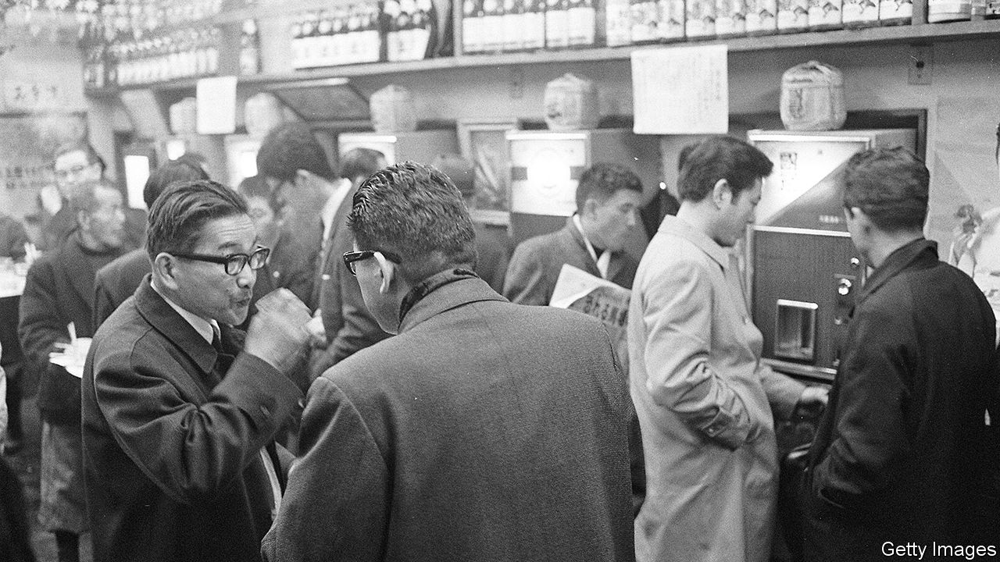

## The presenteeism premium

# Japanese offices struggle to adapt to social distancing

> Many companies still put a strong emphasis on physical presence

> May 9th 2020TOKYO

Editor’s note: The Economist is making some of its most important coverage of the covid-19 pandemic freely available to readers of The Economist Today, our daily newsletter. To receive it, register [here](https://www.economist.com//newslettersignup). For our coronavirus tracker and more coverage, see our [hub](https://www.economist.com//coronavirus)

IN 57AD a Chinese emperor, Guangwu, gave an envoy from the kingdom of Wa, as Japan was then known, a solid gold seal, with a handle in the form of a coiled serpent. Such seals, or hanko, are still commonly used in Japan in place of signatures on official documents and contracts. During the covid-19 pandemic, with many workers forced to defy social-distancing guidelines and trudge to their offices to put ink to paper, the hanko captures corporate Japan’s struggle to modernise its anachronistic workplace culture.

Despite its reputation for hi-tech wizardry, Japan can be stubbornly analogue. When the pandemic hit, only 40% of Japanese firms had used digitised contracts at all and just 30% had systems in place to enable remote working. Faxes remain ubiquitous; in many prefectures, doctors have been faxing coronavirus test results to public-health officials.

The pandemic has also exposed Japan Inc’s unusually heavy reliance on face-to-face communication. Meeting clients or business partners in person is de rigueur. The Japanese style of collective decision-making depends on people huddling in a room together. Salarymen and women put in long days in the office to demonstrate their dedication to their company and colleagues—and then late nights of sake-fuelled carousing to build camaraderie.

In Japan gaiatsu, or external pressure, often provokes deep changes. It took the arrival of America’s Black Ships in 1853 to end more than 200 years of Japanese isolation. A collision between Japanese and Chinese vessels near disputed islands in 2010 prompted a revamp of the armed forces. The pandemic, argues Miyake Kunihiko of the Canon Institute for Global Studies, a think-tank in Tokyo, is gaiatsu for corporate Japan.

Some firms are responding. Covid-19 is a headwind for revenues, but a tailwind “in terms of culture”, says Hagiwara Shinichi, boss of Mitsui Foods, a big wholesaler. He has instructed staff to hold regular Zoom meetings. Many firms are shifting to digital contracts. Virtual drinking parties, or Zoom-nomi, are all the rage; as Honda Masakazu, a columnist, recently put it on Toyo Keizai, a business-news site, “You don’t have to worry about catching the last train.”

So far the changes have been halting and uneven. Large Japanese companies are shifting to flexible work regimes more rapidly; they were more likely to have computer systems in place, as well as cash on hand to make up for lost revenues and pay for investment in hardware and software. Small and medium-sized firms “don’t have that luxury”, admits Mr Hagiwara.

And the evolution may not endure. Once restrictions are relaxed, managers may demand to see their subordinates back at their desks. Perhaps, though, without their hanko. On April 27th the prime minister, Abe Shinzo, called for a rapid review of the practice. Even his minister of technology policy, who also heads a parliamentary group for the protection of hanko culture, conceded that the seals present an obstacle to teleworking.■

Dig deeper:For our latest coverage of the covid-19 pandemic, register for The Economist Today, our daily [newsletter](https://www.economist.com//newslettersignup), or visit our [coronavirus tracker and story hub](https://www.economist.com//coronavirus)

## URL

https://www.economist.com/business/2020/05/09/japanese-offices-struggle-to-adapt-to-social-distancing
