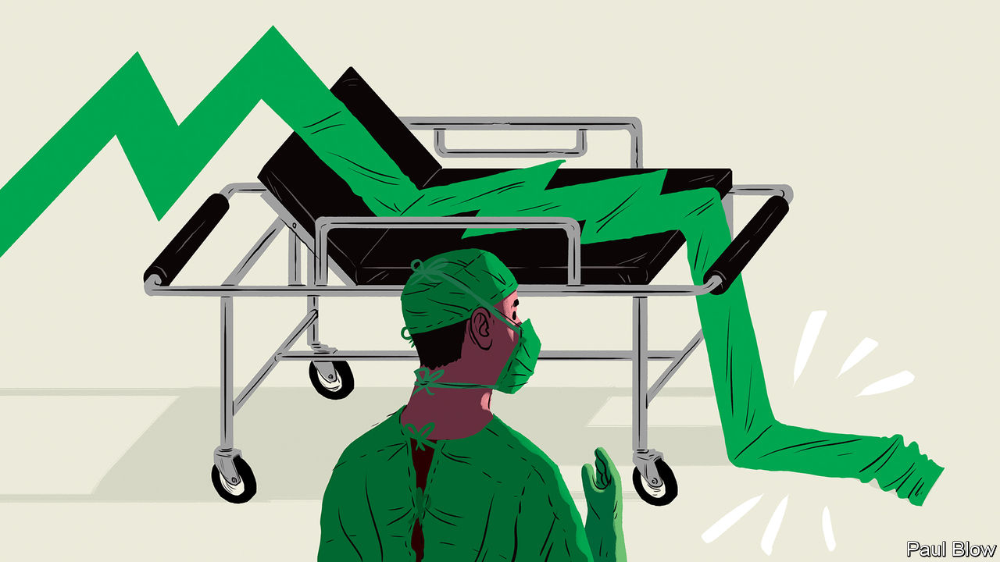
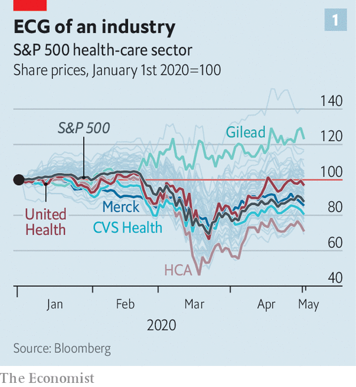
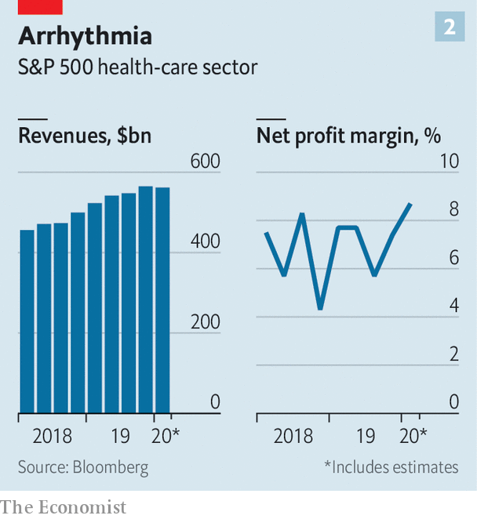

## Prognosis: mixed

# The pandemic will recast America’s health-care industrial complex

> Our guide to winners and losers

> May 9th 2020NEW YORK

Editor’s note: The Economist is making some of its most important coverage of the covid-19 pandemic freely available to readers of The Economist Today, our daily newsletter. To receive it, register [here](https://www.economist.com//newslettersignup). For our coronavirus tracker and more coverage, see our [hub](https://www.economist.com//coronavirus)

DOCTORS AND nurses at Northwell Health have treated nearly 40,000 covid-19 cases, more than any other American provider. But Michael Dowling, who runs New York state’s largest hospital firm, is not triumphant. “This crisis has humbled us,” he sighs. The same goes for much of America’s $4trn health-care sector.

You might think that if anyone stood to benefit from the world’s biggest pandemic in a century it would be providers of health care. Markets certainly give that impression. Health-related firms in the S&P 500 have outperformed the broader index since March, when covid-19 first hit America hard (see chart 1). On May 5th Regeneron, a biotech firm with a promising antibody cocktail, reported first-quarter sales of $1.8bn, a third more than last year. Gilead has received emergency approval to use remdesivir, an antiviral agent it is developing, in coronavirus patients; its share price is up by 19% this year.

For most of the industry, America’s biggest, covid-19 may prove less rewarding as the pandemic unfolds. Reduced spending on health care accounted for nearly half of the 1.2% quarter-on-quarter drop in GDP in the first three months of the year. Things could get worse. Even Regeneron and Gilead are not all they are trumped up to be.

The American Hospital Association, a trade body, estimates that its members will lose more than $50bn a month between March and June. Tim van Biesen of Bain, a consultancy, notes that procedures like hip replacements or heart and brain surgery, which make the most money for hospitals, are down by 65-80%. Strata Decision Technology, which makes software for hospitals, estimates that hospital revenues have dropped by $90bn a month. Mr Dowling says Northwell, with annual revenues of $14bn, made a loss of $350m-400m in the past month. HCA, the biggest listed hospital chain, scrapped its annual guidance, citing uncertainty.

The pain extends beyond clinics. Medtronic, a medical-devices giant, admitted its weekly revenues in America fell by 60%, year on year, in April. Even big pharma, usually resilient to downturns, is not immune. On April 28th Merck, a large drugmaker, said it expected a $2.1bn (around 4%) hit to sales this year because patients sheltering at home are not consuming physician-administered drugs.

America’s health businesses face two questions. How quickly can hospitals return to normal-ish—and with them spending on ailments other than the coronavirus? And will the crisis reshape the industry, which is bigger and more Byzantine than in other rich countries?

The answer to the first question is: not as fast as markets seem to assume. Robert Fields of Mt Sinai Health Partners, which has 4,000 doctors, expects normal services to resume slowly, with “built-in inefficiencies” arising from continued social distancing; other administrators concur. Sam Glick of Oliver Wyman, a consultancy, says that with new safety protocols, extended hours, virtual appointments and the like, non-covid therapies, and so income, could be nearly back to pre-covid levels within two months of the outbreak’s peak in a given region. Without such measures, he says, income might be 35% lower by then.

This would have knock-on effects for the rest of the sector. Take drugmakers. Bain reckons that “injectables”—mostly administered by professionals and so hurt by fewer non-covid hospital visits—make up a quarter of sales at Johnson & Johnson (J&J) and Pfizer, and up to half at Merck. With clinical trials interrupted by lack of patients, potential blockbuster drugs face delays, notes Ben Isgur of PwC, a consultancy. J&J, the world’s biggest pharmaceutical firm, has cut its full-year revenue forecast for 2020 from $86bn to $79bn-82bn.

Even inventing a covid cure does not guarantee riches. A successful firm will face public pressure to make such a drug available cheaply. The Institute for Clinical and Economic Review, an independent drug-evaluator, reckons remdesivir could earn Gilead more than $1bn if reimbursement were based on cost-effectiveness—but only a few million if sold at cost. Bernstein, a research firm, predicts the drug will make no “material” contribution to Gilead’s profits in the next two years. Evan Seigerman of Credit Suisse, a bank, says that it is in big pharma’s interest to help end the pandemic even more or less at cost—so it can return to lucrative business-as-usual.

Pharmacy middlemen and retail chains are in a similar bind. A spike in sales as buyers rushed to fill prescriptions helped CVS Health, a big pharmacy group which reported results on May 6th, beat analyst estimates. But the pandemic may merely have brought purchases forward. New prescriptions fell by 15% year on year in the week to April 17th, according to IQVIA, a data firm. Mr van Biesen observes that pharmacy chains were already squeezed because of a decline in “front of store” profits (from beauty products and over-the-counter drugs) caused by online competition and a shift to low-margin generics.

Health insurers look least vulnerable in the near term. Most have big enough buffers to withstand even a severe scenario for covid-19, in which 130m Americans are infected and 4m-5m need intensive care, reckon credit-raters at Moody’s. The collapse in claims for non-covid procedures has reduced insurers’ overall costs. Ricky Goldwasser of Morgan Stanley, an investment bank, thinks that big ones like Humana and Anthem could see profits rise by 4% and 15%, respectively, in 2020. Another, Centene, has just hired 1,000 new workers.

Next year may be tougher for insurers. Oliver Wyman estimates that six months after an outbreak starts in a region, they will see a “large and sustained rebound in costs”, as patients seek elective treatments. Meanwhile, Gregg Bloche of Georgetown University and Daniel Wikler of Harvard find that insurers (and self-insured firms) could face a bill next year of over $650bn for covid-related expenses.

Where does all this leave the industry? It is likely to emerge a touch more administratively efficient; Chris Coburn of Mass General Brigham, a big hospital network, says things which have been talked about for years, from more telemedicine to less insurance paperwork, have been achieved in six weeks. It will also become a bit more concentrated: a few weaklings will perish; the strong, be they hospitals, drugmakers, pharmacies or middlemen, will get stronger. Covid-19 may push pharmacy chains to shut some bricks-and-mortar stores, of which CVS alone has nearly 10,000.

But the industry was already headed in that direction. The past few years saw a slew of mega-mergers, including CVS’s $69bn purchase of Aetna, a big insurer, and the $67bn tie-up of another big insurance firm, Cigna, with Express Scripts, a middleman which manages prescriptions for health plans. Those on America’s left who see the crisis as a chance to reform what they see as an unjust system, which charges more than other rich countries for worse health outcomes, may be disappointed. Investors who hold their nerve for the next year or two might not be. ■

Dig deeper:For our latest coverage of the covid-19 pandemic, register for The Economist Today, our daily [newsletter](https://www.economist.com//newslettersignup), or visit our [coronavirus tracker and story hub](https://www.economist.com//coronavirus)