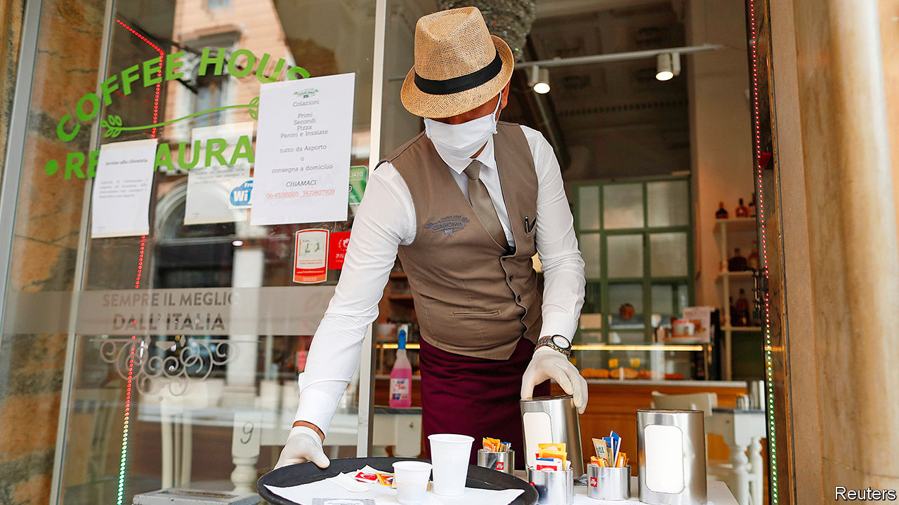

## Latte to go

# Italy, the first country in Europe to enter lockdown, starts to emerge

> But there is a long way to go

> May 9th 2020FLORENCE

Editor’s note: The Economist is making some of its most important coverage of the covid-19 pandemic freely available to readers of The Economist Today, our daily newsletter. To receive it, register [here](https://www.economist.com//newslettersignup). For our coronavirus tracker and more coverage, see our [hub](https://www.economist.com//coronavirus)

MAGDA VERGARI, co-owner of the Bar La Lastra in the hills above Florence, used to sell 80 to 100 pastries a day. “Now, I’m ordering 20,” she says gloomily. Despite an easing of Italy’s strict covid-19 lockdown on May 4th, her sales of coffee are also running at a quarter of the normal level. The problem is that customers are not allowed to enjoy their breakfast cappuccino and brioche at the counter. The new rules preserve social distancing, and only allow bars and restaurants to offer takeaways. Ms Vergari’s regulars must consume their purchases in the street outside.

Awkward compromises are at the heart of Italy’s emergence from an eight-week lockdown. More industries have been allowed to resume production. But most shops will stay closed until May 18th. Hairdressers will have to wait until June 1st. But parks have reopened. People can now travel between municipalities, but not between regions without good reason. And Italians can only visit their congiunti—a term almost unknown beyond officialdom that has prompted confusion and hilarity. The government initially defined it as relatives and in-laws, but then a court ruling was unearthed that included those bound by a “stable and enduring emotional link”, whatever that means.

At least two reasons help explain the hesitancy of what many Italians call Phase 1.5. The prime minister, Giuseppe Conte, faces contrasting fears of infection on the one hand, and of impoverishment on the other. Italy had recorded more deaths than any other country in Europe except Britain (whose figures include care-home deaths, which Italy’s do not): 29,684 by May 6th. But while its economy suffered less than those of either France or Spain in the first quarter, the IMF forecasts a devastating contraction, of 9.1%, by year’s end. With debts of almost 135% of GDP before the pandemic struck, and still unsure how much help it will get from Italy’s EU partners, the government has been reluctant to throw much money at the problems covid-19 is causing for individuals and companies.

Mr Conte’s other problem is the unevenness with which the virus has struck. As the restrictions were eased, three regions in the centre and south were free of fresh contagion. In Lombardy, the region around Milan, more than 3,500 people had tested positive in the previous five days.

Yet it is from the north, Italy’s economic powerhouse and the stronghold of Matteo Salvini’s hard-right Northern League, that the most strident calls have come for the lifting of restrictions. Mr Salvini’s unrelenting criticism of the government does not seem to be doing him much good, however. His poll ratings have fallen. And that is not his only problem. One League governor, Attilio Fontana in Lombardy, is under fire for mishandling the crisis; another, Luca Zaia in Veneto, has been so successful that he is now being talked of as a possible replacement for Mr Salvini as party boss.

As for the prime minister, his biggest challenge may come from within the governing coalition. Matteo Renzi, whose small Italia Viva party could rob Mr Conte of his majority, has threatened to withdraw his support if more is not swiftly done to revive the ailing economy. ■

Dig deeper:For our latest coverage of the covid-19 pandemic, register for The Economist Today, our daily [newsletter](https://www.economist.com//newslettersignup), or visit our [coronavirus tracker and story hub](https://www.economist.com//coronavirus)