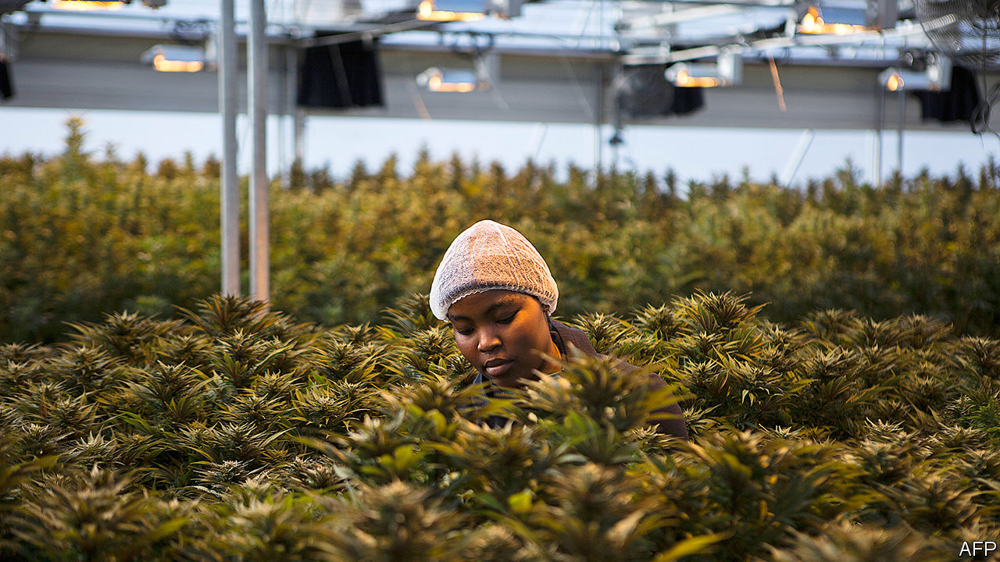

## Pot of gold

# African cannabis growers are on a high

> But their crop is not for smoking

> May 7th 2020KAMPALA

WHEN HE WAS a child, Lauben Kabagambe’s grandparents in western Uganda would boil cannabis leaves to treat sick animals. “I grew up knowing that it is a medicine,” he recalls. Today, as the boss of Industrial Hemp, a Ugandan cannabis company, he is growing weed in computer-controlled greenhouses in partnership with a subsidiary of Together Pharma, an Israeli firm. In April they exported 250kg of medical cannabis to Israel, the first commercial batch ever to leave Uganda.

Africans have been smoking pot for generations: traces have been found on 14th-century pipes in Ethiopia. In colonial times its use was condemned by the church and banned by the state. Now governments sniff an opportunity. Since 2017 five African countries have legalised cannabis farming for medicinal or industrial purposes.

Medicinal plants are typically squat and leafy. The flowers grown in Uganda contain high levels of CBD, a chemical which can be used in therapeutic oils. “It’s cheaper to grow in African countries,” says Nir Sosinsky of Together Pharma, noting that Uganda has low wages and lots of water. This sort of cultivation is high-tech and capital-intensive: firms in Lesotho, a regional pioneer, have attracted multimillion-dollar investments from Canada.

Industrial hemp looks different, growing in tall clusters like bamboo. It contains almost no THC, which gives stoners their highs. The crop can be used for food, rope, textiles and even as concrete. Zorodzai Maroveke, a Zimbabwean dentist, first encountered hemp when she bought a dress in China made from a strange fibre called ma. “I didn’t know what it meant, so I had to go online,” she laughs, “and next thing marijuana pictures were popping up.” Now she is growing Zimbabwe’s first legal hemp crop on a patch of prison land. The site is good for security, she explains, and farming creates work for former inmates.

Reform has been a long battle. Boniface Kadzamira, a Malawian politician, says that “almost the whole house booed me” when he proposed legalisation in parliament. Chiefs and churchmen asked him to explain himself; at the next election he lost his seat. The Hemp Association of Ghana, a campaign group, was told that the word “hemp” in its name was illegal (it registered as the Hempire Association instead). Its president, Nana Kwaku Agyemang, says some politicians hold “archaic” views. Even so, both Ghana and Malawi loosened their laws this year.

The policy shift follows liberalisation in rich countries, which has created a fast-growing market for cannabis products. African firms can be low-cost suppliers to the world, says John Kagia of New Frontier Data, a research firm. In southern Africa cannabis could fill the export gap left by the decline of tobacco. But expensive licences and strict standards shut many local businesses out of the medicinal market. Industrial hemp, by contrast, has lower barriers to entry. Mr Agyemang is registering Ghanaian farmers, some of whom were already growing dope.

Recreational smokers will have to wait. About a quarter of the world’s cannabis users are African (strains such as Malawi Gold are puffed the world over). But only in South Africa, where a court ruled that prohibition violated the right to privacy, is it legal to light up on the continent. Full liberalisation remains a pipe-dream. ■

## URL

https://www.economist.com/middle-east-and-africa/2020/05/07/african-cannabis-growers-are-on-a-high
