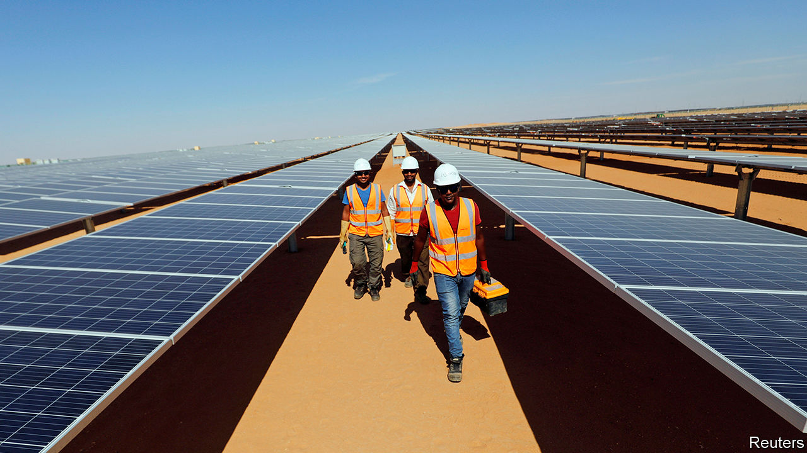
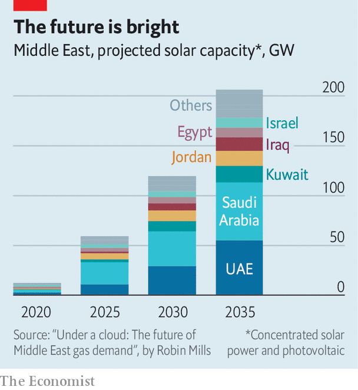

## Rays of hope

# Arab states are embracing solar power

> The Middle East cannot rely on oil forever

> May 7th 2020BENBAN

TWO MILLENNIA after the ancient Egyptians dropped their solar deity, Ra, their descendants are rediscovering the power of the sun. In the southern desert, half an hour’s drive from Aswan, Egypt is putting the finishing touches to Benban, one of the world’s largest solar farms (pictured). Its 6m panels produce 1.5 gigawatts (GW) of energy, enough to power over 1m homes. “In a decade we’ll still need oil for plastics and other petrochemicals, but not for energy,” says Rabeaa Fattal, a Dubai-based investor in Rising Sun, one of Benban’s 40 fields.

Much of the modern Middle East and north Africa was built on oil. It exports more of the black stuff than any other region. A quarter of Middle Eastern power comes from it, compared with 3% from renewable sources. But the recent collapse in oil prices is a reminder that it is risky to depend on a single source of revenue. And in the long run the global trend is towards cleaner energy sources. Renewable-energy capacity in the Middle East has doubled to 40 gigawatts (GW) over the past decade and is set to double again by 2024.

With its vast deserts, the Arab world’s most abundant clean-energy source is the sun. Non-oil economies were first to take advantage of it. More than a third of Morocco’s energy now comes from renewables (in the EU the average is 18%). Oil producers are catching up. A big project in Abu Dhabi, the capital of the United Arab Emirates (UAE), recently received the world’s lowest tariff bid for solar power. Oman, Kuwait and Qatar have large projects, too. The Middle East as a whole generates 9GW of solar power, up from a paltry 91 megawatts a decade ago. Between 2008 and 2018 investment in the field increased 12-fold.

The growing competitiveness of renewables makes analysts optimistic that the trend will continue (see chart). Solar farms are cheaper, faster and safer to build and maintain than oil and gas plants. The UAE’s new solar plant will generate electricity at roughly two-thirds the cost of gas and a third that of oil, even at today’s low prices. Several countries in the region speak of becoming renewable-energy exporters.

Investors, though, still have cause to hesitate. For a start, Arab autocrats often promise more than they deliver. Take Muhammad bin Salman, the de facto ruler of Saudi Arabia, who has made renewable energy a pillar of his economic-reform plan. In 2018 he and SoftBank, a Japanese conglomerate, announced the world’s biggest solar-power-generation project in the Saudi desert. It was shelved six months later.

Regional turmoil scares investors away, too. Iraq’s electricity minister blames protests for derailing his plans to meet 20% of demand with renewables by 2030. Conflicts in neighbouring countries have damned Jordan’s efforts to export solar power to Lebanon. Turbulent Egypt offered to buy solar power at above-market rates in order to attract investors to Benban.

There is also a risk that, in the short term, cheap oil dims countries’ ardour for solar power. Saudi Arabia, for example, might prefer to burn more oil for energy. Declining revenues could force oil-producing states to suspend new solar projects.

But such projects are largely driven by the private sector, and they continue to compare favourably with fossil fuels. “We have seen an acceleration in tenders during covid-19,” says Paddy Padmanathan of ACWA Power, a Saudi firm that operates renewable-energy projects. “Why spend money taking fuel out of the ground and processing it rather than relying on God-given free sun and wind?” ■

## URL

https://www.economist.com/middle-east-and-africa/2020/05/07/arab-states-are-embracing-solar-power
