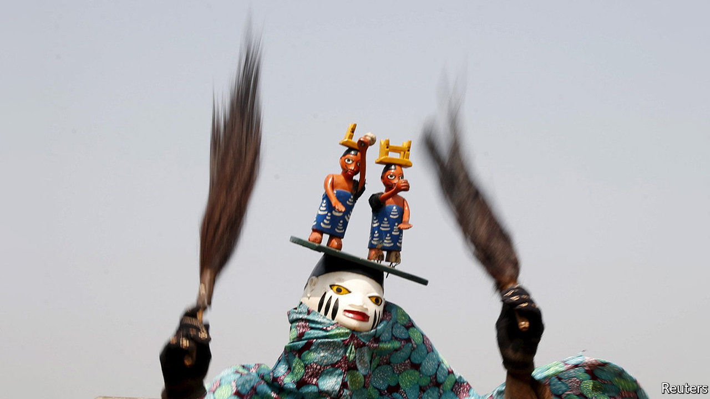

## Alternative medicine

# Voodoo priests recommend voodoo to stop covid-19

> The god of wind can blow it away, apparently

> May 9th 2020OUIDAH

Editor’s note: The Economist is making some of its most important coverage of the covid-19 pandemic freely available to readers of The Economist Today, our daily newsletter. To receive it, register [here](https://www.economist.com//newslettersignup). For our coronavirus tracker and more coverage, see our [hub](https://www.economist.com//coronavirus)

“WE DON’T DO black magic here,” says Zanzan Zinho as he lifts a giant calabash adorned with goat skulls. The shrine of the Vodun (voodoo) priest is in a courtyard in Ouidah, the spiritual home of the religion, in southern Benin. All around are fetishes: dried snakes, twins made of wood and a baby-girl doll into whose mouth the priest inserts a cigarette. “To help her breathe,” explains Mr Zinho. Before your correspondent has a chance to probe, he is given a dram of moonshine from the calabash, of the sort that makes one forget one’s questions.

Roughly 12% of Beninese are adherents of Vodun. Many more, Muslims and Christians alike, incorporate elements of the animist, polytheistic religion in their practice. Suppressed under French rule and then during the Marxist dictatorship of Mathieu Kérékou, Vodun revived after the shift to democracy in the 1990s. In 1996 it was recognised as an official religion. Today tourists from all over visit Ouidah in January for an annual festival. Patrice Talon, the tycoon turned president, has embraced Vodun to bolster his man-of-the-people credentials.

Voodoo can conjure up images of blood and gore. Sacrifices are a core part of ceremonies, providing a way of nourishing the myriad deities. But there is a prosaic aspect to the religion, too. For the Beninese of Ouidah, participating in a ceremony to tap into the Fa (“divination spirit”) is like a Catholic popping into Church to seek wisdom from a priest.

For $10 visitors are allowed to partake in Mr Zinho’s Fa ceremony. After payment the priest grasps a necklace of cowrie shells, manipulating them into patterns to work out which deity is most relevant to the moment. Surprisingly he also inserts twigs between your correspondent’s toes, chain-smokes and offers more moonshine (in lieu of blood sacrifices, apparently). After 15 minutes the priest has reached the relevant spirits. They, via the increasingly inebriated diviner, inform your correspondent that, to live longer, he should eat less papaya and call his father more often.

Despite all this, Ouidah has not been spared the effects of covid-19. Residents are told to stay indoors as much as possible. Gatherings are restricted. Tourism has dwindled. But diviners are busier than ever, as locals seek their help with the pandemic. “There is a greater awareness of human fragility,” says Geoffrey Aidjinou, a guide. He explains that the Vodun god of wind is especially popular at this time. “Only it can speak to the invisible enemy in the air.”■

Dig deeper:For our latest coverage of the covid-19 pandemic, register for The Economist Today, our daily [newsletter](https://www.economist.com//newslettersignup), or visit our [coronavirus tracker and story hub](https://www.economist.com//coronavirus)

## URL

https://www.economist.com/middle-east-and-africa/2020/05/09/voodoo-priests-recommend-voodoo-to-stop-covid-19
