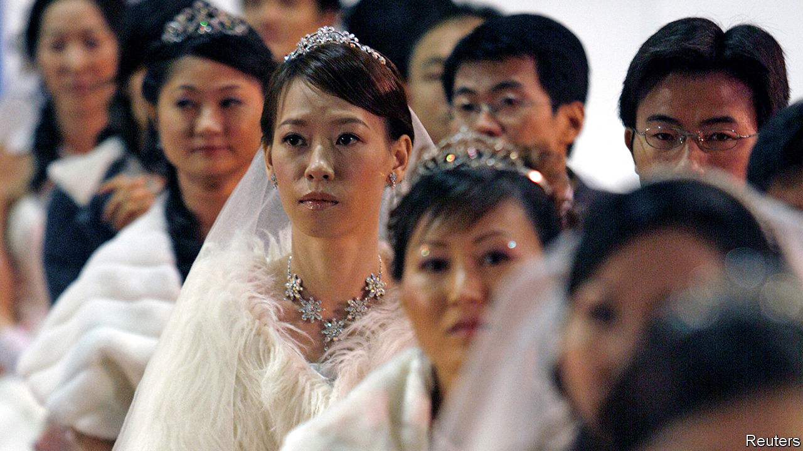

## Liberty for libertines

# Taiwan’s courts may decriminalise adultery

> Jail terms for extramarital affairs are at odds with the country’s otherwise liberal laws

> May 14th 2020TAIPEI

IT IS AN odd mix. Taiwan is the only country in Asia to have legalised gay marriage (unless you count Australia and New Zealand). But it is also one of the few countries in Asia, along with conservative Muslim places such as Afghanistan and Brunei, where adultery remains a crime. From 2016 to 2019 the police investigated more than 10,000 people they suspected of philandering. More than 1,200 were convicted. The guilty all received fines, averaging 90,000 Taiwan dollars ($3,000). They could in theory have been jailed for up to a year. And many straying spouses end up with a criminal record.

Worse, the weight of prosecutions falls largely on women. When husbands are caught cheating, some wives forgive them, but insist on pressing charges against the other woman. Cuckolded men, by contrast, tend to press charges against both their wives and their lovers. The result is that 54% of those convicted in recent years have been women. For other crimes in Taiwan, men earn roughly 80% of all convictions.

The adultery law dates from 1935 and its age leads to further peculiarities. The term it uses for adultery—tongjian—has long been held by the courts to refer to vaginal intercourse between a man and a woman. It is not clear, therefore, whether the law applies to gay couples, says Shawn Tsai Ching-hsiang, the minister of justice.

What is more, the narrow definition of the crime and the reluctance of courts to convict in the absence of clear proof have fostered a cottage industry: private investigators attempt to demonstrate not just that a married person has been having surreptitious trysts with someone of the opposite sex, but also that the pair have been having intercourse. The snoops have been known to wait outside hotel rooms listening for moans before bursting in, camera in hand. A couple caught together in bed once escaped conviction, notes Kuan Hsiao-wei of National Taipei University, by claiming they were just chatting, albeit naked. But it is worth scorned spouses’ while to try to catch their partner in flagrante, since the threat of pressing charges can help secure a more favourable divorce settlement.

Despite all these flaws, Taiwanese seem to like the adultery law. A poll conducted in 2017 by the Taiwanese Public Opinion Foundation found that 69% of adults wanted to keep it on the books. An earlier government survey found even stronger support for retaining the law. “In Taiwanese society, everyone thinks a stable marriage and family is the foundation of social stability,” Mr Tsai says.

Nonetheless, several lower courts have asked the constitutional court to review the law. It heard oral arguments on the subject on March 31st, and says it will announce a ruling at the end of May. The court upheld the law as recently as 2002, but since then has issued a series of more liberal rulings. It was the court, for example, which ordered parliament to legalise gay marriage in 2017. Mr Tsai says the government is open-minded about the law’s future. The judges, however, are likely to be more categorical. ■