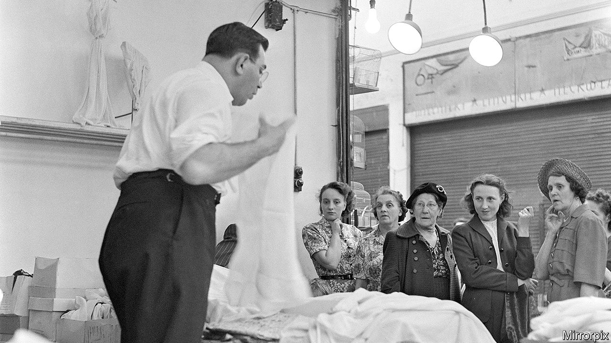

## British fiction

# A spirited and entertaining novel of Brixton in the mid-20th century

> In “Pomeranski” Gerald Jacobs dramatises the lives of Jewish families in the south London neighbourhood

> May 14th 2020

Pomeranski. By Gerald Jacobs. Quartet Books; 256 pages; £12.

VINCENT VAN GOGH once lived in Brixton, where the fledgling artist fell in love with his landlady’s daughter. Formerly famous as a hub of post-war British Caribbean life, more recently a magnet for gentrifying hipsters, the south London neighbourhood boasts a rich cultural history. Until now, though, the area’s literary chroniclers have overlooked the Jewish families who settled in the place Gerald Jacobs calls a “dynamic urban village”.

A long-serving literary editor of Britain’s Jewish Chronicle, Mr Jacobs has written a spirited and entertaining novel of Brixton in the mid-20th century, peopled with characters who balance on a knife-edge between “legit gesheft” (above-board business) and more rackety sorts of enterprise. At times, it reads almost like a low-key, south-of-the-Thames version of “The Sopranos”, but with slices of Bakewell tart in place of Sicilian cannoli.

After the death of Benny Pomeranski in 2000 his son Simon—who has swapped the retail hustles of his parents’ generation for the more genteel profession of drama lecturer—learns about the misadventures that shaped his father’s life. Benny, along with his pals, migrated south from the war-battered streets of the East End (a more familiar stamping-ground for earlier Jewish novelists of London). In Brixton, Benny and his wife Bertha make a decent living from their dress shop, Pomeranski Gowns, but his heart lies with a group of friends who meet in the Astoria café.

These “Astorians” comprise not only “fairly conventional male Jewish shopkeepers” with dreams of a racier existence, but some gay and black confederates. A series of escapades, charmingly told if loosely connected, depict Benny and his mates—among them “Maxie the Ganoff” (“thief”), “Spanish Joe” and “Fancy Goods Harry”—as they sidestep the law to recapture the “rule-breaking” thrills of their slumland youth. “Benny the Fixer” and his chutzpadik gang nurture Robin Hood fantasies as they raid a crooked jewellers or cheer on the career of “Kid Joey”, a half-Jamaican, half-Irish Brixton boxer. They believe a “moral framework” blesses their scams. Not so “Little Jack” Lewis—a big cheese among “South London’s more felonious residents”, weapons-grade thug and sinister proof that playing at crime may lead swiftly down into darkness.

Colourful and episodic, “Pomeranski” scatters its stories liberally. A detour to Kingston, Jamaica, gives readers a tantalising glimpse, but no more, of the island’s long-settled Jewish community. It might have benefited from a tighter focus on fewer figures, such as near-tragic Sam “the Stick” Golub, crippled in childhood and driven by a “constant quest for revenge”. Ultimately, the book endorses Bertha’s scorn for the “nonsense” of treating “petty thieving and threatening people as a sort of political stance”. Mr Jacobs, though, keeps the mood genial and the yarns flowing. The wheezes of his Astorians add an exuberant shot of yiddishkeit to “the everlasting drama that was Brixton”.■