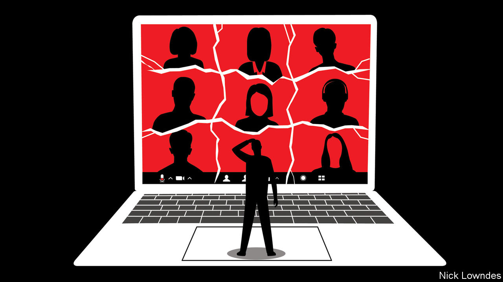

## Johnson

# Why Zoom meetings are so dissatisfying

> Internet chats disrupt the automatic, split-second cues on which conversation relies

> May 16th 2020

Editor’s note: The Economist is making some of its most important coverage of the covid-19 pandemic freely available to readers of The Economist Today, our daily newsletter. To receive it, register [here](https://www.economist.com//newslettersignup). For our coronavirus tracker and more coverage, see our [hub](https://www.economist.com//coronavirus)

READERS OF A certain age will remember when long-distance calls were expensive, international calls ruinously so, three-way calls exciting and video calls the stuff of science fiction. How quickly people take yesterday’s achievements for granted. Today, international video hangouts are free and widely available. Instead of treating them as a miracle, endless commentators have complained about “Zoom fatigue”. Much of their criticism has been about the video: a lack of eye contact, self-consciousness (whether about skin, hair or bookshelves) and the like.

Yet the main reasons Zoom conversations are draining are to do with audio, in which the limitations of the technology run up against habits of speech. Studies find that most cultures observe a conversational rule of “no gap, no overlap”. Despite the various stereotypes that exist about taciturn or interrupting ethnicities, turn-taking is well-organised and almost instantaneous from Mexico to Denmark to Japan.

All that is disrupted in online meetings. Audio and video are chopped into tiny pieces, sent via different channels to the recipient, and then reassembled. Such “packet switching” is robust. DARPA, the Pentagon agency that pioneered the internet, wanted to be sure an enemy could not cut a single line and disable the connection. But some packets may arrive late for reassembly. When they do, the software has a basic choice: to wait, leading to a delay, or to gather what is available, leading to glitches.

Video-calling platforms tend to use audio that arrives quickly but is of middling quality. Zoom says it aims for, and often achieves, a lag of just 150 milliseconds—quicker than the blink of an eye. Yet even when that goal is reached (and it often isn’t, especially when the internet is crowded), that is a lot more time than it seems. Under “no gap, no overlap” rules, the typical silence between the end of one face-to-face conversational turn and the next is about 200 milliseconds. The wait easily exceeds that threshold if Zoom users experience a 150-millisecond lag after the first speaker, followed by another 150 milliseconds for the reply.

Adding these pauses to work calls can make speakers seem less convincing. A study by Felicia Roberts of Purdue University and colleagues found that positive answers to questions (such as “Can you give me a ride?”, “Sure”) were rated as less genuinely willing if the responder took more than 700 milliseconds to reply. That is because it requires less time than that to plan and utter an automatic, positive statement. Above that limit, hearers correctly perceive that the speaker is using extra time to craft a response, perhaps a hedge or a polite “no”. Unfortunately, this means that colleagues who think they are giving forthright answers might come across as cagey on video calls.

A bigger problem may be interruptions, says Ms Roberts, as delays mean that speakers are not able to properly time their turns. In person, when two people overlap one speaker may quickly yield; on a video call it takes longer for this clash to be resolved. Repairing these snags regularly is tiresome.

To make matters worse, colleagues who are hard to understand, even if only for technical reasons, are rated as less trustworthy. Studies find that a foreign accent reduces the believability of factual assertions (such as “a giraffe can go without water longer than a camel”), as does printing such statements in a fuzzy or low-contrast font. In humans’ primitive psychology, the simpler something is to understand, the easier it is to believe. This same bias would unfairly punish the worker cursed with a dodgy internet connection.

With effort, listeners are able to mentally compensate for glitches and delays. “The First Circle”, a novel by Alexander Solzhenitsyn published in 1968, suggests darkly that this is easiest to do during bland exchanges. In the book, intellectuals at a Soviet work camp test a secure calling system by having one engineer read a newspaper over the line, and another rate the quality of the call. The hearer gives a surprisingly high score, despite the spasmodic transmission: he has correctly guessed the missing words, thanks to the formulaic propaganda in the newspaper. Any meeting where it is so easy to predict what colleagues will say raises the question of why it is held in the first place.

There is at least one upside. When workers finally return to offices, they may actually look forward to real face-to-face meetings again—to say nothing of post-work gatherings with friends.

Dig deeper:For our latest coverage of the covid-19 pandemic, register for The Economist Today, our daily [newsletter](https://www.economist.com//newslettersignup), or visit our [coronavirus tracker and story hub](https://www.economist.com//coronavirus)