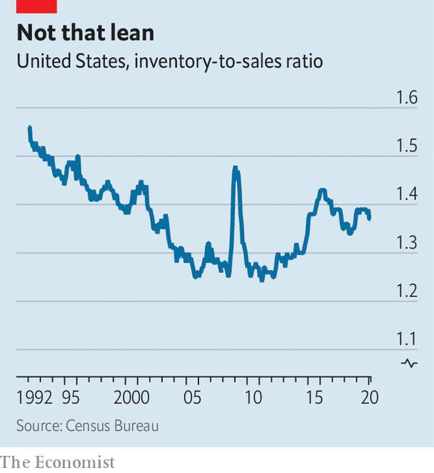

## Supple supplies

# Businesses are proving quite resilient to the pandemic

> But that does not make up for a lack of demand

> May 16th 2020

Editor’s note: The Economist is making some of its most important coverage of the covid-19 pandemic freely available to readers of The Economist Today, our daily newsletter. To receive it, register [here](https://www.economist.com//newslettersignup). For our coronavirus tracker and more coverage, see our [hub](https://www.economist.com//coronavirus)

IF A VENGEFUL deity were to design a weapon to wield against the global supply chains that characterise modern business, it might well hit on a virus which hit production facilities all around the world. In the face of covid-19, though, the sinews of business have, for the most part, held up remarkably well.

Air freight has suffered, but shipping has steamed on—and its comparatively long transit times have provided a buffer to the supply shocks which followed China’s shutdown. Prologis, an American company which operates one-and-a-half Manhattans-worth of warehouse space around the world, says that 95% of its customers have remained at least partially operational. Systemic risks such as those which brought the banking industry crashing down during the financial crisis have, as yet, failed to materialise.

This is not to say that business is booming. But it is demand, not supply, that is lacking. To the extent that the sinew is not working it is for want of a task, not for want of strength.

That companies have been aflurry over their supply chains is not in doubt. From January to May supply-chain disruption was mentioned nearly 30,000 times in the earnings calls of the world’s 2,000 biggest listed firms, up from 23,000 in the same period last year. Mentions of “efficiency” declined from 8,100 to 6,700. Managers know that supply chains are good conduits of economic pain. Looking at the aftermath of the tsunami and earthquake which hit northern Japan in 2011 Vinod Singhal, Brian Jacobs and Kevin Hendricks, three management scholars, found that the share prices of suppliers to companies directly affected dropped by 4%, and those of their customers by 3%.

The sources of disruption, and thus pain, can be impressively obscure. In 2012, a month after a fire at a factory in Germany, carmakers from Düsseldorf to Detroit found themselves facing production cuts. It turned out that Evonik, the factory’s owner, was responsible for between a quarter to a half of the world’s supply of cyclododecatriene, a precursor chemical to a resin widely used in the business. Otto Kocsis, who works for Zurich, an insurance firm, has found that while the proportion of disruptions that can be attributed to “tier one” suppliers—those with which manufacturers deal directly—fell during the first half of the 2010s, the proportion which could be attributed to companies that manufacturers hardly knew they were dealing with, like Evonik, shot up.

One way to avoid such pain is to keep as diverse a supplier base as feasible—something which also helps you deal with customers quick to change their fancies. Zara, a Spanish fashion retailer, exemplifies the approach, with its different frock lines reaching the shops entirely independently. Another is to maintain spare manufacturing capacity. Though companies may pride themselves on their lean manufacturing, the world’s factories do not typically run at full tilt: across the world the proportion of their potential capacity which industrial firms actually use has been flat or falling over the past two decades.

Then there is inventory. It is widely assumed that modern supply chains relentlessly eat away at this source of resilience, but that is not entirely true. Investors can punish firms if they start piling up stock, especially if there are other signs of trouble. But they also look askance at firms that cut too close to the bone.

Hong Chen, Murray Frank and Owen Wu, another trio of business-school professors, have looked at the period between 1981 and 2000 when average inventories in America Inc declined from 96 days to 81 days. The share prices of the companies which slashed inventories by the most and of those which did not cut at all both suffered compared with those which made moderate cuts. Work by Ananth Raman and a colleague at the Harvard Business School shows that when a sharp increase in operational performance is followed by some sort of downturn, investors pay heed to the nature of the setback. If it is down to some exogenous factor, such as a flood, the firm goes unrebuked. If it is down to an internal issue, and so suggestive of excessive cost-cutting, returns on investment decline by 3.8 percentage points.

Since the financial crisis of 2007-09 companies have actually been increasing the amount of stock they have on hand. In America the ratio of inventories to sales just before the pandemic had risen to levels last seen in the early 2000s (see chart). The expansion of warehouse space that has recently been seen around the world is not just down to the rise of e-commerce—which typically requires three times as much as retailers who sell in physical locations. Some is down to firms concentrating on being near to the consumer, which increases the amount of storage a company needs. Prologis says that there has been an uptick in pricier short-term leases in warehouse space over the past few years, suggesting that companies are happy to pay a premium for flexibility.

Further evidence for buffering in the system can be seen in figures on working capital, which is calculated by subtracting what companies owe suppliers from the value of their inventories plus what they are owed by customers. Reducing working capital is the cheapest way for firms to get cash, since they need pay no interest to do so. Yet many companies are not making the most of it.

A recent survey of 15,000 large firms undertaken by PwC, a consultancy, divided them into quartiles based on their working-capital performance. If each firm in the three lower quartiles matched the performance of companies in the quartile above which were in the same line of business they would liberate $1.4trn in cash, equivalent to 55% of their cumulative capital spending. But despite this theoretically copious incentive, working-capital efficiency has not changed since 2016. Part of this is down to the increase in inventories seen in recent years, but another factor is reduced payables. Companies appear willing to spend money on their relationships with suppliers, which speaks to a sensitivity to supply-chain management.

It may also speak to the fact that many companies are already sitting on stacks of cash. Few boast sofas as plumply padded as Apple, Microsoft, Amazon, Alphabet and Facebook, which have $270bn in net cash between them, enough to finance many countries’ covid-related fiscal stimulus. But the total cash holdings of the world’s 2,000 biggest listed non-financial corporations increased from $6.6trn in 2010 to $14.2trn today.

Diversified suppliers, spare capacity, inventory and cash provide companies, especially big ones, with a certain degree of security. But whether their current “portfolios of resilience”, as Panos Kouvelis of the Boeing Centre for Supply Chain Innovation at Washington University puts it, can withstand the pandemic is another matter altogether. With respect to supply chains, the answer has so far been yes. But appetite for most non-essential goods and services among social-distancing consumers has evaporated. For some things, like air travel, ocean cruises or cinema, it may never fully recover.

How, though, could business have been better prepared? It might be possible, in principle, to self-insure against a disastrous drop in overall demand by sacrificing margins in order to build up buffers and to keep open strategic options the company will probably never willingly choose to use. But good luck convincing investors of that approach. Strategies which pay off handsomely in the event of even the worst worst case are terribly expensive.

Consider the Eurekahedge Tail Risk Hedge Fund Index, which tracks vehicles that try to make money out of “black swans”, highly improbable events that have a very large impact. If you had bet on the index on January 1st this year you would have seen a rise of 52%. But if you had bet on January 1st 2008 you would now be 25% below where you started. Insuring against lots of rare risks can never be cheap. Mr Kocsis says that insurance policies against disruptions caused by problems throughout the supply chain, including insolvencies of business partners, tend to cost 1% or more of the turnover insured annually. That is ten times what it would cost to protect the same amount of stock sitting in a warehouse from property damage.

Another worry is that a company which spends on resilience may end up at a disadvantage if others survive without making such provisions, for example by extracting concessions from suppliers or bail-outs from governments, says Debra Dandeneau of Baker McKenzie, a law firm. Such firms would get the benefits of insurance without having paid the premiums.

Today, having built up buffers that keep things going looks smart. But in time the attractions of cutting back will begin to assert themselves again. Yes, long supply chains bring some added risk. But as ManMohan Sodhi of the Cass Business School in London puts it, “Nothing in the operational world is risk-free.” An American company that offloads capital-intensive operations to suppliers in China is weighing the boost in value that provides against the risks—though if the Chinese supplier does a deal with one in Vietnam which then does a deal in Bangladesh, the level of risk may be hard to assess. Low inventories may expose you to disruptions in supply, but they save you from losses due to excessively rosy forecasts of demand, notes Sunil Chopra of the Kellogg School of Management in Chicago. The boss of a big European retailer doubts that his industry will return to heavy stockholding. “We value that efficiency because it keeps prices low,” he explains.

In the age of covid-19 producing closer to home is both an understandable urge and smiled on by many national governments (see [article](https://www.economist.com//briefing/2020/05/14/covid-19s-blow-to-world-trade-is-a-heavy-one)), especially for necessities like medicines or face-masks. But a company’s home country is not necessarily the least disruptive place for operations. Many factories in America are closed or running at low capacity: on May 11th Elon Musk reopened the Tesla factory in Fremont, California, in defiance of a public-health order from Alameda county. Meanwhile, Tim Cook of Apple, which continues to make most of its iPhones in China—and sell millions to Chinese consumers—recently told investors that “we have been gratified by the resilience and adaptability of our global supply chain.”

Mr Kouvelis expects companies mostly to go back to their old ways of thinking about the efficiency-resilience trade-off. Firms “manage one shock at a time”, he says. Having so far emerged from this one relatively unscathed, Mr Cook and others may well stick to Andrew Carnegie’s advice to “put all your good eggs in one basket and then watch that basket.” Until the next black swan waddles along. ■

Dig deeper:For our latest coverage of the covid-19 pandemic, register for The Economist Today, our daily [newsletter](https://www.economist.com//newslettersignup), or visit our [coronavirus tracker and story hub](https://www.economist.com//coronavirus)

## URL

https://www.economist.com/briefing/2020/05/16/businesses-are-proving-quite-resilient-to-the-pandemic
