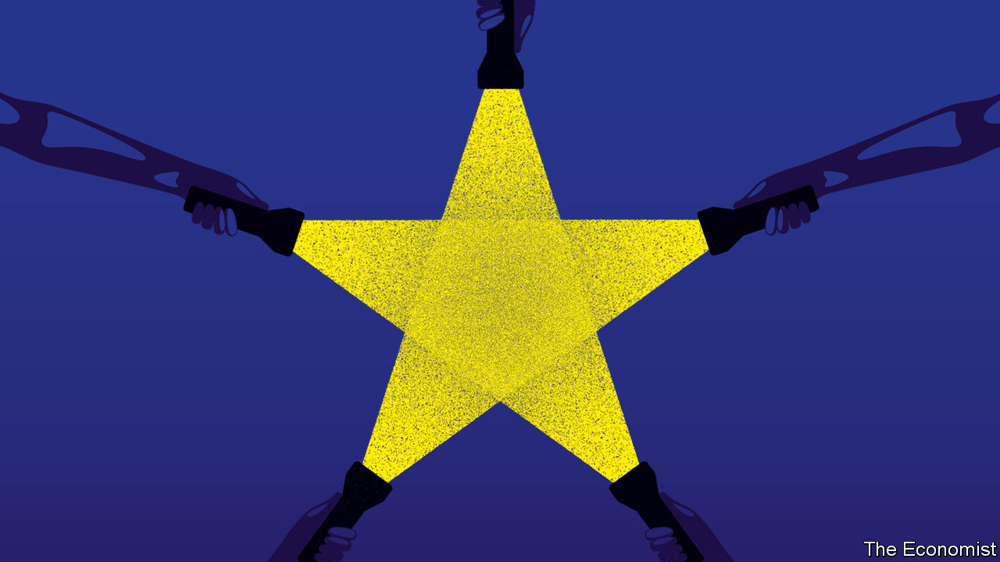
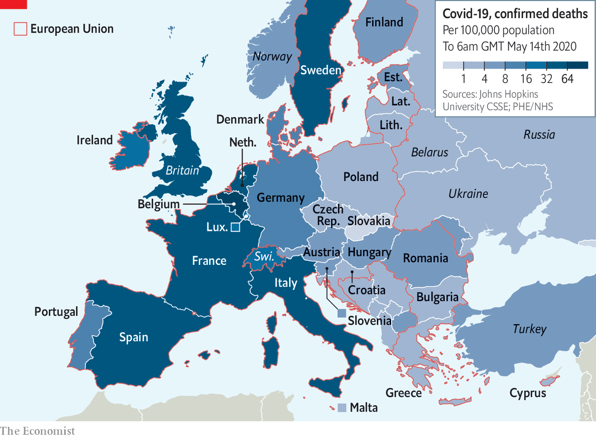
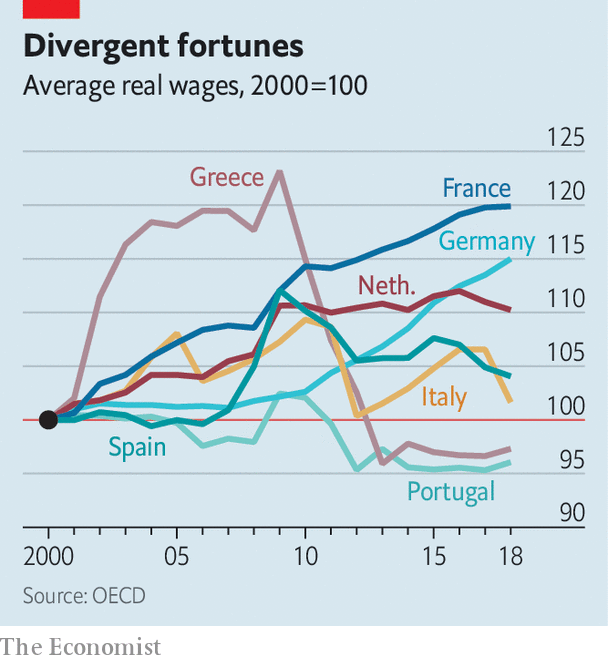
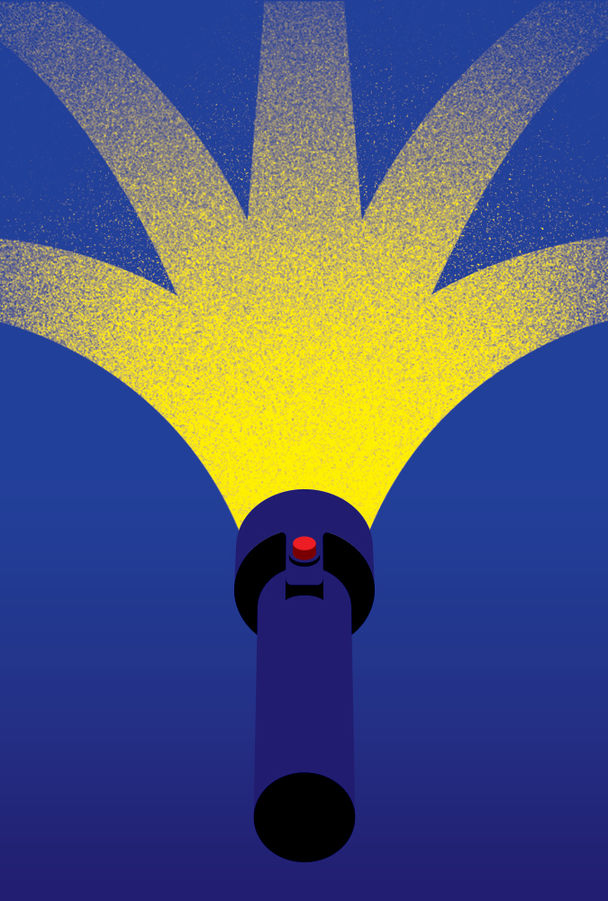

## Searching for meaning

# The covid-19 pandemic puts pressure on the EU

> An old question has resurfaced: what is the point of the bloc?

> May 14th 2020

Editor’s note: The Economist is making some of its most important coverage of the covid-19 pandemic freely available to readers of The Economist Today, our daily newsletter. To receive it, register [here](https://www.economist.com//newslettersignup). For our coronavirus tracker and more coverage, see our [hub](https://www.economist.com//coronavirus)

IN JANUARY BRUSSELS was an optimistic place. The European Union (EU) had survived a decade that included the near collapse of the bloc’s currency, a refugee crisis and its second-largest economy, Britain, voting to leave. For the first time in years, officials had time to think of the future rather than clear up the messes of the past. Then 120,000 people died.

Sweeping lockdowns confined citizens to their homes, in Paris and Warsaw alike. A bloc that prided itself on removing borders—“the scars of history” in the words of Josep Borrell, the European Commission’s foreign-policy chief—reintroduced them in chaos. Commuters were stranded at Poland’s borders with both Lithuania and Germany, some of them for days.

The bloc’s GDP is expected to drop by 7.4% this year, compared with a 4.3% fall in 2009, the worst year of the financial crisis. Investors betting on the collapse of the euro have started to drive up Italy’s borrowing costs. European politicians have attacked each other with a ferocity not seen since the euro crisis, when the bloc’s future was last in doubt. After Wopke Hoekstra, the Dutch finance minister, suggested some countries had themselves to blame for their financial troubles, Antonio Costa, the prime minister of Portugal, issued a fierce response. “This speech is disgusting,” he said. “Disgusting.”

The whole world is struggling with covid-19. But in the EU, the pandemic has triggered a concatenation of crises. What started as a health crisis became an economic crisis, then a political crisis, then a financial crisis, says Pepijn Bergsen of Chatham House, a think-tank. Now it risks becoming a constitutional one, after Germany’s constitutional court challenged the legal supremacy of the European Court of Justice earlier this month.

In its current form, the EU amplifies crises rather than solving them. Sticking with the current system is untenable. Altering it will be difficult. Fundamentally different expectations of the EU divide Europeans. At the heart of these disagreements is an inability to find an answer to a decades-old question: what is the EU actually for?

It began as a peace project. On May 9th 1950, five years after the second world war ended in Europe, Robert Schuman, then France’s foreign minister, unveiled a scheme to make war between his country and West Germany “not merely unthinkable, but materially impossible”. His method? Combining the coal- and steel-production capabilities of the two countries, along with any other willing European nations, and putting them under the control of an independent authority. Two years later the European Coal and Steel Community, the forebear of the EU, was born.

Prosperity soon followed, with European co-operation framed as a path to riches thanks to free movement of goods, workers, capital and services in the original club of six countries (as well as France and West Germany it included Italy, Belgium, the Netherlands and Luxembourg). The small club first expanded to its north, with Ireland, Denmark and Britain joining. Then in the 1980s the young democracies in southern Europe, such as Spain, Portugal and Greece were included. By the mid-2000s, much of eastern Europe had signed up, too.

Building up the bloc was a piecemeal process, as Schuman had envisaged, arguing that “Europe will not be made all at once, or according to a single plan.” Slowly and quietly, bureaucrats in Brussels and judges in European courts disassembled barriers to trade and harmonised regulations. In 1992 the single market programme, backed by Margaret Thatcher, the generally Eurosceptic British prime minister, made trade even easier. It took two constitutional earthquakes for European voters to notice that the foundations of their governments had shifted: the introduction of the euro and the expansion of the bloc to include former communist countries in eastern Europe.

These changes had visible effects. A mass movement of people from central and eastern Europe to richer countries in the west made clear that freedom of movement was not just a nebulous concept, but one which affected people’s daily lives; mostly for good but, in the perception of some, for ill. In 2010 the euro-zone crisis was a potent reminder that the fate of the currency in a Belgian’s wallet was in part determined by the actions of governments in Athens, Rome and Madrid. European voters became painfully aware of the EU’s price, and that led to increasingly anxious questions about its purpose.

Today a common goal is hard to find. The challenges that the EU now faces—on fiscal policy, foreign policy, defence and migration—cut to the heart of sovereignty. Dreams of the EU as a superpower require a strategic unity not easy to find among a 27-member bloc that stretches from Lisbon to Tallinn. Even attempts to turn the EU into an advocate of liberal democratic values fail to inspire everyone. In the past, disagreements on direction could be settled by standing still. Now, the forces that held the EU together risk pulling it apart.

Take the single market. According to the European Commission, allowing the free movement of labour, capital, services and workers adds between 8% and 9% to the EU’s collective GDP. Because all companies in the EU can access each other’s markets, the bloc has strict rules on how much help a government can give to domestic companies. When covid-19 hit, the commission loosened them, allowing governments to hand out cash to industries they feared might go under. Such aid, in the form of guarantees or wage supplements, has amounted to €1.9trn ($2trn) so far. German guarantees for German businesses account for just over half of this figure.

Once a reasonably level playing field, the single market is now lopsided. In the downturn to come, Spain and Italy will endure deeper recessions than Germany, leaving them even less financial muscle to help domestic businesses. Both the Spanish and Italian economies will contract by more than 9% this year, predicts the European Commission. By contrast, Germany’s GDP will fall by 6.5%. Not for the first time in the bloc’s history, the burden falls heaviest on those least able to bear it.

To rebalance the EU’s economy, an alliance of countries led by Spain suggested grants totalling €1.5trn, paid for with debt backed collectively by the EU as a whole. It would be in the self-interest of all EU countries, argues Luis Garicano, a liberal Spanish MEP. Collapsing southern European economies would wreck the cozy economic settlement that has been so beneficial to the likes of Germany and the Netherlands. The euro has enabled Germany to run huge trade surpluses without being hindered by an appreciating currency. Fiscal transfers from north to south would be a small price to pay. Without such a comprehensive recovery fund, the single market risks entrenching inequality rather than spreading wealth.

However this plan was staunchly opposed by small, rich, mostly northern countries, several of which have also had slightly fewer covid-related deaths than others (see map). The Netherlands, Demark and Sweden all pooh-poohed the idea. The Dutch government offered a one-off grant of €1bn, about a tenth of a percent of the sum demanded by the Spanish government, as a gesture of goodwill.

The German government, meanwhile, will stretch only to modest grants, arguing that any EU recovery fund should consist mainly of loans. In the middle, the European Commission is tasked with devising a scheme that keeps both sides happy. It will propose a mixture of grants and loans to indebted countries, paid for out of the EU’s budget. Countries will spend much of the year haggling over it.

The argument over how to respond to the economic crisis reveals another faultline that has long run through the EU: a shared currency but no shared spending policy. This was originally a feature of the euro’s design, not a bug, argues Jan Techau of the German Marshall Fund, a think-tank. The euro’s creators “wanted this tension to be there”, he says. Given the obvious problems of running a currency without a unified budget or transfers between richer and poorer members, fiscal union—considered a step too far when the euro was introduced—would eventually have to follow. What the euro’s designers did not envisage was that Europe’s leaders would balk, repeatedly, at that deeper integration, thus endangering the currency’s survival.

Economic integration has failed to provide the EU with a compelling common purpose. Other, less tangible goals have taken on greater importance. A Europe based on shared values looms large in the imagination of Europhiles. Today Eurocrats are more likely to discuss ways of protecting and promoting the “European way of life” than the merits of close economic ties.

This view taps into a long memory of the EU as a civilising force. “Spain is the problem, Europe is the solution,” declared José Ortega y Gasset, a Spanish writer, in 1910. If his phrase has become a cliché of his country’s political life it is because after the end of the long dictatorship of Francisco Franco in 1975, most Spaniards wanted their country to become a normal European democracy. It is a view shared in Germany. “German problems can only be solved under a European roof,” declared Konrad Adenauer, West Germany’s first chancellor, in 1962.

However, this view is not universal. Memories of authoritarian regimes may linger in the politics of most EU states. Yet no such memory concentrates minds in, say, Sweden, meaning that supranational shackles can be seen as an affront to sovereignty rather than a necessary constraint on the state.

Shared values matter to a continent coming to terms with its past. They also matter for a continent that increasingly tries to influence the world, portraying itself as a global power. Ivan Krastev, a political scientist and the bloc’s most impish critic, sees two paths for the EU. Either it becomes more of a “mission”, going forth and evangelising European values globally, or it becomes a “monastery” and preaches only to Europeans within its precincts.

The idea of a European mission has its fair share of supporters. Ursula von der Leyen, the new president of the European Commission, said it would be a more “geopolitical” body under her leadership. Enrico Letta, a former prime minister of Italy and now the head of the Jacques Delors Institute, a think-tank, argues that the EU should aim to become a third superpower between America and China.

Indeed, the EU already has immense regulatory clout. It sets global standards on everything from privacy to processing chemicals to environmental rules. Rather than use different standards across the globe, businesses obey the EU’s (usually more stringent) regulations to save costs, a phenomenon known as “the Brussels effect”. Translating this into more tangible forms of power is difficult. Superpowers require strategic unity, which may be hard to build in a club that has very different views on Russia, to give just one example.

If the EU rolls back its global ambitions and goes down the second route suggested by Mr Krastev—becoming a monastery—it will have to deal with a war among the monks. Any claim that the EU is united in its support for liberal democratic norms is disproven by the fact that Poland and Hungary have steadily eroded the rule of law—and yet they remain members of the club. Poland’s government has tried to nobble its supreme court. Hungary’s prime minister, Viktor Orban, has subverted or sidelined most of his country’s checks and balances over the past decade, and seized on the pandemic as an excuse to rule by decree indefinitely. Meanwhile, cronies of his ruling party are gorging on aid from Brussels.

Even previously unchallenged parts of the EU’s dogma, such as its legal order, look more shaky. In May Germany’s constitutional court ruled that the European Court of Justice in Luxembourg was acting beyond its authority in the way it ruled on the European Central Bank’s bond-buying in 2018. In effect, the German court declared that since the EU is not a federal state, national courts can decide whether the ECJ has gone beyond its remit. The ECJ disagreed, leaving the two courts jostling for supremacy. The European Commission is examining whether to launch sanctions against Berlin for breaking the EU’s treaties. (The ECJ would have the final say.) A bizarre situation looms in which the German government is criticised for the actions of its independent court.

These warring judges have also called into question the future of actions taken by the ECB to stem the financial effects of the covid-19 crisis. A €750bn bond-buying programme launched in March by the ECB saw the central bank hoover up debt from Italy and Spain, in a bid to dampen the effects of the pandemic. As a result, Italy and Spain can easily borrow on the open market. This contrasts sharply with the start of the euro crisis, when the euro zone’s future seemed to hang in the balance every time Italy held a bond auction.

However, the ECB has created moral hazard. Bold action by the central bank has led to political complacency among the EU’s northern states. It has thus relieved pressure on Europe’s leaders to take tricky decisions, such as whether they should provide southern Europe with enough fiscal power to get out of the crisis. Germany and the Netherlands once railed against the ECB’s largesse; now they are among its beneficiaries, delaying difficult choices in the knowledge that the bank will continue to keep the bloc afloat. For a project that seems to move decisively only when in peril, this is a problem.

The result is that a constitutional reckoning has never seemed more necessary, yet it has never felt less likely. Hard questions proliferate: whether or not the EU will pursue deeper integration, what role the bloc will play in global politics, and so on. Even dilemmas unimaginable a decade ago, such as whether the EU is only for liberal democracies, need to be cleared up.

Although Britain’s chaotic departure was not exactly a tempting advertisement for the joys of leaving the bloc, it is still likely that big changes to the EU’s rules would lead to a slew of tricky plebiscites. Eurocrats have painful memories of past referendums. A fully fledged “constitution” was rejected by French and Dutch voters in 2005. Indeed deeper ties in Europe have always been controversial. In 1992 French voters agreed by just 51% to adopt the Maastricht treaty, which led to the monetary union.

Bold federal steps would help. But a sturdier constitution would result in even more fractious politics. If pushed, German officials will insist that they have no fundamental objection to a mutualisation of debt. At the same time they insist it would have to be accompanied by a corresponding centralisation of fiscal power over how national governments spend, which is likely to upset many European governments. For countries in southern Europe, fiscal union is seen as freedom; for Germany it is seen as tighter control.

Either way resentment is brewing, particularly in southern Europe. Italians have been among the most communitaire of Europeans. In a survey for the commission in 2000, just before the euro became legal tender, only 9% were against EU membership, compared with an EU average of 14%. But by May 7th almost 44% were ready to quit. “Italians feel betrayed,” says Gianluca Borrelli of Termometro Politico, the institute that conducted the latest poll. Apocalyptic rhetoric flows from southern Europe’s leaders. Portugal’s prime minister, Mr Costa, declared: “Either the EU does what needs to be done or it will end.”

A more complacent view exists in the EU’s northern capitals, particularly in Berlin. When it comes to common debt, a feeling exists that Spain, Italy and France—which has supported the two southern countries throughout—are trying it on, using the crisis to mask opportunism. “How do you distinguish between genuine necessity and political opportunity?” asks one ambassador from a northern European country. In this view a compromise will be found; yet another chapter in the EU’s long history of muddling through.

According to an old joke, economists have predicted nine of the past five recessions. Those predicting the demise of the EU may look similarly foolish. The bloc, its currency and its institutions are so central to much of European political life that unpicking them all would require a level of wanton destruction that not even the EU’s harshest critics have advocated. However after a decade of crises survivor bias afflicts the EU’s supporters and fresh thinking is urgently needed. An uncomfortable journey is justified if the destination is worthwhile. But without a clear answer to the question of what Europe stands for, the next decade or so will resemble a rather pointless ride. ■

Dig deeper:For our latest coverage of the covid-19 pandemic, register for The Economist Today, our daily [newsletter](https://www.economist.com//newslettersignup), or visit our [coronavirus tracker and story hub](https://www.economist.com//coronavirus)

## URL

https://www.economist.com/briefing/2020/05/14/the-covid-19-pandemic-puts-pressure-on-the-eu
