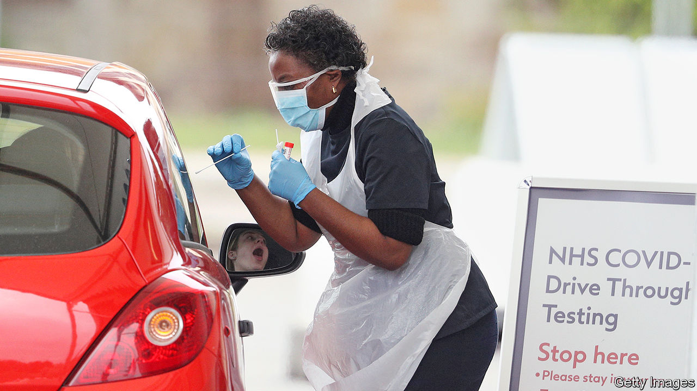

## Carry on Covid

# The pandemic has exposed flaws in Public Health England

> After the pandemic, the government is likely to rethink the executive agency’s role

> May 16th 2020

Editor’s note: The Economist is making some of its most important coverage of the covid-19 pandemic freely available to readers of The Economist Today, our daily newsletter. To receive it, register [here](https://www.economist.com//newslettersignup). For our coronavirus tracker and more coverage, see our [hub](https://www.economist.com//coronavirus)

ON MARCH 25TH Sharon Peacock, a director at Public Health England (PHE), appeared in front of a House of Commons committee. At the time, her agency was doing just 7,000 tests a day. Why, the chair of the committee, Greg Clark, wondered, were PHE concentrating testing in their own and NHS laboratories? Why hadn’t they brought private-sector laboratories into the system, as in South Korea? Ms Peacock paused. “That’s a good question,” she said. A written explanation was promised.

Two weeks earlier, the lack of testing capacity had pushed the government to give up on the test-and-trace strategy used by other countries to suppress the virus. At the time, PHE had responsibility for testing, ran contact tracing and was one of the government’s main sources of expertise. While the failure to raise capacity spreads well beyond PHE, there is concern across the health system—in the NHS, government and local authorities—that PHE has failed to rise to the challenge. Mr Clark is still waiting for an explanation of the testing strategy. (Nor did PHE respond to The Economist’s requests for clarification.)

Before the pandemic, PHE was well regarded. A review by the international association of public-health bodies concluded that it rivalled any in the world. Created as part of controversial reforms to the health system in 2013, it emerged from 129 organisations, including those responsible for health protection (watching for infectious diseases) and for health promotion (campaigning against smoking). The inspiration was America’s Centres for Disease Control and Prevention. In Britain the model seems unlikely to survive the crisis.

PHE spans the divide not only between health prevention and promotion, but also between central and local government. It disburses an annual grant, last year worth £2.9bn ($3.5bn), to local authorities, but has little sway (beyond offering advice) over how it is spent. So it is stuck in the worst of all worlds: without the connections needed to make things work on the ground or the medical heft at the top to lead the national response. Duncan Selbie, PHE’s chief executive, arrived after a career as a hospital administrator and, as one insider notes, is not a medical doctor. He has not had a prominent role in the crisis.

PHE has not worked well with local authorities. When the government gave up on suppressing the virus in March, PHE had just 290 staff working as contact tracers. At that point, it could have used local authorities’ experience in contact tracing for things like sexual health and food-borne diseases. Yet only now is that starting to happen. Local authorities are still confused about whether to contact the CQC, a regulator, or PHE about testing in care homes. A local leader characterises PHE’s response to the crisis as “carry on covid”.

Nor is it working well with the rest of the health system. Those in the NHS complain that PHE failed to give them warning about changes to guidance on protective kit. Explanations for the changes were lacking, too. “You have to be really clear with [medics] about why you are changing, especially if you are deviating from international guidance,” notes an observer.

Glimpses into PHE suggest a startling failure to get on top of the problem. In her evidence to the science committee, Ms Peacock said personal tests would be available within days from Amazon and Boots. Seven weeks later, they are still not. Britain is now testing 60,000 or so people a day, but numbers jumped only after the Office for Life Sciences, a smaller, more agile body, got involved, expanding the testing network to include three big laboratories involving universities and the private sector.

The fragmented system that has resulted has its own problems, particularly in data collection. The health department has brought in Dido Harding, the head of an NHS regulator, to sort things out, and to link the testing programme with contact tracing, which is still run by PHE. The Office for National Statistics is leading serological studies to see how widespread covid-19 is in the British population. It is an all-hands-on-deck-situation for the government. Yet effective organisations tend to accumulate responsibilities. Instead, some in the NHS joke that PHE is enjoying a period of “self-isolation”. ■

Dig deeper:For our latest coverage of the covid-19 pandemic, register for The Economist Today, our daily [newsletter](https://www.economist.com//newslettersignup), or visit our [coronavirus tracker and story hub](https://www.economist.com//coronavirus)

## URL

https://www.economist.com/britain/2020/05/16/the-pandemic-has-exposed-flaws-in-public-health-england
