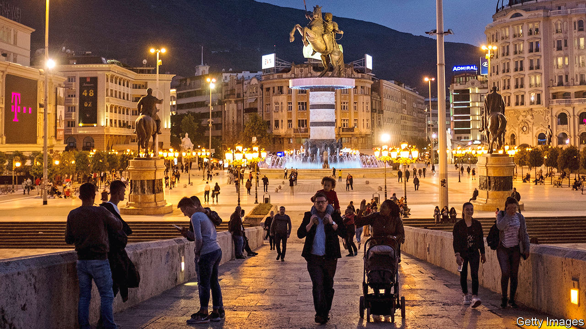

## Sketchy in Skopje

# No one knows how many people live in North Macedonia

> Which makes planning hard for the government

> May 14th 2020

IT IS AN odd admission for the boss of a national statistical agency. Not only are many of his numbers wrong, says Apostol Simovski, head of North Macedonia’s statistical office, but he has no idea what the right ones might be. Officially, there are 2.08m people in his country. In fact, he says: “I am afraid there are no more than 1.5m, but I cannot prove it.”

Countless calculations—income per head, number of bathtubs per head—depend on knowing how many heads there are. If Mr Simovski is right and there are 27.5% fewer people in North Macedonia than officially estimated, then GDP per head, among other things, will be much higher. However, the true population may be between 1.6m and 1.8m, says Izet Zeqiri, an economist. Until there is a census, no one will know.

The last count was in 2002. An attempt to update it in 2011 turned into a fiasco. Nationalist Macedonian politicians and those from the country’s Albanian minority encouraged their supporters to list lots of family members who lived abroad. When officials realised that the totals would be fantastical, the process was aborted.

A new census was planned for April this year. However, when a snap election was called, the census was postponed. And the election itself was then postponed because of covid-19. As a result, says Verica Janeska, an economist, the government cannot make well-informed economic decisions.

In 2019, for the first time in history, more Macedonians died than were born. Births and deaths, at least, are accurately counted. Harder to gauge are the numbers who move abroad to work. Some 81,000 have Bulgarian passports. This means they can work easily and legally in the EU. It also means they don’t show up as Macedonians on any foreign database. Unemployment used to be a big problem. Now labour shortages are emerging as a bigger one. This is a problem across the Balkans, but in all Europe only North Macedonia and Ukraine, which last held a census in 2001, share the honour of not knowing even roughly how many people they have.

## URL

https://www.economist.com/europe/2020/05/14/no-one-knows-how-many-people-live-in-north-macedonia
