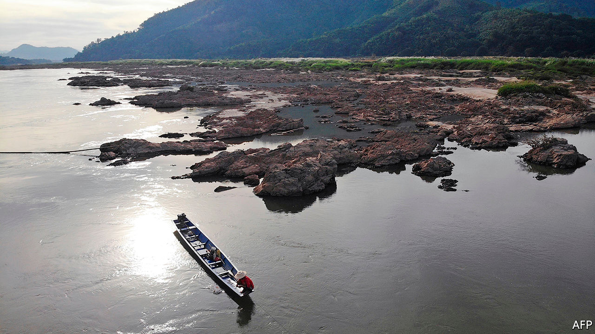

## Water torture

# If China won’t build fewer dams, it could at least share information

> Its secrecy means that farmers and fisherman in downstream countries cannot plan

> May 14th 2020

RIVERS FLOW downhill, which in much of Asia means they start on the Tibetan plateau before cascading away to the east, west and south. Those steep descents provide the ideal setting for hydropower projects. And since Tibet is part of China, Chinese engineers have been making the most of that potential. They have built big dams not only on rivers like the Yellow and the Yangzi, which flow across China to the Pacific, but also on others, like the Brahmaputra and the Mekong, which pass through several more countries on their way to the sea.

China has every right to do so. Countries lucky enough to control the sources of big rivers often make use of the water for hydropower or irrigation before it sloshes away across a border. Their neighbours downstream, however, are naturally twitchy. If the countries nearest the source suck up too much of the flow, or even simply stop silt flowing down or fish swimming up by building dams, the consequences in the lower reaches of the river can be grim: parched crops, collapsed fisheries, salty farmland. In the best cases, the various riparian countries sign treaties setting out how much water each will guarantee to the next. In the worst, bickering over the flow is a source of constant tension and recrimination.

Tension and recrimination have been the order of the day for China and its neighbours, alas. In part, this is because a river like the Mekong does not contain enough water to go round. China has already built 11 dams across the main river (never mind its tributaries) and has plans for eight more; the downstream states have built two and are contemplating seven more. Last year, during a drought, the river ran so low that Cambodia had to turn off a big hydropower plant (see [article](https://www.economist.com//asia/2020/05/14/south-east-asias-biggest-river-is-drying-up)). Even when rainfall is normal, the altered flow and diminished siltation are causing saltwater to intrude into the Mekong delta, which is the breadbasket of Vietnam, and depleting the fish stocks that provide the only protein for millions of poor Cambodians.

China has long resisted any formal commitment to curb its construction of dams or to guarantee downstream countries a minimum allocation of water. It will not even join the Mekong River Commission, a body intended to help riparian countries resolve water-sharing disputes. The problem is not just that China gets huffy about anything that could be construed as foreign interference in its “internal affairs”. The country’s leaders are also mesmerised by big engineering projects and seldom show much concern for the people displaced or disadvantaged by them, even when the victims are their fellow citizens. So keen is China on big dams, in fact, that it is helping Pakistan build several on the Indus—a river too small and remote in its Chinese reaches to be worth damming—and is trying to persuade Myanmar to build a huge barrage across the Irrawaddy, whose tributaries flow through China for just a tantalising couple of kilometres.

But even if China’s rulers cannot overcome their engineering fetish, they could do plenty more to reassure their neighbours. Sharing data on water levels routinely, without interruption, would be a good start. During a row over a poorly demarcated section of their shared border in 2017, China stopped providing India with information about the flow of the Brahmaputra that is used to provide flood warnings to villagers downstream. It took a summit of the two countries’ leaders to get the information flowing again. By the same token, downstream countries would love to know when Chinese hydropower plants plan to retain or discharge water, to allow farmers and fishermen in the lower reaches time to prepare. And it would not hurt China to undertake to alleviate droughts when it can. That would send a flood of gratitude flowing uphill. ■

## URL

https://www.economist.com/leaders/2020/05/14/if-china-wont-build-fewer-dams-it-could-at-least-share-information
