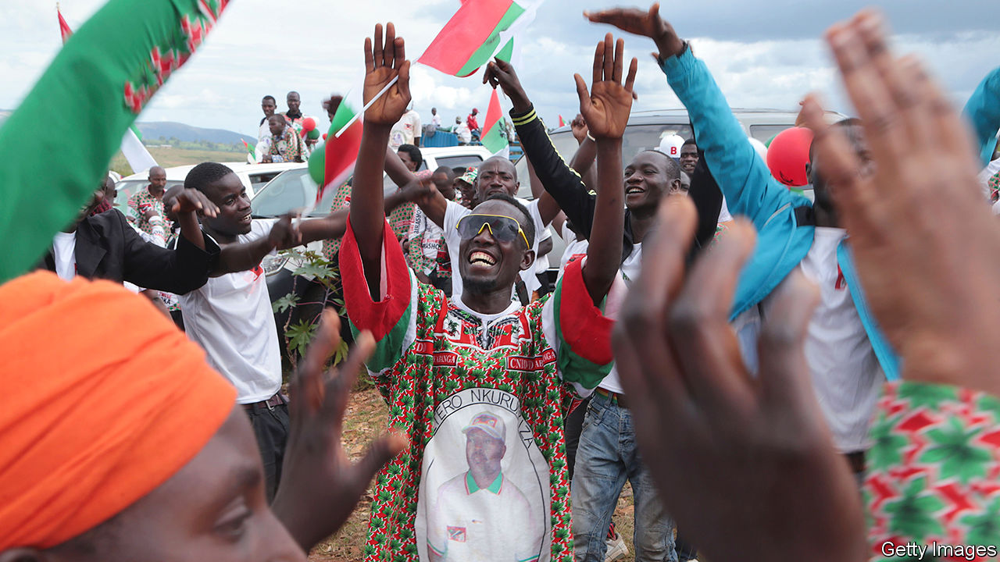

## We don’t need no observation

# Covid-19 helps ballot-dodgers in Africa

> Foreign election monitors are staying at home

> May 16th 2020NAIROBI

Editor’s note: The Economist is making some of its most important coverage of the covid-19 pandemic freely available to readers of The Economist Today, our daily newsletter. To receive it, register [here](https://www.economist.com//newslettersignup). For our coronavirus tracker and more coverage, see our [hub](https://www.economist.com//coronavirus)

STRONGMEN TEND to find election observers rather a nuisance. The sharper-eyed ones make trickery harder to get away with. Which is why autocrats see an upside to covid-19. These days, even the nosiest monitors are disinclined to travel.

Alpha Condé, Guinea’s president, has taken full advantage of the pandemic. On March 22nd he pressed ahead with a parliamentary vote he had postponed four times before. The coronavirus was apparently not a good enough reason to warrant a fifth delay. Foreign observers, who had previously raised concerns about possible tampering with the electoral register, stayed away, as did the opposition, who declared a boycott. Mr Condé’s ruling party’s share of seats in parliament duly rose to more than two-thirds. Because the president also slipped in a referendum on relaxing term limits, Guineans may now enjoy his rule until 2032, when he will be 94.

President Pierre Nkurunziza of Burundi is similarly determined not to let the virus stop his people having their say. Burundians will crowd into polling stations on May 20th to choose a new president and parliament. Most observers are planning to stay away, which suits Mr Nkurunziza just fine. Nonetheless, 12 days before the election his government took no chances, telling the East African Community that any monitors it might still think of sending would have to spend 14 days in quarantine.

Mr Nkurunziza has been less strict when it comes to protecting his own people from the virus. Beyond quarantining observers, his regime has imposed few restrictions. Bars, restaurants and churches remain open. Burundi has been the only African country to continue top-tier football. Games were suspended on April 13th, but only so that stadiums could be used for campaign rallies. Fixtures will resume the day after the poll. “The coronavirus is killing people everywhere else,” said General Evariste Ndayishimye, the party apparatchik the president has chosen to succeed him. He told supporters not to worry: “Do not be afraid. God loves Burundi.”

Opposition types are less keen on the absence of monitors. Agathon Rwasa, Burundi’s foremost opposition candidate, suggests that many abuses are now going undocumented. His supporters are being intimidated. Several have been attacked, arrested or even murdered. He also complains that the electoral commission has not published voter lists, which makes them easier to manipulate.

Given that the commission is almost entirely made up of members of the ruling CNDD-FDD, election officials are under no pressure to listen to Mr Rwasa. Besides, many opposition supporters may never get the chance to cast their ballots anyway. Voter cards are doled out by local chiefs. As these also all belong to the CNDD-FDD, they are inclined to give the cards only to those known to be party supporters.

There is little the opposition can do about any of this. So Mr Nkurunziza, who has had himself named “Eternal Supreme Guide” and may attempt to rule through his successor, is likely to see his gamble pay off. His nominee, General Ndayishimye, is all but certain to win.

Others will pay the price. Packing voters into campaign rallies and polling stations is hardly sensible during a pandemic, as Guinea’s example shows. The country had been relatively unscathed by covid-19 when voters went to the polls, with just two cases recorded. It is now the eighth-worst affected in Africa, with more than 2,300 recorded cases. The head of Guinea’s electoral commission and Mr Condé’s chief of staff are among the 14 who have died. The opposition now accuses the president of spreading the virus.

Burundi, too, has apparently had relatively few cases—only 15 confirmed ones by May 13th, though just 284 tests had been conducted. As in Guinea, those numbers could easily jump. If they do, the president’s cynicism will be partly to blame.

Covid-19 is the excuse that keeps giving. John Magufuli, Tanzania’s president, is likely to press ahead with an election in October, when he is expected to fend off a browbeaten opposition. Though he is as casual as President Nkurunziza about the virus, he could use it as an excuse to block foreign observers. This would be particularly handy in Zanzibar, a restive island where elections were annulled in 2015 because of foul play.

The virus can also furnish a pretext for dodging a ballot entirely. Uganda’s Yoweri Museveni says it would be “madness” to hold elections scheduled for next year. He would probably win them because they are unlikely to be free or fair. Even so, Mr Museveni is nervous. If he held an unfair vote and still failed to win convincingly, he could face calls from within his own party to stand down.

Malawi’s president, Peter Mutharika, risks defeat in an election on July 2nd that he is being dragged kicking into. In February judges annulled his victory in a poll last year after finding evidence of vote-rigging, and ordered a re-run. On May 8th they threw out his “embarrassing” and “unprofessional” appeal.

Mali’s ruling party felt obliged last month to go ahead with an election even though it expected to lose seats. It did not try to stop the ballot because it knew that without a new parliament, a peace deal with separatists could not go ahead.

Many Big Men are trying to exploit the pandemic. The key to stopping their shenanigans, in times of sickness as in those of health, is independent judges, uppity activists and brave voters. ■

Dig deeper:For our latest coverage of the covid-19 pandemic, register for The Economist Today, our daily [newsletter](https://www.economist.com//newslettersignup), or visit our [coronavirus tracker and story hub](https://www.economist.com//coronavirus)